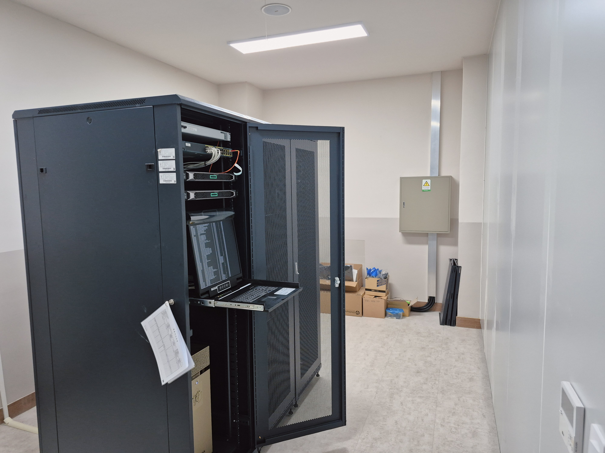
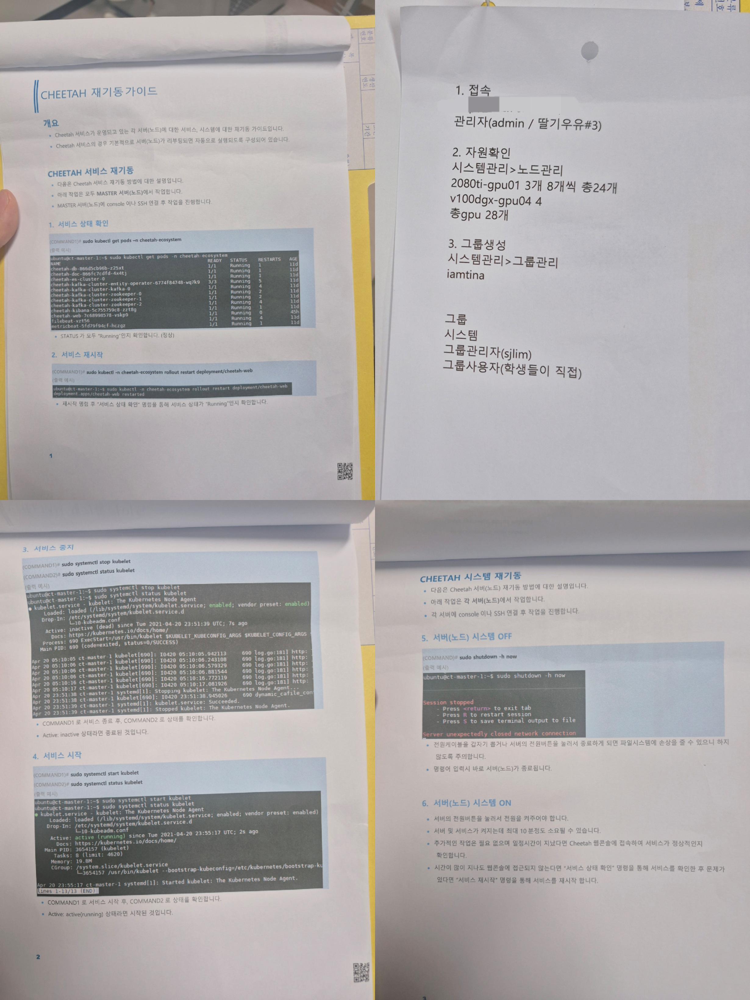
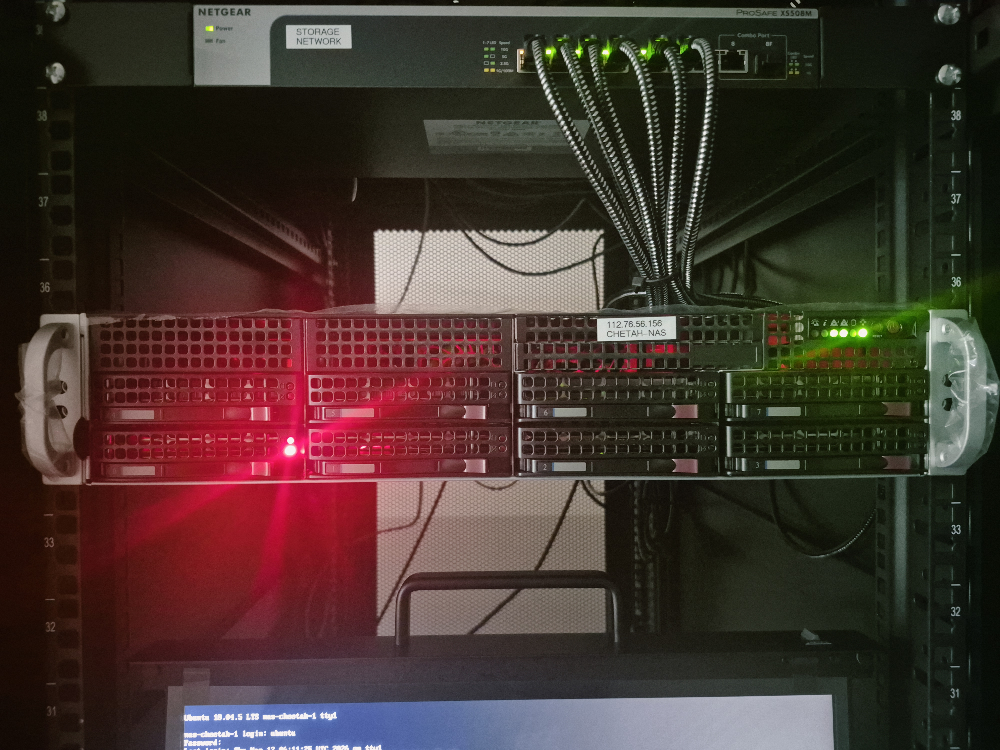
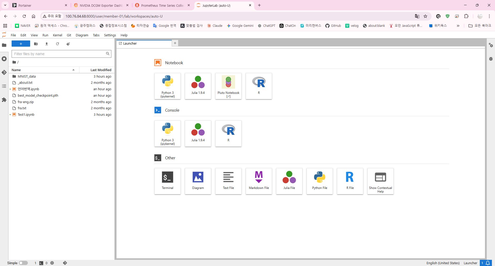

# 🖥️ 27GPU 온프레미스 클러스터 기반 ML 파이프라인 구축

> 사용 불가능한 상태였던 **27 GPU 레거시 서버 인프라를 단독으로 복구·재설계하고**
> Kubernetes 기반 AI 학습 클러스터 및 자동화된 ML 파이프라인으로 재구성했습니다.
>
> **단순 복구가 아닌, 기존 시스템을 폐기하고 새로운 아키텍처로 전환하여
> Git push → 자동 학습 실행이 가능한 환경까지 구축했습니다.**
>
> 온프레미스 환경에서 GPU 자원 관리, 네트워크 분리, 스토리지 연동, CI/CD 기반 학습 자동화를 포함한 전체 인프라를 직접 구축했습니다.
>
> 프로젝트 시작 시점에는 인프라 운영 경험이 많지 않았지만 AI를 문제 해결 보조 도구로 활용해 실제 작업을 진행했고 부족한 개념은 이후 학습과 문서화를 통해 보완했습니다.



---

## 📌 프로젝트 개요

| 항목     | 내용                                                                    |
| -------- | ----------------------------------------------------------------------- |
| **기간** | 2026년 3월 12일 ~ 진행중                                                |
| **역할** | 단독 수행 (시스템 복구 · 인프라 설계 · ML 파이프라인 구축 전 과정)      |
| **환경** | 학교 서버실 온프레미스 GPU 클러스터                                     |
| **목표** | 방치된 GPU 클러스터를 AI 학습 파이프라인이 동작하는 MLOps 인프라로 전환 |

---

## 🔥 시작하게 된 계기

1학년 때 교수님께 "학과 서버실에 AI 훈련용 GPU 서버가 있다"는 말을 들었습니다. 2학년이 되어 직접 서버실을 찾아갔고, 5년간 업데이트가 멈춘 클러스터와 4페이지짜리 재기동 매뉴얼을 발견했습니다.

담당 업체는 이미 서비스를 종료한 상태였고, 유지보수도 불가능한 상황이었습니다. 교수님께

> "제가 복구해봐도 되겠습니까? 복구 과정에서 프로그램이 망가져도 상관없습니까?
> 그때는 새로 만들어보겠습니다"

라고 여쭤본 뒤 작업을 시작했고 구형 시스템을 되살리는 과정에서 **OS가 너무 구형이라 K8s + GPU 생태계 연동이 근본적으로 불가능하다**는 한계를 직접 확인했습니다.

단순 복구가 아닌 전면 재설계를 결정했고, Ubuntu 22.04 + Kubernetes 기반으로 클러스터를 새로 구축한 뒤 JupyterHub 팀 환경, YOLOv8 학습 파이프라인, Argo Workflows까지 완성했습니다.



---

## 🏗️ 클러스터 구성

| 노드          | 역할                      | GPU        | IP                                      |
| ------------- | ------------------------- | ---------- | --------------------------------------- |
| master-01     | Control Plane             | —          | `MASTER-IP`                             |
| master-02     | Worker (시스템 파드 전담) | —          | `WORKER-IP-02`                          |
| v100-gpu-01   | Worker (학습 전용)        | V100 × 4   | `WORKER-IP-03`                          |
| 2080ti-gpu-02 | Worker                    | 2080Ti × 8 | `WORKER-IP-04`                          |
| 2080ti-gpu-03 | Worker                    | 2080Ti × 7 | `WORKER-IP-05`                          |
| 2080ti-gpu-04 | Worker (서빙 전용)        | 2080Ti × 8 | `WORKER-IP-06`                          |
| NAS (nas-01)  | 스토리지                  | —          | `MASTER-IP` (1G) / `10.10.10.157` (10G) |

- **총 GPU:** V100 4장 + 2080Ti 23장 = **27장**
- **K8s 버전:** v1.29.15
- **OS:** Ubuntu 22.04.5 LTS

> 구축 당시(2026년 3월) GPU Operator · Calico · MetalLB 등 핵심 애드온의 호환성이 충분히 검증된 버전으로 v1.29를 선택했습니다. 최신 버전보다 패치가 안정적으로 쌓인 버전을 택하는 것이 온프레미스 GPU 클러스터 초기 구축에서 리스크를 줄이는 합리적인 판단이었습니다.

---

## 🧭 기술 선택 근거

| 항목             | 검토한 대안       | 선택               | 선택 근거                                                                                             |
| ---------------- | ----------------- | ------------------ | ----------------------------------------------------------------------------------------------------- |
| 오케스트레이터   | Slurm, Nomad, Ray | **Kubernetes**     | Argo · MLflow 등 MLOps 도구가 K8s 전제로 설계됨. 구직시장 범용성. Slurm은 컨테이너 재현성 관리에 약점 |
| CNI              | Cilium, Flannel   | **Calico**         | 온프레미스 BGP 지원, 운영 안정성, 공식 문서·커뮤니티 자료 성숙도                                      |
| 스토리지         | Ceph, Longhorn    | **NFS**            | 기존 NAS 하드웨어 직접 활용, 구현 단순성 우선. Ceph는 별도 클러스터 필요                              |
| 컨테이너 런타임  | CRI-O             | **containerd**     | GPU Operator 공식 권장 런타임                                                                         |
| ML 파이프라인    | Kubeflow, Prefect | **Argo Workflows** | K8s 네이티브, 경량, 학습 진입장벽 낮음. Kubeflow는 현 규모 대비 설치 복잡도 과함                      |
| etcd 백업 자동화 | K8s CronJob       | **호스트 crontab** | K8s 장애 시에도 백업이 동작해야 하므로 K8s에 의존하지 않는 호스트 레벨 선택                           |

---

## 🗺️ 작업 타임라인

```
━━━ Phase 1 : 레거시 복구 (3/12 ~ 3/19) ━━━━━━━━━━━━━━━━━━━━━━━━━━━━

3월 12일  ──  구형 CHEETAH 시스템 복구 시도
              └ GRUB 단일 사용자 모드로 패스워드 재설정 (인증 정보 전량 분실)
              └ K8s 인증서 5년치 만료 → 갱신 및 워커노드 재연결
              └ ES / Kafka / MetalLB 장애 복구 (8시간 소요)

3월 16일  ──  NAS RAID 복구
              └ 0번 SSD 빨간불 감지 → MegaRAID BIOS 직접 진입
              └ RAID 1 미러링 재구성 + RAID 5 27.3TB 재생성

3월 17일  ──  HPE ACPI 로그 스팸 장애 해결
              └ GRUB 커널 파라미터 튜닝으로 영구 해결

3월 19일  ──  GPU 드라이버 업그레이드 시도 → 재구축 결정 ⭐ 핵심 판단
              apt 방식 실패(의존성 지옥) → Runfile로 드라이버 418.87 → 535 성공
              toolkit 설치 성공, Docker GPU 인식 성공
              K8s Device Plugin nvidia.com/gpu: 0 → 3가지 경로(DaemonSet/수동 바이너리/토폴로지 매니페스트) 모두 실패
              Ubuntu 18.04 라이브러리 경로 체계 구조적 문제 → 이후에도 반복될 것으로 판단
              → 클러스터 전면 재구축 결정

━━━ Phase 2 : 클러스터 재구축 (3/20 ~ 3/27) ━━━━━━━━━━━━━━━━━━━━━━━━━━

3월 20일  ──  데이터 백업 및 재구축 준비
              └ 기존 CHEETAH 시스템 전체 데이터 NAS로 tar 아카이빙
              └ ubuntu 홈 디렉토리 권한/심볼릭링크 보존 백업

3월 20~21일  ──  Ubuntu 22.04 클린 설치 + K8s 클러스터 초기화
              └ Containerd + kubeadm v1.29 + Calico CNI
              └ 워커노드 6대 Join

3월 23일  ──  10G 네트워크 병목 발견 및 해결 ⭐
              └ NAS 네트워크 조회 중 10G NIC 부재 발견
              └ master-02 유휴 10G NIC → NAS로 직접 이전 (PCIe 카드 물리 이전)
              └ GPU 노드 ↔ NAS 전송속도 1G → 10G (약 10배)
              └ 2080ti-gpu-03 GPU 인식 상태 조회 → 8장 중 7장만 감지 확인

3월 24일  ──  GPU 미인식 물리 점검 → 27장 확정 → 서비스 구축 시작
              └ 서버 커버 오픈, 8핀 전원 케이블 위치 변경 시도 → 변화 없음
              └ PCIe 슬롯 교체까지 필요 → 일정 우선으로 스킵
              └ "27장으로 먼저 완성" 판단 → 즉시 서비스 구축 돌입

3월 24~27일  ──  GPU Operator · NFS Provisioner · 모니터링 · 외부접속 완성
              └ NVIDIA GPU Operator (V100 + 2080Ti 혼합 환경 자동 관리)
              └ NFS Provisioner, Prometheus + Grafana, MetalLB, Tailscale

3월 27일  ──  운영 중 장애 3건 연속 발생 및 해결
              └ NAS 10G NIC (BCM57810) PCIe 접촉불량 → rev ff 진단 → 물리 재삽입 → 9.41Gbps 복구
              └ Grafana DCGM Dashboard No data → ServiceMonitor 라벨 불일치 → json replace 패치
              └ Portainer Tailscale 접속 불가 → port-forward 좀비 상태 → 서비스 재시작

━━━ Phase 3 : 팀 환경 구축 및 서비스 안정화 (3/30 ~ 4/2) ━━━━━━━━━━━━━━

3월 30일  ──  AI 팀 환경 구축 (RBAC + JupyterHub + GPU 검증)
              └ ai-team 네임스페이스 + RBAC ((팀이름)-01~05) 구성
              └ JupyterHub Helm 배포 (chart 4.3.3 / JupyterHub 5.4.4)
              └ 이미지 호환성 문제 해결 → cschranz/gpu-jupyter:v1.6_cuda-12.0_ubuntu-22.04 채택
              └ Tailscale port-forward systemd 서비스 등록 → http://TAILSCALE-IP:8000
              └ K8s 스케줄러 GPU 자동 배정 확인 (V100 / 2080Ti 분산 배치)
              └ TensorFlow / PyTorch CUDA 인식 완료
              └ MNIST 소프트맥스 회귀 학습 성공 (GPU 연산 동작 검증)

4월 1일   ──  JupyterHub 다중 접속 장애 → 서비스 구조 전면 재설계 ⭐
              └ 팀원 동시 접속 시 세션 끊김 원인 규명
              └ kubectl port-forward 남용 → 1인용 터널의 한계 확인
              └ MetalLB IP Pool에 master-01 IP(151) 포함 → ARP 충돌 → speaker 89회 재시작
              └ Calico CrashLoopBackOff 연쇄 장애 복구
              └ 구 클러스터 허용 IP(MASTER-IP) MetalLB Pool 재활용
              └ 서비스 구조 재설계: 학과생용(158, 포트 없음) / 관리자용(151:303xx) 분리
              └ JupyterHub http://MASTER-IP 공개 접속 완성
              └ Grafana 전용 ServiceAccount(grafana-sa) 생성 → 최소 권한 원칙 적용

4월 2일   ──  10GbE 라우팅 최적화 — ML 학습을 위한 인프라 정비
              └ GPU 노드 기본 라우트가 1GbE → DCGM 스크래핑 타임아웃 근본 원인 확인
              └ 전 GPU 노드 192.168.0.0/16 경로를 10GbE로 우선 라우팅 (metric 50)
              └ v100-gpu-01 물리 케이블 Cat5 → Cat5e/6 교체 → 1000Mbps 복구

━━━ Phase 4 : ML 파이프라인 및 서빙 구축 (4/2 ~ 4/17) ━━━━━━━━━━━━━━━━━━━━━━━━━━

4월 2일   ──  YOLOv8 COCO 학습 파이프라인 첫 가동
              └ YOLOv8 COCO 학습 K8s Job 제출 → mAP@0.5 46.8% 달성
              └ 로컬 PC 웹캠 실시간 추론 테스트 성공

4월 3일   ──  VisDrone 데이터셋 구축 + V100 멀티GPU DDP 학습 시작
              └ VisDrone2019 데이터셋 NAS 다운로드 및 YOLO 포맷 변환
              └ V100 4장 멀티GPU DDP 학습 K8s Job 가동
              └ PyTorch CC 7.0 호환성 문제 → ultralytics:8.1.0 이미지로 교체
              └ /dev/shm 부족 문제 → emptyDir Memory 16Gi 추가

4월 4일   ──  VisDrone 학습 결과 분석 및 검증
              └ V100 4장 DDP 학습 완료 (100 epochs, 1.517시간)
              └ mAP@0.5 33.4% 달성 (car 75.4% 최고 / bicycle 7.2% 최저)
              └ Grafana DCGM 대시보드로 GPU 사용률 실시간 확인
              └ 로컬 PC 웹캠 추론 테스트 성공
              └ 소형 객체 한계 분석 → imgsz=1280 / YOLOv8s 개선 방향 도출

4월 6일   ──  Argo Workflows 도입 → MLOps 파이프라인 1단계 완성 ⭐
              └ Argo Workflows v4 Helm 설치 (install.yaml CRD 누락 문제 → Helm으로 해결)
              └ MetalLB IP Pool에 MASTER-IP 추가 → Argo UI 외부 노출
              └ ai-team 네임스페이스 연동 (controller.workflowNamespaces 설정)
              └ NAS /data/datasets 직접 마운트 Static PV/PVC 구성 (nfs-datasets-pvc)
              └ YOLOv8 VisDrone WorkflowTemplate 작성 (epochs/batch/gpu-type 파라미터화)
              └ 팀원이 SSH 없이 Argo UI로 학습 Job 제출 가능

4월 7일   ──  Alertmanager 이메일 알람 구성 + Argo DAG 파이프라인 ⭐
              └ Gmail SMTP 연동 (앱 비밀번호 발급, TLS 설정)
              └ GPU 특화 PrometheusRule 3개 등록
              └   · GPUHighTemperature: 온도 >85°C → critical (2분)
              └   · GPUMemoryHigh: 메모리 >95% → warning (5분)
              └   · GPUNodeDown: DCGM Exporter 응답 없음 → critical (1분)
              └ 실제 클러스터 알람 이메일 수신 확인 → 모니터링 스택 완성
              └ Argo DAG 4단계 파이프라인 구성 (validate-data → train → evaluate → save-model)
              └ 단계별 실패 시 파이프라인 중단 · UI에서 단계별 상태 시각화
              └ visdrone-v1.pt / visdrone-v2.pt NAS 버전별 저장 확인

4월 9일   ──  Alertmanager 오탐 억제 + Argo Tailscale 접속 구성
              └ continuous-image-puller DaemonSet 오탐 분석
              └   · master-01 NoSchedule taint로 인한 의도된 상태 → Silence 1년 등록
              └ Argo UI 포트 변경 (2746 → 30500) + Helm upgrade
              └ systemd port-forward 서비스로 Tailscale 접속 구성
              └ http://TAILSCALE-IP:30500 외부 접속 완료

4월 13일  ──  마무리 스프린트: 운영 기반 3종 동시 롤아웃 ⭐
              (etcd DR · MLflow 실험추적 · GitHub Actions CI/CD)
              ※ 각 컴포넌트 설계·매니페스트를 사전 준비한 상태에서 일괄 배포
              └ [etcd 백업] distroless 컨테이너 대응 → /proc/{pid}/root 스냅샷 복사
              └ [etcd 백업] 호스트 crontab 매일 02:00 자동 백업 · NAS 7일 보존 · 74MB DR 검증 ✅
              └ [MLflow] PostgreSQL 백엔드 K8s 배포 + Argo DAG 연동
              └ [MLflow] ultralytics autolog → params 105개 + mAP50/5095 자동 기록
              └ [MLflow] K8s 내부 DNS(cluster.local) 활용 → NodePort 의존성 제거
              └ [GitHub Actions] 프라이빗 레포(28gpu-cluster-cicd) + Self-hosted Runner 구성
              └ [GitHub Actions] git push → 16초 내 Argo cicd-pipeline 자동 트리거 확인
              └ [GitHub Actions] workflow_dispatch로 epochs/batch/version 수동 파라미터 입력 지원

4월 15일  ──  MLflow alias + FastAPI 운영 서빙 연결 + 웹 UI 구축 ⭐
              └ [MLflow] Model Registry alias "champion" 기반 버전 관리 적용
              └ [Argo DAG] evaluate 단계에 best.pt artifact 연동 로직 추가
              └ [FastAPI] /predict-demo(COCO) / /predict(champion) 엔드포인트 분리
              └ [FastAPI] NAS 저장 모델 파일 우선 로드 + artifact 경로 폴백 구조 적용
              └ [FastAPI] /reload-champion 으로 재시작 없는 수동 반영 가능
              └ [UI] 루트(/) 페이지에 파일 업로드 · 웹캠 캡처 · 결과 시각화 웹 UI 추가
              └ [검증] champion v4 NAS 로드 확인 · /health 정상 응답 · 웹 UI 추론 성공

4월 16일  ──  서빙 이미지화 — pip install 런타임 제거 ⭐
              └ nerdctl v1.7.6 + buildkit v0.14.1 master-01에 구성
              └ Dockerfile 작성: ultralytics:8.1.0 베이스 + fastapi/mlflow pip install 내장
              └ yolov8-serving:local-v1 빌드 (13.7 GiB)
              └ tar export → scp → 2080ti-gpu-04 nerdctl --namespace k8s.io load
              └ Deployment 교체: command/args 제거 + ConfigMap /app 마운트 제거 + hostname 고정
              └ 장애 3건 해소: containerd namespace 격리 · ConfigMap read-only 충돌 · nodeSelector 범위 불일치
              └ /health · /predict-demo · /predict 전 엔드포인트 정상 확인

4월 17일  ──  DockerHub 등록 + nodeSelector 고정 해제 ⭐
              └ nerdctl login https://index.docker.io/v1 + config.json auths 키 교정
              └ 1jkim/yolov8-serving:v1 DockerHub push 완료 (203s, 13.7 GiB)
              └ Deployment 이미지 교체: yolov8-serving:local-v1 → 1jkim/yolov8-serving:v1
              └ hostname nodeSelector 제거 → gpu-type: 2080ti 단독 유지
              └ 2080Ti 풀(02~04) 전체에서 자동 스케줄 가능한 구조로 전환
              └ 검증: Pod Running · 1jkim/yolov8-serving:v1 · champion_ready=true · v5 정상
```

---

## 💡 핵심 의사결정 4가지

### 1. 재구축 vs 패치 — "고칠 것인가, 새로 만들 것인가"

구형 CHEETAH 시스템을 일단 살린 뒤, V100 DGX 노드의 GPU 드라이버(418.87 → 535) 업그레이드를 직접 시도했습니다.

시도한 순서는 다음과 같습니다.

1. `apt` 방식 설치 시도 → Ubuntu 18.04 라이브러리 의존성 충돌로 실패
2. Runfile 수동 설치 방식으로 전환 → 드라이버 535 설치 성공, Docker GPU 인식 성공
3. K8s Device Plugin GPU 인식 시도 → 3가지 경로(DaemonSet 공식 매니페스트 / 수동 바이너리 배포 / 토폴로지 매니페스트 커스터마이즈)로 시도했으나 `nvidia.com/gpu: 0` 상태 유지
4. **Ubuntu 18.04 라이브러리 경로 체계 문제로 K8s Device Plugin 연동이 근본적으로 불가능하다** 결론 도출
5. 전면 재구축 결정

작업 타임라인까지 분 단위로 기록한 작업일지: 3.19 GPU 드라이버 업데이트

> 무작정 버리지 않고, 세 가지 방법을 순서대로 시도한 뒤 직접 한계를 확인하고 나서 결정했습니다.

---

### 2. 10G 네트워크 병목 발견 → 하드웨어 재배치

클러스터 구축 중, NAS가 10G 스위치에 연결되어 있지만 실제로는 1G NIC만 탑재되어 있다는 점을 발견했습니다. 28TB 스토리지에서 GPU 노드로 학습 데이터를 전송할 때 병목이 발생한다는 것을 인식했고, master-01에 장착된 10G PCIe NIC를 NAS로 직접 이전하여 내부 10G 통신을 구성했습니다.

> 소프트웨어 설정이 아닌 **물리 하드웨어 재배치**로 해결한 사례입니다.


---

### 3. 완벽함보다 동작 — 2080Ti 1장 미인식 문제

2080Ti 1장이 인식되지 않아 케이블 교체 및 PCIe 슬롯 변경을 시도했습니다. 슬롯 교체까지 가려면 추가 시간이 상당히 필요하다고 판단하여, **27장으로 먼저 클러스터를 완성하는 것을 선택**했습니다.

> 완벽한 28장보다 지금 동작하는 27장이 더 가치 있다는 트레이드오프 판단입니다.


---

### 4. kubectl Job → Argo Workflows — "팀원이 스스로 실험할 수 있는 환경"

YOLOv8 학습을 K8s Job으로 실행하는 것까지는 됐지만, 팀원이 실험 조건(epochs, batch size, GPU 타입)을 바꾸려면 매번 YAML을 수정하고 kubectl 명령어를 직접 입력해야 했습니다.

이 구조의 문제는 두 가지였습니다.

첫째, **운영 의존성** — 실험 조건을 바꿀 때마다 관리자가 직접 개입해야 했습니다.

둘째, **보안** — 팀원이 스스로 Job을 제출하려면 master-01 SSH 접근 권한, 즉 Ubuntu 관리자 계정을 공유해야 하는 상황이었습니다. 이는 클러스터 전체에 대한 접근권을 팀원에게 주는 것과 다름없었습니다.

Argo Workflows 도입으로 WorkflowTemplate을 파라미터화하고 웹 UI에서 Submit할 수 있도록 구성해, 팀원은 SSH 없이 브라우저에서 실험 조건만 입력하고 학습을 제출할 수 있게 됐습니다.

> 인프라 구축에서 그치지 않고, 팀원이 안전하게 독립적으로 실험할 수 있는 환경을 만드는 것까지가 MLOps의 첫 번째 레이어라고 판단했습니다.

---

## 🛠️ 주요 트러블슈팅

> 인프라 복구 2건 + MLOps 파이프라인 운영 중 발생한 3건으로 구성했습니다. 상세 내용은 각 문서를 참고하세요.

---

### [인프라] GRUB 단일 사용자 모드 — 인증 정보 전량 분실 상황 복구

교수님 승인 하에 물리 접근 권한으로 복구를 진행했습니다. 모든 서버의 인증 정보가 유실된 상태에서 데이터 보존을 위해 포맷 대신 GRUB 단일 사용자 모드를 선택했습니다. 재부팅 시 커널 파라미터에 `rw init=/bin/bash`를 주입해 루트 쉘에 진입하고 패스워드를 재설정했습니다.

```bash
# 수정 전: ... ro quiet splash
# 수정 후: ... rw init=/bin/bash
passwd ubuntu && sync && reboot -f
```

---

### [인프라] NAS RAID 복구 — 컨트롤러 "두더지 잡기 현상"

0번 SSD 장애 감지 후 MegaRAID BIOS 직접 진입. 컨트롤러가 OS 미러링 복구를 위해 데이터용 HDD를 무단 점유해 `Rebuild` 상태로 만들어버리는 현상을 발견했습니다.

핵심은 세 단계의 선행 작업이었습니다. 이 순서가 틀리면 이후 어떤 작업도 불가능합니다.

1. `PD Mgmt` → 0번 SSD 선택 → `F2` → **Make Unconfigured Good** — `Unconfigured Bad` 낙인을 제거하지 않으면 컨트롤러가 해당 드라이브를 완전히 무시해 이후 작업이 불가
2. `Foreign Config` → **Clear** — 이전 RAID 잔류 정보를 소거하지 않으면 컨트롤러가 구형 구성을 복원하려 시도
3. `Rebuild` 중인 10TB HDD → `F2` → **Stop Rebuild → Make UG** — HDD를 자유 상태로 풀지 않으면 RAID 5 재생성 목록에 나타나지 않음

세 단계 완료 후 0번 SSD를 `Global Hot Spare`로 지정 → OS 미러링 자동 복구, RAID 5 27.3TB 재생성.




---

### [MLOps] PyTorch + V100 호환성 — CUDA no kernel image error

V100 학습 Job 실행 시 `CUDA error: no kernel image is available for execution on the device` 발생. 원인은 `ultralytics:latest`의 PyTorch 2.11이 V100 Compute Capability 7.0을 미지원하는 것이었습니다. `ultralytics:8.1.0` (PyTorch 2.1.0)으로 이미지를 교체해 해결했습니다.

| 이미지             | PyTorch | V100 (CC 7.0) |
| ------------------ | ------- | ------------- |
| ultralytics:latest | 2.11.0  | ❌            |
| ultralytics:8.1.0  | 2.1.0   | ✅            |

> GPU 버전 호환성은 CUDA 버전이 아니라 **PyTorch 빌드 타겟 Compute Capability** 기준으로 확인해야 한다.

---

### [MLOps] DDP 멀티GPU — shared memory 부족

V100 4장 DDP 학습 Job에서 `RuntimeError: No space left on device` 발생. K8s Pod 기본 `/dev/shm` 크기(64MB)가 멀티GPU 워커 프로세스 간 데이터 공유에 부족한 것이 원인이었습니다. YAML에 `emptyDir: medium: Memory, sizeLimit: 16Gi` 볼륨을 추가해 해결했습니다.

```yaml
- name: dshm
  emptyDir:
    medium: Memory
    sizeLimit: 16Gi
```

> DDP Job은 `/dev/shm` 설정이 필수다. Argo WorkflowTemplate 수정 후에는 Retry가 아닌 새 Submit으로 제출해야 변경사항이 반영된다.

---

### [MLOps] JupyterHub 다중 접속 — 세션 끊김 및 서비스 구조 재설계

팀원 2명이 동시 접속하면 한 명의 세션이 끊기는 현상 발생. Pod와 MetalLB는 정상이었지만 `kubectl port-forward`를 systemd 서비스로 등록해 팀 서버로 운용하는 구조가 문제였습니다. `port-forward`는 단일 프로세스가 모든 요청을 중계하는 1인용 임시 터널이라 동시 접속 시 WebSocket 충돌이 필연적으로 발생합니다.

추가로 MetalLB IP Pool에 master-01 IP(151)가 포함되어 ARP 충돌 → speaker 89회 재시작 → Calico CrashLoopBackOff까지 연쇄 장애로 이어졌습니다.

port-forward를 전면 제거하고 `proxy-public`을 LoadBalancer 타입으로 전환, MetalLB Pool을 기존 허용 IP(158)로 교체해 해결했습니다.

```bash
# port-forward 전면 제거
sudo pkill -f "kubectl port-forward"
sudo systemctl disable kubectl-jupyterhub.service

# proxy-public LoadBalancer 전환
kubectl patch svc proxy-public -n ai-team \
  -p '{"spec": {"type": "LoadBalancer", "loadBalancerIP": "MASTER-IP"}}'
```

> `kubectl port-forward`는 개발자 1인용 디버깅 도구다. 다중 사용자 환경에 systemd 서비스로 등록하면 WebSocket 세션 충돌이 필연적으로 발생한다. MetalLB IP Pool에 노드 자체 IP를 절대 포함하지 마라.

---

## 📦 기술 스택

| 영역                  | 기술                                                  |
| --------------------- | ----------------------------------------------------- |
| **OS**                | Ubuntu 22.04.5 LTS                                    |
| **Container Runtime** | Containerd                                            |
| **Orchestration**     | Kubernetes v1.29.15                                   |
| **CNI**               | Calico v3.27                                          |
| **GPU 관리**          | NVIDIA GPU Operator                                   |
| **스토리지**          | NFS (nfs-subdir-external-provisioner)                 |
| **로드밸런서**        | MetalLB v0.13.12                                      |
| **모니터링**          | Prometheus + Grafana (kube-prometheus-stack)          |
| **GPU 모니터링**      | DCGM Exporter (Grafana Dashboard #12239)              |
| **관리 UI**           | Portainer                                             |
| **원격 접속**         | Tailscale VPN                                         |
| **RAID**              | AVAGO 3108 MegaRAID (RAID 1 + RAID 5)                 |
| **팀 환경**           | JupyterHub (Helm chart 4.3.3 / gpu-jupyter CUDA 12.0) |
| **ML 프레임워크**     | PyTorch, TensorFlow, Ultralytics YOLOv8               |
| **워크플로우**        | Argo Workflows (Helm v4.0.4)                          |
| **실험 추적**         | MLflow (PostgreSQL 백엔드, NFS Artifact 저장소)       |
| **알람**              | Alertmanager (Gmail SMTP, PrometheusRule CRD)         |

---

## ✅ 최종 결과

| 항목          | 결과                                                                                                  |
| ------------- | ----------------------------------------------------------------------------------------------------- |
| 총 GPU        | V100 4장 + 2080Ti 23장 = **27장 통합**                                                                |
| 스토리지      | **27.3TB** NFS 마운트 완료                                                                            |
| 내부 네트워크 | **전 노드 ~9Gbps** (1G → 10G, 약 10배)                                                                |
| 모니터링      | Grafana GPU 실시간 대시보드 (온도/전력/메모리)                                                        |
| 공용 접속     | `http://MASTER-IP` (포트 번호 없음, 학내 직접 접속)                                                   |
| 원격 접속     | `http://TAILSCALE-IP:30000` (Tailscale VPN)                                                           |
| 관리자 접속   | Grafana `:30300` / Prometheus `:30310` / Portainer `:30320`                                           |
| 팀 환경       | JupyterHub (5명 계정, GPU 자동 배정, NFS 홈 디렉토리)                                                 |
| GPU 검증      | TensorFlow / PyTorch CUDA 인식 · MNIST 학습 동작 검증                                                 |
| ML 학습       | YOLOv8 COCO mAP@0.5 46.8% / VisDrone mAP@0.5 33.4% (V100 4장 DDP)                                     |
| 알람          | GPU 온도/메모리/노드 다운 3종 → Gmail 자동 통보                                                       |
| 워크플로우    | Argo Workflows — 팀원 웹 UI로 학습 Job 제출 가능                                                      |
| MLflow        | 실험 추적 · params 105개 + metrics 자동 기록 · Registry alias(champion) 기반 버전 관리                |
| 모델 서빙     | FastAPI /predict(champion) · /predict-demo(COCO) · 웹 UI · 77ms · DockerHub `1jkim/yolov8-serving:v1` |
| 복구 기간     | **약 5주** (3/12 ~ 4/17)                                                                              |



---

## 🚀 완료된 작업

- [x] 학생 Job 제출용 Namespace + RBAC 격리 환경 구성
- [x] JupyterHub GPU 환경 구축 및 CUDA 검증
- [x] JupyterHub 다중 접속 장애 해결 및 서비스 구조 재설계
- [x] Grafana ServiceAccount 보안 강화 (최소 권한 원칙 적용)
- [x] 10GbE 라우팅 최적화 (GPU 노드 Pod 통신 경로 개선)
- [x] YOLOv8 COCO 학습 완료 (mAP@0.5 46.8%, 웹캠 추론 테스트 성공)
- [x] VisDrone 데이터셋 NAS 구축 + V100 멀티GPU DDP 학습 Job 가동
- [x] VisDrone 학습 결과 분석 완료 (mAP@0.5 33.4%, 소형 객체 한계 분석)
- [x] Argo Workflows 도입 — 팀원 웹 UI로 학습 Job 제출 가능
- [x] Alertmanager GPU 알람 구성 (온도/메모리/노드 다운 → Gmail 자동 통보)
- [x] etcd 정기 백업 구성 (호스트 crontab → NAS 자동 저장 + snapshot 무결성 DR 검증)
- [x] MLflow 연동 — Argo DAG params/metrics 자동 기록 · 버전별 모델 저장
- [x] GitHub Actions CI/CD — 코드 push → 자동 Argo Workflow 트리거
- [x] FastAPI 모델 서빙 — K8s Deployment로 /predict 엔드포인트 배포 (77ms, 2080Ti GPU)
- [x] Filebrowser — NAS 웹 파일 탐색기 배포 (monitoring 네임스페이스)
- [x] MLflow alias + FastAPI 엔드포인트 분리 — /predict-demo(COCO), /predict(champion) 분리 + NAS 우선 로드 구조 적용
- [x] FastAPI 웹 UI 구축 — 파일 업로드 / 웹캠 캡처 / 결과 시각화 페이지 추가
- [x] 서빙 이미지화 — pip install 런타임 제거, nerdctl + buildkit 커스텀 이미지 빌드
- [x] DockerHub 등록 — `1jkim/yolov8-serving:v1` push 완료, hostname nodeSelector 고정 해제

## 🏁 향후 계획

- [ ] Ingress + TLS — HTTPS 적용 (웹캠 getUserMedia 제약 해소)
- [ ] JupyterHub GitHub OAuth — DummyAuthenticator 교체
- [ ] ResourceQuota + PriorityClass — 네임스페이스별 GPU 자원 상한 및 우선순위 정책 적용

---

## 🗂️ 문서 구조

```text
📁 docs/
├── 📁 overview/
│   ├── 📄 cluster-diagram.md            # 클러스터 구성도
│   └── 📄 current-architecture.md       # 현재 유효한 클러스터 구조 한 장 요약
│
├── 📁 journal/                          # 날짜순 작업 기록 (증거 문서)
│   ├── 📁 1.cheetah-복구/               # Phase 1 — 레거시 시스템 복구 시도
│   │   ├── 📄 3_12_AI_클러스터_복구_1~5
│   │   ├── 📄 3_16_NAS_복구_1~2
│   │   ├── 📄 3_17_HPE_ACPI_장애
│   │   └── 📄 3_19_GPU_드라이버_업데이트  ⭐ 재구축 결정 근거
│   │
│   ├── 📁 2.GPU_클러스터_재구축/         # Phase 2 — Ubuntu 22.04 + K8s 신규 구축
│   │   ├── 📄 0_시스템_재구축_개요
│   │   ├── 📄 1_백업 ~ 6_워커노드_합류
│   │   └── 📄 7_GPU_클러스터_완전_구축_가이드
│   │
│   ├── 📁 3.AI_학습_팀_환경_구축/        # Phase 3 — JupyterHub · RBAC · 네트워크
│   │   ├── 📄 3_30_RBAC_Namespace_JupyterHub_구축  ⚠️ [superseded]
│   │   ├── 📄 4_01_Grafana_ServiceAccount_분리_및_보안_강화
│   │   └── 📄 4_02_GPU_노드_네트워크_최적화_10GbE_라우팅_설정
│   │
│   └── 📁 4.ML_파이프라인_구축/          # Phase 4~5 — YOLOv8 · Argo · MLflow · CI/CD
│       ├── 📄 4_02_YOLOv8_COCO_학습
│       ├── 📄 4_03_YOLOv8_VisDrone_멀티GPU_학습_Job
│       ├── 📄 4_04_YOLOv8_VisDrone_학습_결과_보고서
│       ├── 📄 4_06_Argo_Workflows_설치_및_WorkflowTemplate_구성
│       ├── 📄 4_07_Alertmanager_이메일_알람_구성
│       ├── 📄 4_09_Argo_Workflows_Tailscale_접속_및_포트_변경
│       ├── 📄 4_13_MLflow_설치_및_Argo_DAG_연동
│       ├── 📄 4_13_GitHub_Actions_CICD
│       ├── 📄 4_13_FastAPI_YOLOv8_모델_서빙
│       ├── 📄 4_15_MLflow_alias_FastAPI_엔드포인트_분리
│       ├── 📄 4_16_YOLOv8_서빙_이미지화
│       └── 📄 4_17_YOLOv8_서빙_이미지_DockerHub_등록
│
├── 📁 runbooks/                         # 운영 절차 · 복구 매뉴얼
│   ├── 📄 runbook_etcd_restore.md       # etcd 백업 · 스냅샷 복원 DR 검증
│   ├── 📄 runbook_argo_dag.md           # DAG 파이프라인 구성 · 운영
│   └── 📄 runbook_model_serving.md      # FastAPI 서빙 배포 · 운영
│
├── 📁 incidents/                        # 장애 기록 · 트러블슈팅
│   ├── 📄 3_23_10G_NIC_이전             ⭐ 하드웨어 재배치로 10G 개통
│   ├── 📄 3_23_2080Ti_GPU_미인식        ⭐ 27장 확정 판단
│   ├── 📄 3_27_NAS_NIC_접촉불량         ⭐ rev ff 진단 · PCIe 재삽입
│   ├── 📄 3_27_Grafana_DCGM_No_data
│   ├── 📄 3_27_Portainer_Tailscale_접속불가
│   ├── 📄 3_31_네트워크_장애_및_클러스터_설계_개선  ⭐ MetalLB ARP 충돌 · Calico 연쇄 장애
│   ├── 📄 4_01_JupyterHub_다중_접속_장애_및_서비스_설계_개선  ⭐ port-forward 제거 · 재설계
│   ├── 📄 4_01_Grafana_대시보드_미표시_및_RBAC_권한_문제
│   ├── 📄 4_09_Alertmanager_Silence_DaemonSet_알람_억제
│   └── 📄 4_16_incidents_이미지화_장애_3건   ⭐ containerd namespace 격리 · ConfigMap read-only 충돌 · nodeSelector 범위 불일치
│
└── 📁 images/
```

---

## 📁 작업 문서

> 현재 클러스터 구조 한 장 요약 → [**overview/current-architecture.md**](docs/overview/current-architecture.md)
> 운영 절차 → [**docs/runbooks/**](docs/runbooks/)

### 1. CHEETAH 클러스터 복구

| 문서                                                                                  | 내용                                   |
| ------------------------------------------------------------------------------------- | -------------------------------------- |
| [AI 클러스터 복구 1](docs/journal/1.cheetah-복구/3_12_AI_클러스터_복구_1.md)          | OS 루트 권한 복구 및 패스워드 초기화   |
| [AI 클러스터 복구 2](docs/journal/1.cheetah-복구/3_12_AI_클러스터_복구_2.md)          | K8s 인증서 갱신 및 노드 동기화         |
| [AI 클러스터 복구 3](docs/journal/1.cheetah-복구/3_12_AI_클러스터_복구_3.md)          | Elasticsearch/Kibana 메모리 이슈       |
| [AI 클러스터 복구 4](docs/journal/1.cheetah-복구/3_12_AI_클러스터_복구_4.md)          | Kafka/Zookeeper 연동 이슈              |
| [AI 클러스터 복구 5](docs/journal/1.cheetah-복구/3_12_AI_클러스터_복구_5.md)          | MetalLB LoadBalancer 복구              |
| [NAS 복구 1](docs/journal/1.cheetah-복구/3_16_NAS_복구_1.md)                          | RAID 재구성 및 드라이브 장애 해결      |
| [NAS 복구 2](docs/journal/1.cheetah-복구/3_16_NAS_복구_2.md)                          | NFS 연결 및 K8s PV 복구                |
| [HPE ACPI 장애](docs/journal/1.cheetah-복구/3_17_HPE_ACPI_장애.md)                    | 커널-펌웨어 호환성 문제 해결           |
| [GPU 드라이버 업데이트 ⭐](docs/journal/1.cheetah-복구/3_19_GPU_드라이버_업데이트.md) | 재구축 결정의 근거가 된 핵심 판단 문서 |

### 2. GPU 클러스터 재구축

| 문서                                                                                                      | 내용                              |
| --------------------------------------------------------------------------------------------------------- | --------------------------------- |
| [데이터 백업](docs/journal/2.GPU_클러스터_재구축/1_백업.md)                                               | 레거시 시스템 데이터 NAS 아카이빙 |
| [Ubuntu OS 재설치](docs/journal/2.GPU_클러스터_재구축/2_우분투_OS_재설치.md)                              | LVM 제거, 고정 IP, 클린 설치      |
| [K8s 엔진 설치](docs/journal/2.GPU_클러스터_재구축/3_K8s_엔진_설치.md)                                    | Containerd, kubeadm, kubectl      |
| [K8s 클러스터 초기화](docs/journal/2.GPU_클러스터_재구축/4_K8s_클러스터_초기화.md)                        | kubeadm init, Join Token 발급     |
| [Calico CNI 설치](docs/journal/2.GPU_클러스터_재구축/5_Calico_CNI_설치.md)                                | Pod 네트워크 구성                 |
| [워커노드 구성 및 클러스터 합류](docs/journal/2.GPU_클러스터_재구축/6_워커_노드_구성_및_클러스터_합류.md) | 6대 워커노드 원샷 설치 스크립트   |
| [GPU 클러스터 완전 구축 가이드](docs/journal/2.GPU_클러스터_재구축/7_GPU_클러스터_완전_구축_가이드.md)    | 전체 재구축 상세 가이드           |

### 3. AI 팀 환경 구축

| 문서                                                                                                                             | 내용                                                      |
| -------------------------------------------------------------------------------------------------------------------------------- | --------------------------------------------------------- |
| [RBAC + JupyterHub 구축⚠️(superseded)](docs/journal/3.AI_학습_팀_환경_구축/3_30_RBAC_Namespace_JupyterHub_구축.md)               | RBAC 5명 계정 · JupyterHub · GPU 자동 배정 · CUDA 검증    |
| [Grafana ServiceAccount 분리 및 보안 강화](docs/journal/3.AI_학습_팀_환경_구축/4_01_Grafana_ServiceAccount_분리_및_보안_강화.md) | grafana-sa 생성 · 최소 권한 원칙 적용                     |
| [GPU 노드 10GbE 라우팅 최적화 ⭐](docs/journal/3.AI_학습_팀_환경_구축/4_02_GPU_노드_네트워크_최적화_10GbE_라우팅_설정.md)        | Pod 통신 경로 1GbE → 10GbE 우선 라우팅 · v100 케이블 교체 |

### 4. ML 파이프라인 구축

| 문서                                                                                                                                      | 내용                                                                                          |
| ----------------------------------------------------------------------------------------------------------------------------------------- | --------------------------------------------------------------------------------------------- |
| [YOLOv8 COCO 학습 및 웹캠 추론 ⭐](docs/journal/4.ML_파이프라인_구축/4_02_YOLOv8_COCO_학습_및_웹캠_추론_테스트.md)                        | K8s Job 파이프라인 · mAP@0.5 46.8% · 실시간 추론 성공                                         |
| [YOLOv8 VisDrone 멀티GPU 학습 Job ⭐](docs/journal/4.ML_파이프라인_구축/4_03_YOLOv8_VisDrone_멀티GPU_학습_Job.md)                         | V100 4장 DDP · VisDrone 드론 Object Detection 학습                                            |
| [YOLOv8 VisDrone 학습 결과 보고서](docs/journal/4.ML_파이프라인_구축/4_04_YOLOv8_VisDrone_학습_결과_보고서.md)                            | 학습 결과 분석 · mAP@0.5 33.4% · 소형 객체 한계 분석                                          |
| [Argo Workflows 설치 및 WorkflowTemplate 구성 ⭐](docs/journal/4.ML_파이프라인_구축/4_06_Argo_Workflows_설치_및_WorkflowTemplate_구성.md) | Helm 설치 · MetalLB UI 노출 · 팀원 웹 UI Job 제출 환경 완성                                   |
| [Alertmanager 이메일 알람 구성 ⭐](docs/journal/4.ML_파이프라인_구축/4_07_Alertmanager_이메일_알람_구성.md)                               | Gmail SMTP 연동 · GPU 온도/메모리/노드 다운 알람 3종 · 실제 수신 확인                         |
| [Argo DAG 파이프라인 구성 ⭐](docs/runbooks/runbook_argo_dag.md)                                                                          | 데이터검증→학습→평가→버전별저장 4단계 · visdrone-v1.pt/v2.pt 버전 관리                        |
| [Argo Workflows Tailscale 접속 및 포트 변경](docs/journal/4.ML_파이프라인_구축/4_09_Argo_Workflows_Tailscale_접속_및_포트_변경.md)        | 포트 2746 → 30500 · systemd port-forward · Tailscale 외부 접속                                |
| [MLflow 설치 및 Argo DAG 연동 ⭐](docs/journal/4.ML_파이프라인_구축/4_13_MLflow_설치_및_Argo_DAG_연동.md)                                 | PostgreSQL 백엔드 · params 105개 + metrics 자동 기록 · 버전별 모델 저장                       |
| [GitHub Actions CI/CD ⭐](docs/journal/4.ML_파이프라인_구축/4_13_GitHub_Actions_CICD.md)                                                  | Self-hosted Runner · git push → Argo Workflow 자동 트리거 · 16s 완료                          |
| [MLflow alias + FastAPI 엔드포인트 분리 ⭐](docs/journal/4.ML_파이프라인_구축/4_15_MLflow_alias_FastAPI_엔드포인트_분리.md)               | Registry alias(champion) · NAS 우선 로드 · /predict-demo / /predict 분리 · 웹 UI 구축         |
| [YOLOv8 서빙 이미지화 ⭐](docs/journal/4.ML_파이프라인_구축/4_16_YOLOv8_서빙_이미지화.md)                                                 | nerdctl + buildkit 빌드 · pip install 런타임 제거 · ConfigMap 마운트 해제 · 장애 3건 해소     |
| [서빙 이미지 DockerHub 등록 ⭐](docs/journal/4.ML_파이프라인_구축/4_17_YOLOv8_서빙_이미지_DockerHub_등록.md)                              | `1jkim/yolov8-serving:v1` push · hostname nodeSelector 고정 해제 · 2080Ti 풀 전체 스케줄 가능 |
| [etcd 백업 및 DR 검증 ⭐](docs/runbooks/runbook_etcd_restore.md)                                                                          | 호스트 crontab 자동 백업 · NAS 저장 · snapshot 무결성 검증                                    |

### 5. 장애 기록 (incidents)

| 문서                                                                                                                  | 내용                                                                            |
| --------------------------------------------------------------------------------------------------------------------- | ------------------------------------------------------------------------------- |
| [10G NIC 이전 ⭐](docs/incidents/3_23_10G_NIC_이전.md)                                                                | 병목 발견 → 하드웨어 재배치 → 10G 개통                                          |
| [2080Ti GPU 미인식 ⭐](docs/incidents/3_23_2080Ti_GPU_미인식.md)                                                      | 8장 중 1장 미인식 → 27장 확정 판단                                              |
| [NAS NIC 접촉불량 ⭐](docs/incidents/3_27_NAS_NIC_접촉불량.md)                                                        | rev ff 진단 → PCIe 재삽입 → 9.41Gbps 복구                                       |
| [Grafana DCGM No data](docs/incidents/3_27_Grafana_DCGM_No_data.md)                                                   | ServiceMonitor 라벨 불일치 → json replace 패치                                  |
| [Portainer Tailscale 접속불가](docs/incidents/3_27_Portainer_Tailscale_접속불가.md)                                   | port-forward 좀비 상태 → 서비스 재시작                                          |
| [네트워크 장애 및 클러스터 설계 개선 ⭐](docs/incidents/3_31_네트워크_장애_및_클러스터_설계_개선.md)                  | MetalLB ARP 충돌 · Calico 연쇄 장애 · IP Pool 재설계                            |
| [JupyterHub 다중 접속 장애 및 서비스 재설계 ⭐](docs/incidents/4_01_JupyterHub_다중_접속_장애_및_서비스_설계_개선.md) | port-forward 제거 · MetalLB IP 재설계 · 공용/관리자 접속 분리                   |
| [Grafana 대시보드 미표시 및 RBAC 권한 문제](docs/incidents/4_01_Grafana_대시보드_미표시_및_RBAC_권한_문제.md)         | 물리 네트워크 단절 + RBAC 권한 부족 동시 진단                                   |
| [Alertmanager Silence — DaemonSet 오탐 억제](docs/incidents/4_09_Alertmanager_Silence_DaemonSet_알람_억제.md)         | continuous-image-puller 오탐 분석 · PrometheusRule 대신 Silence 적용            |
| [이미지화 장애 3건 ⭐](docs/incidents/4_16_incidents_이미지화_장애_3건.md)                                            | containerd namespace 격리 · ConfigMap read-only 충돌 · nodeSelector 범위 불일치 |
