# 🏗️ 28GPU 클러스터 풀스택 아키텍처

```mermaid
graph TB
    %% 외부 접속 계층
    subgraph External["🌐 외부 접속"]
        Student["🎓 학과생\n학교 내부망"]
        Admin["🔧 관리자\nTailscale VPN\n100.76.84.68"]
    end

    %% 네트워크 진입 계층
    subgraph Network["🔀 네트워크 계층"]
        Switch1G["Cisco 2960G\n1GbE 관리망\n(control-plane-public-ip)"]
        Switch10G["NETGEAR XS508M\n10GbE 데이터망\n10.10.10.x"]
        MetalLB["MetalLB\nLoadBalancer\n(control-plane-public-ip)"]
        Tailscale["Tailscale VPN\nmaster-01\n100.76.84.68"]
    end

    %% 서비스 계층
    subgraph Services["⚙️ Kubernetes Service 계층"]
        JHub_LB["JupyterHub\nLoadBalancer :80\nNodePort :30000"]
        Grafana_NP["Grafana\nNodePort :30300"]
        Prometheus_NP["Prometheus\nNodePort :30310"]
        Portainer_NP["Portainer\nNodePort :30320"]
    end

    %% Control Plane
    subgraph ControlPlane["🖥️ Control Plane"]
        Master01["master-01\n(control-plane-public-ip)\nkube-apiserver\netcd\nkube-scheduler\nMetalLB / Tailscale"]
        Master02["master-02\n(control-plane-public-ip)\nPrometheus\nGrafana\nPortainer"]
    end

    %% GPU 워커 노드
    subgraph Workers["🎮 GPU Worker Nodes"]
        V100["v100-gpu-01\n(control-plane-public-ip)\n(storage-backend-ip)\nV100 × 4 (64GB)\nDCGM Exporter"]
        GPU02["2080ti-gpu-02\n(control-plane-public-ip)\n(storage-backend-ip)\n2080Ti × 8 (88GB)\nDCGM Exporter"]
        GPU03["2080ti-gpu-03\n(control-plane-public-ip)\n(storage-backend-ip)\n2080Ti × 7 (77GB)\nDCGM Exporter"]
        GPU04["2080ti-gpu-04\n(control-plane-public-ip)\n(storage-backend-ip)\n2080Ti × 8 (88GB)\nDCGM Exporter"]
    end

    %% 스토리지 계층
    subgraph Storage["💾 스토리지 계층"]
        NAS["nas-01\n(control-plane-public-ip)\n(storage-backend-ip)\n28TB NFS\nRAID 5 (HDD×4)\nRAID 1 (SSD×2)"]
        PV["PersistentVolume\nnfs-pvc-data 28Ti\nai-datasets 100Gi"]
        SC["StorageClass\nnfs-client\nDynamic Provisioning"]
    end

    %% Kubernetes 소프트웨어 스택
    subgraph K8sStack["☸️ Kubernetes 소프트웨어 스택"]
        direction TB
        K8s["Kubernetes v1.29.15\nkubeadm + containerd"]
        Calico["Calico v3.27\nCNI / Pod Network\n192.168.0.0/16"]
        GPUOp["NVIDIA GPU Operator\nDriver + Container Toolkit\nDevice Plugin"]
        JupyterHub["JupyterHub 5.4.4\nHelm chart 4.3.3\ngpu-jupyter CUDA 12.0\nRBAC 5명 계정"]
        Monitoring["모니터링 스택\nPrometheus + Grafana\nDCGM Exporter\nkube-prometheus-stack"]
        NFSProv["NFS Provisioner\nnfs-subdir-external\nDynamic PVC 생성"]
    end

    %% AI 워크로드
    subgraph AIWorkload["🤖 AI 워크로드"]
        RBAC["ai-team Namespace\nRBAC ((팀이름)-01~05)\nServiceAccount 격리"]
        YOLOJob["YOLOv8 K8s Job\nCOCO mAP@0.5 46.8%\nVisDrone DDP 학습\nnodeSelector: GPU"]
        Notebooks["JupyterHub Notebooks\n5명 동시 접속\nGPU 자동 배정\nNFS 홈 디렉토리"]
    end

    %% 접속 경로
    Student -->|"http://158"| MetalLB
    Admin -->|"Tailscale :30000"| Tailscale
    Admin -->|":30300/:30310/:30320"| Switch1G

    MetalLB --> JHub_LB
    Tailscale --> JHub_LB
    Switch1G --> Grafana_NP
    Switch1G --> Prometheus_NP
    Switch1G --> Portainer_NP

    Switch1G <--> Master01
    Switch1G <--> Master02

    %% 10GbE Pod 통신
    Switch10G <===>|"10GbE\nCalico Pod Network"| V100
    Switch10G <===>|"10GbE"| GPU02
    Switch10G <===>|"10GbE"| GPU03
    Switch10G <===>|"10GbE"| GPU04
    Switch10G <===>|"10GbE NFS"| NAS

    %% 스토리지 연결
    NAS --> PV
    PV --> SC
    SC -.->|"Dynamic Provisioning"| Notebooks
    SC -.->|"Dynamic Provisioning"| YOLOJob

    %% K8s 스택 관계
    K8s --> Calico
    K8s --> GPUOp
    K8s --> JupyterHub
    K8s --> Monitoring
    K8s --> NFSProv

    GPUOp -.->|"GPU 할당"| V100
    GPUOp -.->|"GPU 할당"| GPU02
    GPUOp -.->|"GPU 할당"| GPU03
    GPUOp -.->|"GPU 할당"| GPU04

    Monitoring -.->|"DCGM 스크래핑\n10GbE :9400"| V100
    Monitoring -.->|"DCGM 스크래핑"| GPU02
    Monitoring -.->|"DCGM 스크래핑"| GPU03
    Monitoring -.->|"DCGM 스크래핑"| GPU04

    JupyterHub --> RBAC
    RBAC --> Notebooks
    Notebooks -->|"GPU 요청"| GPUOp
    YOLOJob -->|"GPU 요청"| GPUOp

    %% 스타일
    style External fill:#E8F4FD,stroke:#2196F3
    style Network fill:#FFF3E0,stroke:#FF9800
    style Services fill:#F3E5F5,stroke:#9C27B0
    style ControlPlane fill:#E8F5E9,stroke:#4CAF50
    style Workers fill:#FCE4EC,stroke:#E91E63
    style Storage fill:#FFF8E1,stroke:#FFC107
    style K8sStack fill:#E0F2F1,stroke:#009688
    style AIWorkload fill:#EDE7F6,stroke:#673AB7

    style Master01 fill:#A5D6A7,stroke:#2E7D32
    style Master02 fill:#A5D6A7,stroke:#2E7D32
    style V100 fill:#EF9A9A,stroke:#B71C1C
    style GPU02 fill:#F48FB1,stroke:#880E4F
    style GPU03 fill:#F48FB1,stroke:#880E4F
    style GPU04 fill:#F48FB1,stroke:#880E4F
    style NAS fill:#FFE082,stroke:#F57F17
    style MetalLB fill:#CE93D8,stroke:#4A148C
```

---

## 📊 스펙 요약

| 구분           | 항목            | 내용                                             |
| -------------- | --------------- | ------------------------------------------------ |
| **물리 노드**  | Control Plane   | master-01 (HPE ProLiant DL360 Gen10)             |
|                | Worker (시스템) | master-02 (HPE ProLiant DL360 Gen10)             |
|                | GPU Worker      | v100-gpu-01 (DGX Station)                        |
|                | GPU Worker      | 2080ti-gpu-02/03/04 (Supermicro SYS-4029GP-TRT2) |
|                | Storage         | nas-01 (Supermicro, 28TB)                        |
| **GPU**        | V100            | 4장 × 16GB = 64GB VRAM                           |
|                | RTX 2080Ti      | 23장 × 11GB = 253GB VRAM                         |
|                | **합계**        | **27장 / 317GB VRAM**                            |
| **네트워크**   | 관리망          | 1GbE (Cisco 2960G)                               |
|                | 데이터망        | 10GbE (NETGEAR XS508M)                           |
| **소프트웨어** | OS              | Ubuntu 22.04.5 LTS                               |
|                | Orchestration   | Kubernetes v1.29.15                              |
|                | CNI             | Calico v3.27                                     |
|                | GPU 관리        | NVIDIA GPU Operator                              |
|                | 팀 환경         | JupyterHub 5.4.4 (5명, CUDA 12.0)                |
|                | 모니터링        | Prometheus + Grafana + DCGM Exporter             |

---

## 🔑 핵심 설계 원칙

- **네트워크 이중화**: 1GbE(관리) / 10GbE(데이터) 완전 분리
- **서비스 역할 분리**: 공용 LoadBalancer(158:80) / 관리자 NodePort(151:303xx)
- **GPU 자동 배정**: K8s 스케줄러 + NVIDIA Device Plugin으로 수동 개입 없이 GPU 할당
- **스토리지 동적 프로비저닝**: PVC 생성 시 NAS 디렉토리 자동 생성
- **보안 격리**: ai-team 네임스페이스 + RBAC + ServiceAccount 분리
