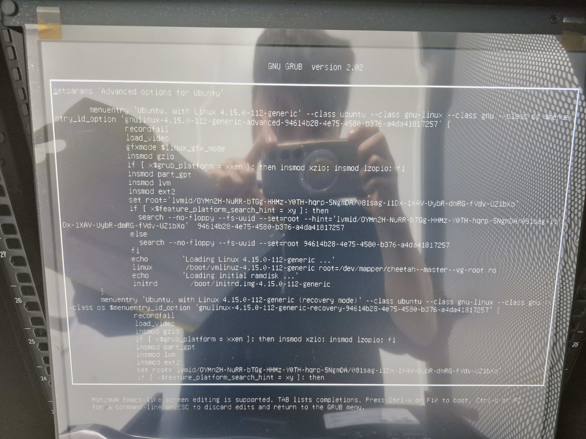
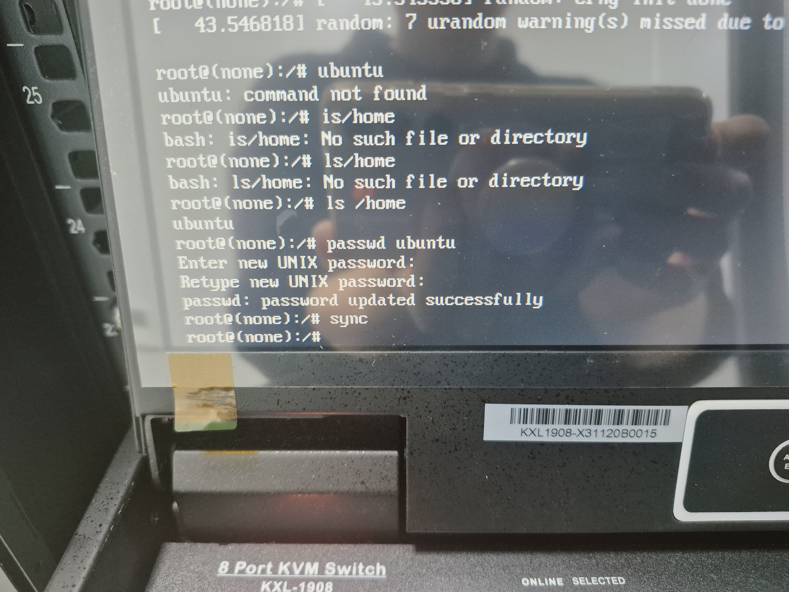

# 🛡️ [Part 1] OS 루트 권한 복구 및 패스워드 초기화

> 담당 교수님 승인 하에 물리 접근 권한으로 복구를 진행한 작업입니다.

## 1. 개요

| 항목          | 내용                                                                        |
| ------------- | --------------------------------------------------------------------------- |
| **목적**      | 관리자 부재 및 인증 정보 유실로 접근 불가능한 GPU 서버의 물리적 제어권 회복 |
| **대상**      | Master(HPE), v100dgx(DGX Station), 2080Ti 노드(Supermicro), NAS 장비        |
| **핵심 전략** | 데이터 보존을 위해 포맷 대신 GRUB 단일 사용자 모드로 루트 쉘 진입    |

---

## 2. 문제 현상

모든 서버의 인증 정보(패스워드)가 완전히 유실된 상태. 로그인 화면은 뜨지만 어떤 계정으로도 접속 불가. 기존 CUDA, Docker 등 연구 자료 보존이 필수적이므로 포맷은 불가.

---

## 3. 원인 분석

인증 정보 자체가 유실된 것이므로 소프트웨어적 복구 방법이 없음. OS 부팅 과정에 직접 개입하여 초기화 데몬 실행 전에 루트 쉘을 획득하는 방식으로 접근.

---

## 4. 해결 과정

### 4.1 마스터 노드 (HPE) 및 DGX Station

GRUB 메뉴에 진입하여 커널 파라미터를 수정, 읽기 전용 마운트를 읽기/쓰기로 전환하고 초기화 데몬 대신 `bash`를 직접 실행하여 루트 쉘에 진입.

1. 재부팅 시 `Shift` 또는 `ESC` 키 연타 → GRUB 메뉴 진입
2. 커널 편집 모드(`e`)에서 파라미터 수정
3. `ro quiet splash` → `rw init=/bin/bash` 로 변경
4. 루트 쉘 진입 후 패스워드 재설정 및 재부팅

**🛠️ 사용 명령어:**

```bash
# GRUB 편집 화면에서 linux 커널 라인 수정
# 수정 전: ... root=/dev/mapper/vg-root ro quiet splash
# 수정 후: ... root=/dev/mapper/vg-root rw init=/bin/bash

# 루트 쉘(root#) 진입 후 실행
mount -o remount,rw /  # 파일 시스템 쓰기 권한 재확인
ls /home               # 실제 존재하는 사용자 계정 확인
passwd ubuntu          # 확인된 계정의 비밀번호 재설정
sync                   # 변경된 정보를 디스크에 강제 기록
reboot -f              # 시스템 강제 재부팅
```




---

### 4.2 Supermicro 서버 및 NAS 장비

부팅 속도가 빠르거나 UEFI 환경 특성상 `Shift/ESC` 연타만으로는 GRUB 메뉴 진입이 되지 않음. 부팅 장치 선택 메뉴(Boot Menu)를 경유하여 강제로 부팅 흐름을 끊는 방식으로 우회.

1. 기동 시 `F11` → Boot Menu 진입
2. (NAS의 경우) OS가 설치된 PCI RAID Adapter 선택
3. `Enter`를 누르는 동시에 `ESC` 키를 0.5초 간격으로 연타 → GRUB 진입
4. 이후 과정은 4.1과 동일

**🛠️ 사용 명령어:**

```bash
# 커널 파라미터 수정 및 패스워드 초기화 (4.1과 동일)
# rw init=/bin/bash → passwd → sync → reboot -f
```

---

## 5. 결과

- 전체 서버(HPE, DGX, Supermicro 3대, NAS) 루트 권한 복구 완료
- 기존 데이터 손상 없이 계정 패스워드 재설정 성공
- 이후 K8s 복구 작업(Part 2) 진행 가능 상태로 전환

```

```
