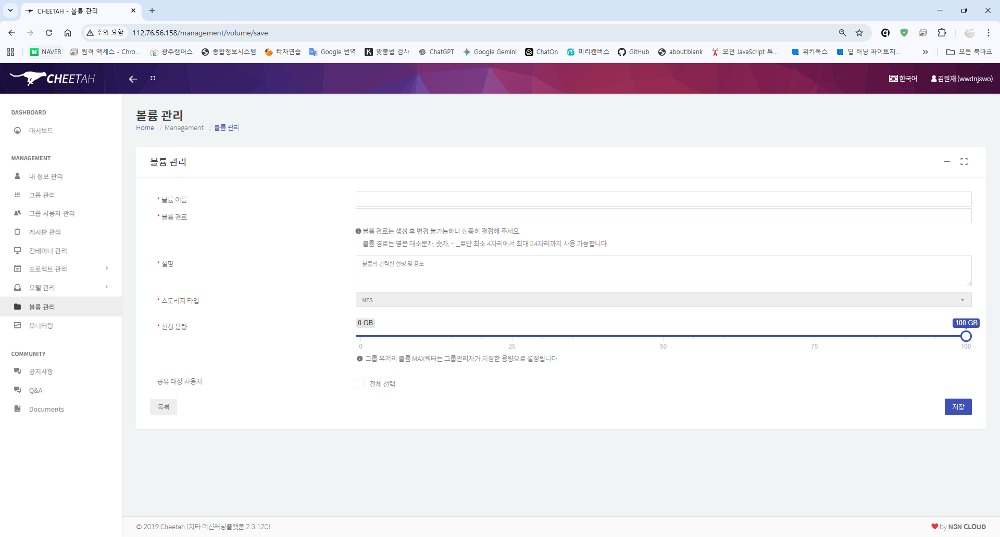

# 🛡️ [NAS 복구 2] NFS 연결 복구 및 K8s PV/PVC 재등록

---

## 1. 개요

| 항목          | 내용                                                                                                               |
| ------------- | ------------------------------------------------------------------------------------------------------------------ |
| **목적**      | RAID 재구성 후 단절된 NAS ↔ K8s 마스터 간 NFS 연결 복구 및 Cheetah 대시보드 정상화                                 |
| **대상**      | Master Node(`cheetah-master`, ()), Storage Node(`nas-cheetah-1`, (control-plane-public-ip) / (storage-backend-ip)) |
| **핵심 전략** | NFS 공유 재활성화 → fstab 영구 마운트 → 소실된 PV/PVC 수동 재등록                                                  |

---

## 2. 문제 현상

- Cheetah 대시보드 볼륨 관리 메뉴에서 용량이 `NaN GB`로 표기, 볼륨 생성 및 업로드 불가
- `kubectl get pv,pvc` 조회 시 `No resources found` — 실제 NAS 데이터는 존재하나 K8s 메타데이터 소실
- `nfs-client-provisioner` 파드 로그에서 `mkdir /persistentvolumes: file exists` 에러 반복

---

## 3. 원인 분석

| 원인                    | 내용                                                                        |
| ----------------------- | --------------------------------------------------------------------------- |
| **NFS 연결 단절**       | NAS RAID 재포맷 후 기존 마운트 세션 파괴 → 마스터 서버가 스토리지 경로 상실 |
| **K8s 메타데이터 소실** | etcd 내 PV/PVC 정보와 실제 NAS 데이터 폴더 간 동기화 정보 유실              |
| **Cheetah UI 버그**     | 볼륨 크기 파싱 시 1,000Gi 이상 입력 시 데이터 타입 오류(`NaN`) 발생         |

---

## 4. 해결 과정

### 4.1 NAS 서버 — NFS 공유 재활성화

마스터 서버가 NAS 데이터를 읽고 쓸 수 있도록 NFS 공유 설정을 열어주는 작업.

**🛠️ 사용 명령어:**

```bash
# /etc/exports 파일에 공유 경로 추가
# (vi 편집: G → o → 내용 입력 → Esc → :wq!)
# 추가 내용:
# /data (storage-backend-ip)/24(rw,sync,no_root_squash,no_subtree_check)

sudo chmod -R 777 /data           # 복구 단계 임시 쓰기 권한 허용
sudo exportfs -ra                 # 설정 파일 즉시 반영
sudo systemctl restart nfs-kernel-server
```

> 주의: `777` 권한은 복구 단계 한정. 운영 안정화 후 적절한 UID/GID 권한으로 회수 필요.

---

### 4.2 마스터 서버 — NFS 영구 마운트 설정

재부팅 후에도 NAS 연결이 유지되도록 fstab에 등록.

**🛠️ 사용 명령어:**

```bash
sudo mkdir -p /data
echo "(storage-backend-ip):/data /data nfs defaults 0 0" | sudo tee -a /etc/fstab
sudo mount -a                     # 즉시 적용
```

> 공인 IP 대신 내부 전용망 IP(10.x.x.x)를 사용해야 대역폭과 보안이 모두 확보된다.

---

### 4.3 마스터 서버 — 소실된 PV/PVC 수동 재등록

K8s etcd에서 사라진 볼륨 메타데이터를 YAML로 직접 재등록.

**🛠️ 사용 명령어:**

```bash
kubectl apply -f recovery-pv.yaml
```

```yaml
apiVersion: v1
kind: PersistentVolume
metadata:
  name: pv-recovery-aymdur
spec:
  capacity:
    storage: 999Gi
  accessModes: [ReadWriteMany]
  nfs:
    server: (storage-backend-ip)
    path: /data/cheetah-volume-aymdur-pvc-xxxx # NAS 실제 폴더명 매칭
  storageClassName: nfs-storageclass
  persistentVolumeReclaimPolicy: Retain
---
apiVersion: v1
kind: PersistentVolumeClaim
metadata:
  name: pvc-recovery-aymdur
  namespace: cheetah
spec:
  accessModes: [ReadWriteMany]
  resources:
    requests:
      storage: 999Gi
  storageClassName: nfs-storageclass
  volumeName: pv-recovery-aymdur
```

> 용량을 999Gi로 설정한 이유: Cheetah UI의 1,000Gi 이상 입력 시 `NaN` 파싱 버그 회피.

---

### 4.4 프로비저너 재시작

꼬인 연결 상태를 초기화하기 위해 파드 재시작.

**🛠️ 사용 명령어:**

```bash
kubectl delete pod -n cheetah -l app=nfs-client-provisioner
```

---

## 5. 결과

| 항목            | 결과                                              |
| --------------- | ------------------------------------------------- |
| **대시보드**    | `NaN` 표기 해소, 볼륨 상태 '사용 가능'으로 전환   |
| **데이터 접근** | 웹 UI 파일 탐색기 업로드/다운로드 정상 작동       |
| **스토리지**    | `/data` 영역 약 27.3TB 마운트 완료 (`df -h` 확인) |



---

## 6. 핵심 인사이트

- **진단 우선순위** — `NaN` 오류 발생 시 UI 버그보다 `kubectl logs nfs-client-provisioner`로 NFS 연결 상태를 먼저 확인하는 것이 효율적이다.
- **내부망 IP 사용** — NFS 마운트는 공인 IP 대신 내부 전용망(10.x.x.x)으로 구성해야 대역폭 안정성과 보안을 동시에 확보할 수 있다.
- **설정 파일 백업 습관** — 수정 전 `sudo cp /etc/exports /etc/exports.bak` 같은 백업이 응급 상황에서 복구 시간을 크게 단축시킨다.
- **권한 회수 계획** — 복구 단계에서 사용한 `777` 권한은 서비스 정상화 후 반드시 UID/GID 기반 권한으로 회수해야 한다.
