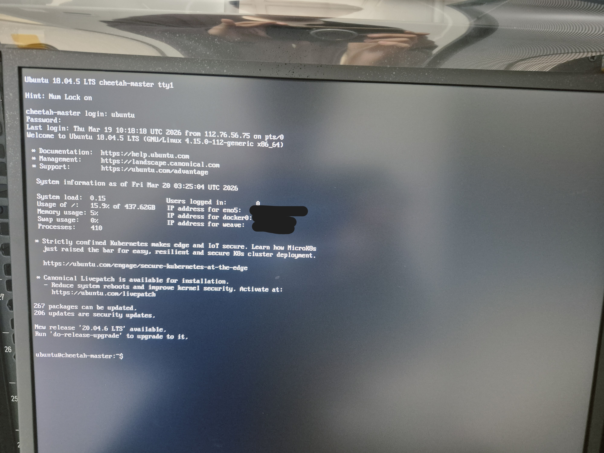
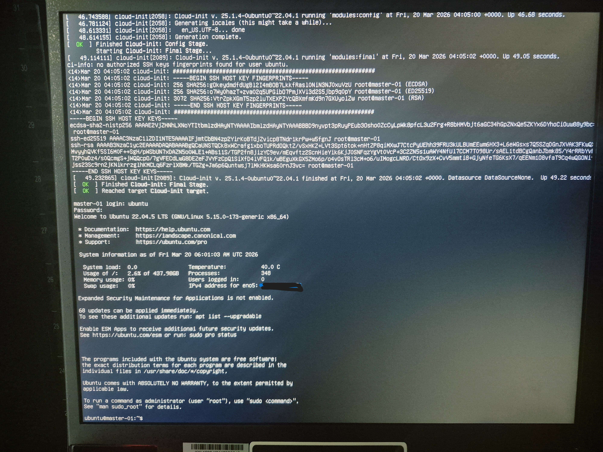

# Ubuntu 22.04 OS 재설치 및 마스터 노드 초기 구성

> **작업 일자:** 2026-03-20
> **대상 장비:** HPE ProLiant DL360 Gen10 (master-01)
> **목적:** 레거시 시스템 제거 후 Kubernetes 클러스터 마스터 노드로 재구성



---

## 1. 작업 개요

노후화된 레거시 CHEETAH 시스템을 완전히 제거하고,
최신 GPU 워크로드를 처리할 수 있는 Ubuntu 22.04 LTS 기반 마스터 노드를 새로 구축했습니다.

| 항목          | 내용                         |
| ------------- | ---------------------------- |
| **OS**        | Ubuntu 22.04.5 LTS           |
| **대상 장비** | HPE ProLiant DL360 Gen10     |
| **IP**        | MASTER_IP    |
| **핵심 결정** | LVM 제거 → 디스크 I/O 최적화 |

---

## 2. 주요 의사결정

### LVM 제거 이유

Ubuntu 기본 설치 시 LVM(Logical Volume Manager)이 자동으로 구성됩니다.
LVM은 유연한 파티션 관리가 가능하지만, AI 학습 워크로드 환경에서는 불필요한 추상화 레이어가 됩니다.

**결정:** LVM 없이 전체 디스크를 `/` 파티션에 직접 할당.

- 대상: 447.1GB SSD
- 결과: 약 446GB 단일 파티션 → 파일시스템 구조 단순화 및 I/O 오버헤드 제거

---

### 고정 IP 수동 할당 이유

DHCP로 IP가 변경되면 K8s 클러스터 내부 통신이 끊어집니다.
클러스터 구성 요소들이 마스터 노드의 IP를 고정값으로 참조하기 때문에,
반드시 Static IP로 설정해야 합니다.

```yaml
# /etc/netplan/50-cloud-init.yaml
network:
  version: 2
  ethernets:
    eno5:
      addresses:
        - MASTER_IP/24
      nameservers:
        addresses: [164.124.101.2, 203.248.252.2]
      routes:
        - to: default
          via: GATEWAY_IP
```

---

### Secure Boot 비활성화 이유

NVIDIA GPU 드라이버 및 커널 모듈이 Secure Boot 환경에서 서명 검증에 실패할 수 있습니다.
GPU Operator 설치 전 단계에서 미리 비활성화했습니다.

---

## 3. 설치 진행

### 부팅 미디어 준비

- **도구:** Rufus 4.1
- **파티션 방식:** MBR (BIOS/UEFI 호환)
- **Secure Boot:** BIOS에서 비활성화 후 진행

### 설치 후 체크리스트

```bash
# OS 버전 확인
cat /etc/os-release

# 고정 IP 할당 확인
ip a

# 디스크 파티션 확인 (LVM 없이 단일 파티션)
df -hT

# 외부 인터넷 연결 확인
ping -c 3 8.8.8.8
```

---

## 4. SSH 접속 환경 구성

물리적 접근 없이 모든 노드를 원격으로 관리하기 위해 OpenSSH를 활성화했습니다.

```bash
# 설치 시 OpenSSH server 활성화 선택
# Password authentication 허용 (초기 구성 단계)
```

```powershell
# Windows에서 접속
ssh ubuntu@MASTER_IP

# OS 재설치 후 SSH 지문 충돌 발생 시
ssh-keygen -R MASTER_IP
```

---

## 5. 작업 결과

- Ubuntu 22.04.5 LTS 클린 설치 완료
- LVM 없는 단일 파티션 구성 (446GB)
- 고정 IP 할당 (`MASTER_IP`)
- SSH 원격 접속 확인
- 다음 단계: Kubernetes 엔진(Containerd) 설치 진행


