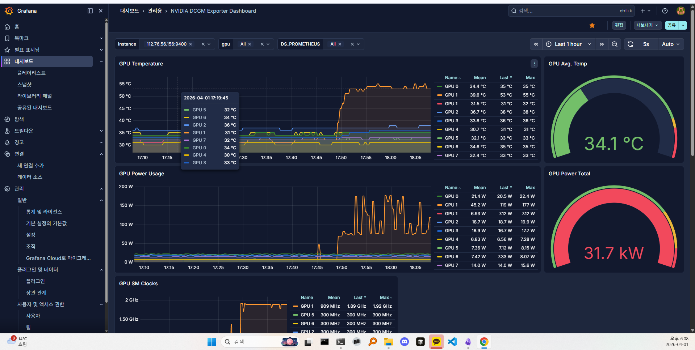
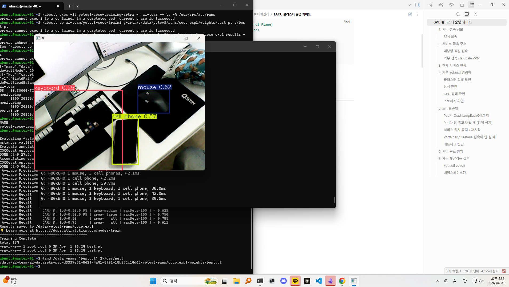

# YOLOv8 COCO 학습 및 웹캠 추론 테스트

## 🗂️ 1. 작업 개요

> **작업 일자:** 2026-04-01~02
> **작업 목적:** K8s Job 파이프라인을 활용해 YOLOv8 모델을 COCO 데이터셋으로 학습하고, 로컬 PC 웹캠으로 실시간 추론 동작을 검증한다.
> **대상 서버:** master-01, NAS 
> **작업 환경:** Kubernetes v1.29, NFS PVC, Anaconda (로컬 PC)
> **최종 결과:** mAP@0.5 46.8% 달성, 로컬 웹캠 실시간 Object Detection 동작 확인

---

## 🏗️ 2. 작업 흐름

```
[K8s Job 제출 → ai-team 네임스페이스]
        │ GPU 노드 자동 스케줄링
        ▼
[YOLOv8 학습 컨테이너]
        │ COCO 데이터셋 (NFS PVC 마운트)
        ▼
[NAS /data/ → best.pt 저장]
        │ scp 로컬 복사
        ▼
[로컬 PC Anaconda + ultralytics]
        │ 웹캠 스트림 입력
        ▼
[실시간 Object Detection 화면 출력]
```

---

## 🚀 3. Step 1 — K8s Job 학습 실행

### 3.1 Job 상태 확인

```bash
kubectl get jobs -n ai-team
```

**결과:**

```
NAME                   COMPLETIONS   DURATION   AGE
yolov8-coco-training   1/1           8h         22h
```

학습 소요 시간 **8시간**, 정상 완료(`1/1`).

### 3.2 학습 결과 로그 확인

```bash
kubectl logs job/yolov8-coco-training -n ai-team | tail -30
```

**최종 출력:**

```
Training Complete!
total 13M
-rw-r--r-- 1 root root 6.3M Apr  1 16:24 best.pt
-rw-r--r-- 1 root root 6.3M Apr  1 16:24 last.pt
```

---

## 📊 4. Step 2 — mAP 평가 결과

COCO val2017 기준 평가 결과:

| 지표             | 수치      |
| ---------------- | --------- |
| **mAP@0.5**      | **46.8%** |
| **mAP@0.5:0.95** | **32.6%** |
| mAP@0.75         | 35.6%     |
| AP (소형 객체)   | 15.5%     |
| AP (중형 객체)   | 35.8%     |
| AP (대형 객체)   | 46.2%     |
| AR@100           | 56.0%     |
| AR (소형)        | 31.8%     |
| AR (대형)        | 75.0%     |

> **해석:** YOLOv8n 첫 학습 기준으로 mAP@0.5 46.8%는 양호한 수치다. 소형 객체 AP(15.5%)가 낮은 것은 COCO 데이터셋 특성상 원거리 소형 객체가 많기 때문이며, VisDrone 데이터셋 학습 시 개선 여지가 있다.

---

## 💾 5. Step 3 — 모델 파일 로컬 복사

### 5.1 NAS 내 모델 경로 확인

```bash
# master-01에서 실행
find /data -name "best.pt" 2>/dev/null
```

**결과:**

```
/data/ai-team-ai-datasets-pvc-d3337e51-8621-4a41-8901-18b372c14d65/yolov8/runs/coco_exp1/weights/best.pt
```

NFS PVC 자동 생성 디렉토리 하위에 저장됨을 확인.

### 5.2 로컬 PC로 scp 복사

```bash
# 로컬 PC Anaconda Prompt에서 실행
scp ubuntu@(control-plane-public-ip):/data/ai-team-ai-datasets-pvc-d3337e51-8621-4a41-8901-18b372c14d65/yolov8/runs/coco_exp1/weights/best.pt C:\Users\wwdnj\Desktop\
```

`best.pt` (6.3MB) 바탕화면 복사 완료.

---

## 🖥️ 6. Step 4 — 로컬 웹캠 실시간 추론

### 6.1 ultralytics 설치

```bash
# Anaconda Prompt에서 실행
pip install ultralytics
```

### 6.2 웹캠 추론 실행

```bash
python -c "from ultralytics import YOLO; model = YOLO(r'C:\Users\wwdnj\Desktop\best.pt'); model.predict(source=0, show=True)"
```

| 항목        | 내용                         |
| ----------- | ---------------------------- |
| `source=0`  | 로컬 PC 웹캠 (기본 장치)     |
| `show=True` | 실시간 바운딩 박스 화면 출력 |
| 종료 방법   | `Q` 키                       |

### 6.3 추론 결과

추론 속도: **~40ms/frame** (실시간 동작 확인)

감지된 객체 예시:

- `keyboard 0.25`
- `mouse 0.62`
- `cell phone 0.57`

---

## ✅ 7. 최종 결과

| 항목              | 결과                                  |
| ----------------- | ------------------------------------- |
| K8s Job 학습 완료 | ✅ 8시간, COMPLETIONS 1/1             |
| mAP@0.5           | ✅ 46.8%                              |
| 모델 파일 저장    | ✅ NAS PVC `/weights/best.pt` (6.3MB) |
| 로컬 웹캠 추론    | ✅ 실시간 40ms/frame 동작 확인        |
|                   |                                       |





---

## 💡 8. 핵심 인사이트

**K8s Job → NAS → 로컬 추론 파이프라인 검증 완료** 클러스터에서 학습한 모델을 NFS PVC를 통해 저장하고, scp로 로컬에 가져와 즉시 추론에 활용하는 전체 파이프라인이 동작함을 확인했다. 학습 환경(K8s)과 추론 환경(로컬)이 분리된 실제 MLOps 흐름과 동일한 구조다.

**소형 객체 AP 한계 → VisDrone 학습으로 이어진다** COCO 기반 학습에서 소형 객체 AP가 15.5%로 낮게 나왔다. 드론 영상 특화 데이터셋인 VisDrone은 소형 객체 비율이 높기 때문에, 다음 단계 학습에서 이 수치를 끌어올리는 것이 핵심 목표다.

---

## 🚀 9. 다음 계획

- [x] YOLOv8 VisDrone 학습 Job 실행 (소형 객체 특화)
- [x] 학습 결과 mAP 비교 (COCO vs VisDrone)
- [ ] VisDrone 데이터셋 NAS 업로드 및 K8s Job 설계
- [ ] 모델 서빙 구조 설계 (K8s 위 추론 서버)
