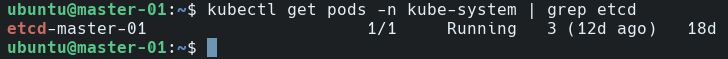
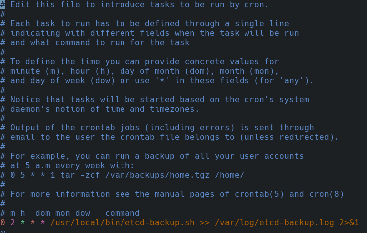

# etcd 정기 백업 및 DR 검증

> etcd는 K8s 클러스터의 모든 상태를 저장하는 핵심 데이터베이스입니다.
> etcd가 손상되면 클러스터 전체가 복구 불가 상태가 됩니다.
> 이 문서는 NAS 자동 백업 구성과 실제 스냅샷 복원 가능 여부 검증 과정을 기록합니다.

---

## 환경

| 항목        | 내용                                     |
| ----------- | ---------------------------------------- |
| 작업일      | 2026년 4월 13일                          |
| etcd 버전   | v3.5.16 (kubeadm v1.29 기본 설치)        |
| 백업 저장소 | NAS (`/data/backups/etcd/`) — 10GbE 연결 |
| 자동화 방식 | 호스트 crontab (매일 02:00)              |
| 보존 기간   | 7일 자동 삭제                            |

---

## 사전 환경 확인

### etcd Pod 및 인증서 경로 확인

```bash
kubectl get pods -n kube-system | grep etcd
```



```bash
kubectl describe pod etcd-master-01 -n kube-system | grep -E "listen-client|cert-file|key-file|trusted-ca"
```

### NAS 마운트 경로 확인

```bash
df -h | grep -v tmpfs
mount | grep nfs
```

```
LB_PUBLIC_IP:/data   28T  4.0G   26T   1% /data
LB_PUBLIC_IP:/data on /data type nfs4 (rw,relatime,vers=4.2 ...)
```

master-01에 `/data`로 NFS 마운트되어 있음을 확인. 백업 디렉토리 생성:

```bash
sudo mkdir -p /data/backups/etcd
```

---

## 왜 K8s CronJob이 아닌 호스트 crontab인가

etcd는 K8s의 Static Pod로 동작합니다. K8s 자체가 장애 상태일 때 CronJob도 함께 동작 불가합니다.
클러스터가 죽은 상황에서 백업이 필요하기 때문에, 백업 자동화는 **K8s에 의존하지 않는 호스트 crontab**으로 구성했습니다.

---

## Step 1: 수동 스냅샷 테스트

etcdctl이 호스트 PATH에 없어서 etcd 컨테이너 내부에서 직접 실행했습니다.

```bash
sudo crictl exec -it $(sudo crictl ps | grep etcd | awk '{print $1}') \
  etcdctl snapshot save /tmp/etcd-snapshot-test.db \
  --endpoints=https://127.0.0.1:2379 \
  --cacert=/etc/kubernetes/pki/etcd/ca.crt \
  --cert=/etc/kubernetes/pki/etcd/server.crt \
  --key=/etc/kubernetes/pki/etcd/server.key
```

**결과:** 74MB 스냅샷 1초 내 저장 성공

---

## Step 2: 백업 스크립트 구성

etcd 컨테이너는 distroless 이미지라 `cat`, `cp`, `rm` 등 기본 명령어가 없습니다.
컨테이너 내부 `/tmp`에 스냅샷을 저장한 뒤, 호스트에서 `/proc/{pid}/root` 경로로 직접 접근해 복사했습니다.

```bash
# /usr/local/bin/etcd-backup.sh
#!/bin/bash

BACKUP_DIR="/data/backups/etcd"
TIMESTAMP=$(date +%Y%m%d_%H%M%S)
SNAPSHOT_PATH="${BACKUP_DIR}/etcd-snapshot-${TIMESTAMP}.db"
RETAIN_DAYS=7

# etcd 컨테이너 ID
ETCD_CONTAINER=$(crictl --runtime-endpoint unix:///run/containerd/containerd.sock ps | grep etcd | awk '{print $1}')

# etcd 컨테이너 PID 획득
CONTAINER_PID=$(crictl --runtime-endpoint unix:///run/containerd/containerd.sock inspect ${ETCD_CONTAINER} | python3 -c "import sys,json; print(json.load(sys.stdin)['info']['pid'])")

# 스냅샷을 컨테이너 내부 /tmp에 저장
crictl --runtime-endpoint unix:///run/containerd/containerd.sock exec -i ${ETCD_CONTAINER} \
  etcdctl snapshot save /tmp/etcd-snapshot-${TIMESTAMP}.db \
  --endpoints=https://127.0.0.1:2379 \
  --cacert=/etc/kubernetes/pki/etcd/ca.crt \
  --cert=/etc/kubernetes/pki/etcd/server.crt \
  --key=/etc/kubernetes/pki/etcd/server.key

# 호스트에서 /proc/{pid}/root 경로로 직접 복사 (distroless 컨테이너 대응)
sudo cp /proc/${CONTAINER_PID}/root/tmp/etcd-snapshot-${TIMESTAMP}.db ${SNAPSHOT_PATH}

# 7일 이상 된 백업 자동 삭제
find ${BACKUP_DIR} -name "*.db" -mtime +${RETAIN_DAYS} -delete

echo "[$(date)] etcd snapshot saved: ${SNAPSHOT_PATH} ($(du -h ${SNAPSHOT_PATH} | cut -f1))"
```

```bash
sudo chmod +x /usr/local/bin/etcd-backup.sh
```

**핵심 트러블슈팅:** distroless 이미지는 쉘과 기본 유틸리티가 없어 `crictl exec cat` 방식이 실패합니다. `/proc/{pid}/root`를 통한 호스트 직접 접근으로 해결했습니다.

---

## Step 3: crontab 자동화 등록

```bash
sudo crontab -e
```



```bash
sudo touch /var/log/etcd-backup.log
sudo chmod 644 /var/log/etcd-backup.log
```

---

## Step 4: 스냅샷 무결성 검증 (DR 검증)

실제 restore를 수행하면 클러스터가 중단되므로, 스냅샷의 복원 가능 여부를 `snapshot status`로 검증했습니다.

```bash
SNAPSHOT=$(ls -t /data/backups/etcd/*.db | head -1)
ETCD_CONTAINER=$(sudo crictl --runtime-endpoint unix:///run/containerd/containerd.sock ps | grep etcd | awk '{print $1}')
CONTAINER_PID=$(sudo crictl --runtime-endpoint unix:///run/containerd/containerd.sock inspect ${ETCD_CONTAINER} | python3 -c "import sys,json; print(json.load(sys.stdin)['info']['pid'])")

sudo cp $SNAPSHOT /proc/${CONTAINER_PID}/root/tmp/verify.db

sudo crictl --runtime-endpoint unix:///run/containerd/containerd.sock exec -i ${ETCD_CONTAINER} \
  etcdctl snapshot status /tmp/verify.db \
  --write-out=table
```

**검증 결과:**

```
+----------+----------+------------+------------+
|   HASH   | REVISION | TOTAL KEYS | TOTAL SIZE |
+----------+----------+------------+------------+
| ac37ac53 |  7881825 |       3090 |      74 MB |
+----------+----------+------------+------------+
```

HASH, REVISION, TOTAL KEYS 모두 정상 — 복원 가능한 스냅샷임이 확인되었습니다.

---

## 실제 restore 절차 (참고용)

> ⚠️ 아래 절차는 클러스터 장애 시 참고용입니다. 운영 중 클러스터에서 실행하면 서비스가 중단됩니다.

```bash
# 1. etcd Static Pod 중지
sudo mv /etc/kubernetes/manifests/etcd.yaml /tmp/

# 2. 기존 etcd 데이터 백업
sudo mv /var/lib/etcd /var/lib/etcd.bak

# 3. 스냅샷 복원
sudo etcdutl snapshot restore /data/backups/etcd/etcd-snapshot-{TIMESTAMP}.db \
  --data-dir=/var/lib/etcd \
  --name=master-01 \
  --initial-cluster=master-01=https://LB_PUBLIC_IP:2380 \
  --initial-advertise-peer-urls=https://LB_PUBLIC_IP:2380

# 4. etcd 재시작
sudo mv /tmp/etcd.yaml /etc/kubernetes/manifests/

# 5. 클러스터 상태 확인
kubectl get nodes
```

---

## 결과 요약

| 항목        | 내용                                     |
| ----------- | ---------------------------------------- |
| 백업 위치   | `/data/backups/etcd/` (NAS 10GbE 마운트) |
| 자동 실행   | 매일 02:00 (호스트 crontab)              |
| 보존 기간   | 7일 자동 삭제                            |
| 스냅샷 크기 | 74MB                                     |
| 무결성 검증 | HASH/REVISION/KEYS 정상 확인 ✅          |
| 로그        | `/var/log/etcd-backup.log`               |

> **설계 원칙:** K8s가 죽어도 백업은 살아있어야 한다. etcd 백업은 K8s에 의존하지 않는 호스트 레벨에서 동작해야 한다.
