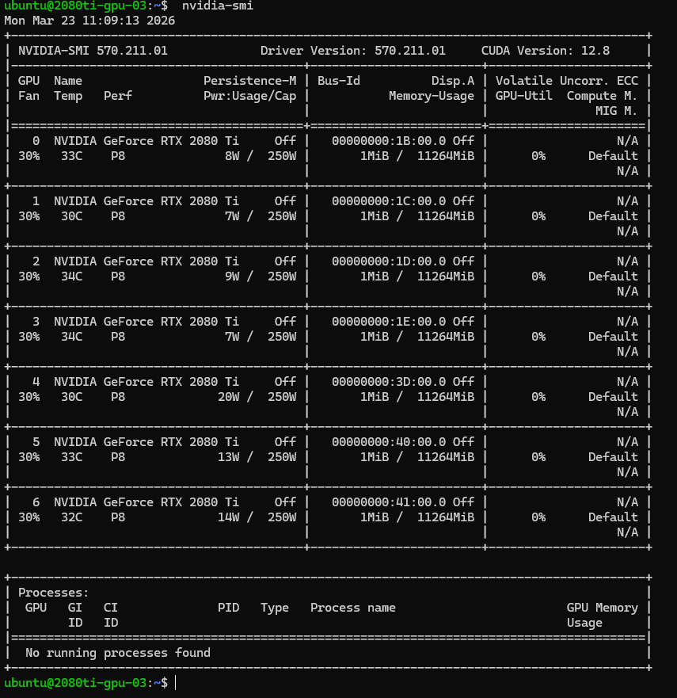

# 🛡️ [트러블슈팅] 2080Ti GPU 미인식 (2080ti-gpu-03)

> **작업 일자:** 2026-03-23~24
> **대상:** `2080ti-gpu-03` (Supermicro SYS-4029GP-TRT2, 2080Ti × 8)
> **환경:** Ubuntu 22.04 LTS, NVIDIA Driver 580.126.09
> **증상:** GPU 8장 중 1장이 PCI 레벨에서 미인식
> **결과:** PCIe 슬롯 불량으로 판단, 일정 우선으로 스킵 → **27장으로 클러스터 확정**

---

## 1. 개요

| 항목          | 내용                                                      |
| ------------- | --------------------------------------------------------- |
| **목적**      | 2080ti-gpu-03 노드 GPU 8장 중 1장 미인식 원인 진단         |
| **대상**      | `2080ti-gpu-03` (Supermicro SYS-4029GP-TRT2, 2080Ti × 8) |
| **핵심 전략** | PCI 레벨 진단 → 소프트웨어 문제 배제 → 하드웨어 불량 확인 → 27장으로 클러스터 확정 |

---

## 2. 문제 현상

GPU Operator 설치 전 각 노드의 GPU 인식 상태를 점검하던 중,
`2080ti-gpu-03`에서 `nvidia-smi` 실행 시 **7장만 표시**되는 것을 발견했습니다.



---

## 3. 원인 분석

### 3-1. 진단 과정

#### Step 1 — PCI 레벨에서 물리 인식 확인

OS 드라이버가 아닌 하드웨어 레벨에서 GPU가 몇 장 감지되는지 확인했습니다.

```bash
lspci | grep -i vga | grep -i nvidia
```

**결과:**

```
1b:00.0 VGA compatible controller: NVIDIA Corporation TU102 [GeForce RTX 2080 Ti] (rev a1)
1c:00.0 VGA compatible controller: NVIDIA Corporation TU102 [GeForce RTX 2080 Ti Rev. A] (rev a1)
1d:00.0 VGA compatible controller: NVIDIA Corporation TU102 [GeForce RTX 2080 Ti] (rev a1)
1e:00.0 VGA compatible controller: NVIDIA Corporation TU102 [GeForce RTX 2080 Ti Rev. A] (rev a1)
3d:00.0 VGA compatible controller: NVIDIA Corporation TU102 [GeForce RTX 2080 Ti] (rev a1)
40:00.0 VGA compatible controller: NVIDIA Corporation TU102 [GeForce RTX 2080 Ti] (rev a1)
41:00.0 VGA compatible controller: NVIDIA Corporation TU102 [GeForce RTX 2080 Ti] (rev a1)
```

→ **PCI 레벨에서도 7장만 감지.** 드라이버 문제가 아닌 하드웨어 문제로 범위 좁힘.

---

#### Step 2 — nvidia-smi 확인

```bash
nvidia-smi
```

**결과 (2026-03-23 15:42:14 기준):**

```
+-----------------------------------------------------------------------------------------+
| NVIDIA-SMI 580.126.09   Driver Version: 580.126.09   CUDA Version: 13.0               |
+-----------------------------------------+------------------------+----------------------+
|   0  NVIDIA GeForce RTX 2080 Ti     Off |   00000000:1B:00.0 Off |                  N/A |
|   1  NVIDIA GeForce RTX 2080 Ti     Off |   00000000:1C:00.0 Off |                  N/A |
|   2  NVIDIA GeForce RTX 2080 Ti     Off |   00000000:1D:00.0 Off |                  N/A |
|   3  NVIDIA GeForce RTX 2080 Ti     Off |   00000000:1E:00.0 Off |                  N/A |
|   4  NVIDIA GeForce RTX 2080 Ti     Off |   00000000:3D:00.0 Off |                  N/A |
|   5  NVIDIA GeForce RTX 2080 Ti     Off |   00000000:40:00.0 Off |                  N/A |
|   6  NVIDIA GeForce RTX 2080 Ti     Off |   00000000:41:00.0 Off |                  N/A |
+-----------------------------------------------------------------------------------------+
```

→ GPU 0~6, **총 7장만 인식.** 8번째 슬롯의 카드가 시스템에 존재하지 않음.

---

#### Step 3 — 커널 드라이버 로드 상태 확인

```bash
sudo dmesg -T | grep -i NVRM
```

**결과:**

```
[Mon Mar 23 15:20:24 2026] NVRM: loading NVIDIA UNIX x86_64 Kernel Module 580.126.09
```

→ 드라이버 자체는 정상 로드됨. **8번째 카드만 하드웨어 레벨에서 감지 안 됨.**

---

## 4. 해결 과정

### 4-1. 물리 점검

서버 커버를 열고 직접 확인 및 조치를 시도했습니다.

| 시도                      | 내용                         | 결과                          |
| ------------------------- | ---------------------------- | ----------------------------- |
| 8핀 전원 케이블 위치 변경 | 다른 케이블 포트로 교체      | 변화 없음 — 여전히 7장만 인식 |
| PCIe 슬롯 변경            | 다른 슬롯으로 카드 이동 필요 | **시간 지체 우려로 스킵**     |

**케이블 교체 후에도 `lspci` 결과 동일** → 전원 문제가 아닌 **PCIe 슬롯 또는 카드 자체 불량** 가능성 높음.


---

## 5. 결과

### 5-1. 최종 판단 — 27장으로 클러스터 확정

PCIe 슬롯 변경까지 진행하면 최종 고장 여부를 판단할 수 있지만,
GPU Operator 및 모니터링 구축 일정을 고려했을 때 **시간 대비 효율이 낮다**고 판단했습니다.

> "완벽한 28장보다 지금 동작하는 27장이 더 가치 있다."

- **현재:** 27장으로 클러스터 구성 확정 및 운영
- **추후:** 정기 점검 시 PCIe 슬롯 교체 후 최종 고장 판단 예정

---

### 5-2. 최종 GPU 구성

| 노드          | 인식 GPU       | 비고                             |
| ------------- | -------------- | -------------------------------- |
| v100-gpu-01   | V100 × 4       | 정상                             |
| 2080ti-gpu-02 | 2080Ti × 8     | 정상                             |
| 2080ti-gpu-03 | 2080Ti × **7** | 1장 미인식 (PCIe 슬롯 점검 필요) |
| 2080ti-gpu-04 | 2080Ti × 8     | 정상                             |
| **합계**      | **27장**       |                                  |

---

## 6. 핵심 인사이트

**"멈출 줄 아는 것도 판단이다"**

케이블 교체까지 시도했지만 변화가 없었고, 다음 단계인 PCIe 슬롯 교체는
추가적인 서버 분해와 검증 시간이 필요한 작업이었습니다.

전체 클러스터 구축 일정과 비교했을 때, 카드 1장을 위해 전체 일정을 지연시키는 것보다
27장으로 먼저 완성하고 추후 점검하는 것이 합리적인 선택이었습니다.

완벽함을 추구하다 아무것도 완성하지 못하는 것보다,
동작하는 시스템을 먼저 만드는 것이 엔지니어링의 현실적인 판단입니다.
