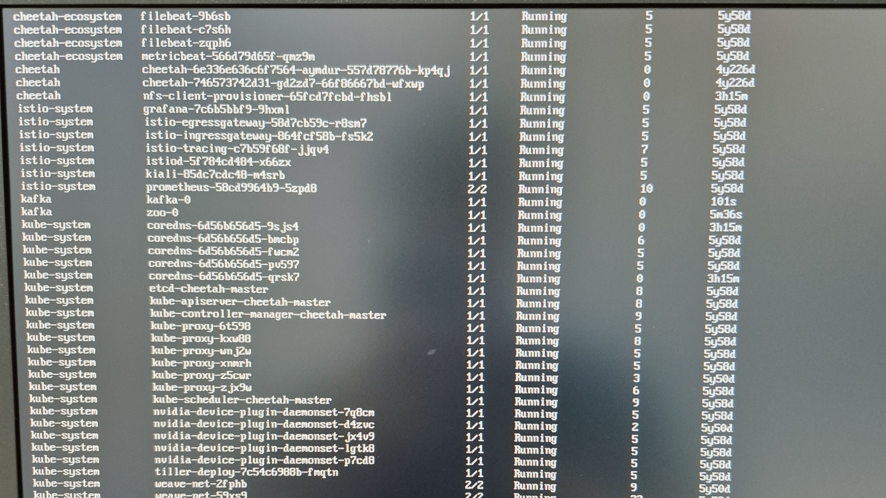

# 🛡️ [Part 4] Web Server 및 Kafka/Zookeeper 연동 이슈

---

## 1. 개요

| 항목          | 내용                                                                                 |
| ------------- | ------------------------------------------------------------------------------------ |
| **목적**      | `Running` 상태임에도 응답 없는 Web 서버 복구 및 Kafka 연동 정상화                    |
| **대상**      | `cheetah-ecosystem` 네임스페이스의 cheetah-web, kafka 네임스페이스의 Zookeeper/Kafka |
| **핵심 전략** | 연쇄 의존성 장애를 추적하여 최하위 원인(Zookeeper)부터 순서대로 복구                 |

---

## 2. 문제 현상

- `cheetah-web` 포드가 `1/1 Running` 상태임에도 실제 서비스 접속 불가
- 서버 내부 `curl -I http://localhost:31969` 호출 시 응답 없음

---

## 3. 원인 분석

Web 서버 로그에서 `Timeout expired while fetching topic metadata` 발견. Web 서버가 기동 시 Kafka와 통신을 시도하다 타임아웃으로 백그라운드 실행이 멈춘 '좀비 상태'였음.

Kafka 의존성 체인을 추적한 결과:

```text
Zookeeper (OOMKill) → Kafka 미기동 → Web 서버 좀비 상태
```

| 포드          | 상태                    | 원인                                  |
| ------------- | ----------------------- | ------------------------------------- |
| `zoo-0`       | `Init:CrashLoopBackOff` | 메모리 120Mi → OOMKill                |
| `kafka-0`     | `CrashLoopBackOff`      | Zookeeper 미기동으로 연결 실패        |
| `cheetah-web` | Running (좀비)          | Kafka 타임아웃으로 내부 프로세스 중단 |

**🛠️ 사용 명령어 (진단):**

```bash
kubectl logs -n cheetah-ecosystem [Web-Pod-Name] | grep -iE "listen|start"
kubectl get pods -A | grep -iE "kafka|zookeeper"
kubectl describe pod zoo-0 -n kafka  # Exit Code: 255, OOMKilling 확인
```

---

## 4. 해결 과정

### 4.1 Zookeeper 메모리 증설 (1Gi)

**🛠️ 사용 명령어:**

```bash
kubectl patch statefulset zoo -n kafka \
  --type='json' \
  -p='[{"op": "replace", "path": "/spec/template/spec/containers/0/resources", "value": {"limits": {"cpu": "500m", "memory": "1Gi"}, "requests": {"cpu": "250m", "memory": "512Mi"}}}]'
```

---

### 4.2 Kafka 메모리 증설 (2Gi)

Zookeeper 정상화 후, Kafka도 동일한 문제 재발 방지를 위해 사전 증설.

**🛠️ 사용 명령어:**

```bash
kubectl patch statefulset kafka -n kafka \
  --type='json' \
  -p='[{"op": "replace", "path": "/spec/template/spec/containers/0/resources", "value": {"limits": {"cpu": "1", "memory": "2Gi"}, "requests": {"cpu": "500m", "memory": "1Gi"}}}]'
```

---

### 4.3 Web 포드 재시작

Zookeeper, Kafka 모두 `Running` 확인 후 Web 서버가 정상 핸드셰이크를 재시도하도록 재시작.

**🛠️ 사용 명령어:**

```bash
kubectl rollout restart deployment/cheetah-web -n cheetah-ecosystem
```

---

## 5. 결과

- Zookeeper, Kafka 포드 전체 `Running` 상태 진입
- `cheetah-web` Kafka 정상 연동 및 내부 `curl` 테스트 성공
- UI 대시보드 접속 기능 복구 완료


