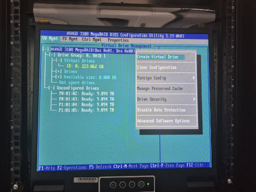
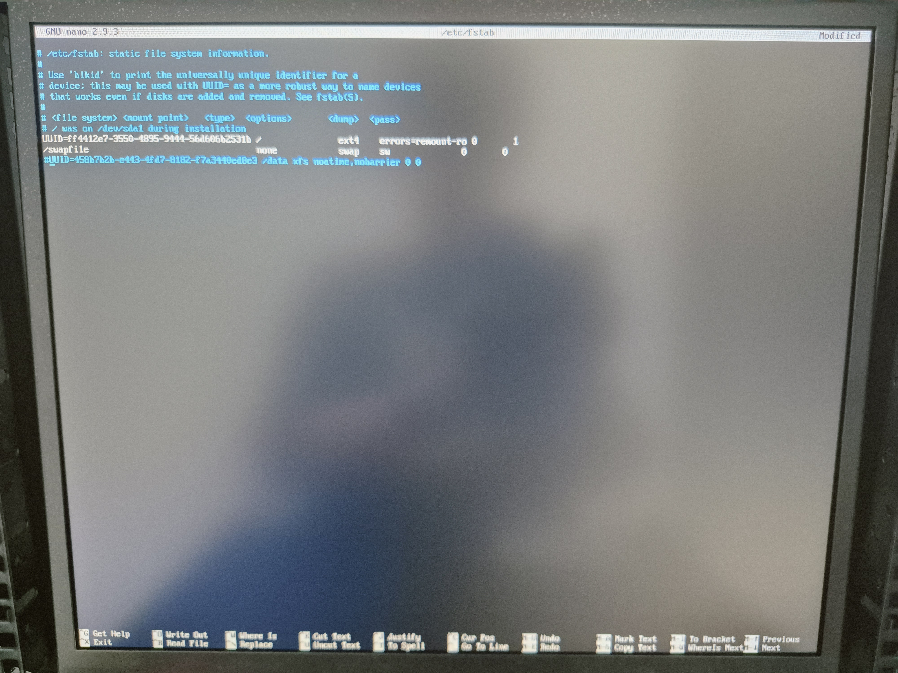

# 🛡️ [NAS 복구 1] RAID 드라이브 장애 해결 및 27TB 스토리지 정상화

---

## 1. 개요

| 항목              | 내용                                                                      |
| ----------------- | ------------------------------------------------------------------------- |
| **목적**          | 드라이브 장애로 부팅 불가 상태의 NAS RAID 재구성 및 27TB 데이터 영역 복구 |
| **대상**          | `nas-cheetah-1` (Ubuntu 20.04 LTS 기반 스토리지 서버)                     |
| **구성**          | OS 영역: SSD 2개 RAID 1 / 데이터 영역: 10TB HDD 4개 RAID 5                |
| **RAID 컨트롤러** | AVAGO 3108 MegaRAID (LSI/Broadcom 계열 하드웨어 RAID 카드)                |
| **접속 환경**     | 서버실 직접 방문, KVM 스위치(KXL-1908) 콘솔 접속                          |

---

## 2. 문제 현상

- 서버 전면 드라이브 베이 **0번 슬롯 빨간 LED** 점등
- 부팅 시 "Logical Drive Failed" / "Degraded" 메시지 출력, 정상 부팅 실패
- `/data` 마운트 지점(28TB 볼륨) 소실 → AI 플랫폼 서비스 가동 중단


---

## 3. 원인 분석

| 원인          | 내용                                                                                                                                                                              |
| ------------- | --------------------------------------------------------------------------------------------------------------------------------------------------------------------------------- |
| **직접 원인** | 0번 SSD에 I/O 오류 발생 → 컨트롤러가 물리 고장(`Unconfigured Bad`)으로 판단 → 부팅 드라이브 세션 파괴                                                                             |
| **간접 원인** | RAID 재구성 과정에서 컨트롤러가 데이터용 HDD(10TB)를 OS 미러링 복구용으로 무단 점유 → `Rebuild` 상태로 전환 → 신규 RAID 구성 목록에서 HDD가 사라지는 "두더지 잡기" 무한 루프 발생 |

MegaRAID BIOS `PD Mgmt` 탭에서 드라이브 상태가 `Online`이 아닌 `UB`, `Rebuild`, `Foreign` 등으로 혼재됨을 확인.

---

## 4. 해결 과정

### 4.1 데이터 무결성 확인 및 긴급 아카이빙

작업 중 데이터 유실에 대비하여 현재 `/data` 상태를 먼저 분석.

**🛠️ 사용 명령어:**

```bash
df -h                                              # 전체 마운트 상태 확인
sudo du -ah /data --max-depth=2 | sort -rh | head -n 20  # 데이터 폴더 구조 분석
tar -cvzf ~/data_backup.tar.gz /data              # 중요 설정 및 K8s PV 데이터 백업
```

실제 데이터는 약 89MB(K8s 볼륨 캐시 및 설정 파일)로 소량 확인. 유실 위험도가 낮아 즉시 RAID 재구성 진행.

---

### 4.2 MegaRAID BIOS 진입 및 진단

서버 리부팅 중 POST 화면에서 `Ctrl + R` 입력 → `AVAGO 3108 MegaRAID BIOS Configuration Utility` 진입.

- 0번 SSD: `Unconfigured Bad` 상태
- 데이터용 HDD 4개 중 1개: `Rebuild` 중

BIOS 조작 단축키: `Ctrl+N` (다음 탭), `Ctrl+P` (이전 탭), `F2` (작업 메뉴), `Space` (드라이브 선택)

---

### 4.3 RAID 물리 구성 초기화 및 드라이브 해방

1. `PD Mgmt` → 0번 SSD 선택 → `F2` → **Make Unconfigured Good** (낙인 제거)
2. `Foreign Config` 메뉴 → **Clear** (이전 RAID 잔류 정보 소거)
3. `Rebuild` 중인 10TB HDD 선택 → `F2` → **Stop Rebuild** → `Make UG` (자유 상태로 복구)
4. `VD Mgmt` → `Drive Group 1`(데이터용) → **Delete Virtual Drive** (기존 볼륨 완전 삭제)


---

### 4.4 OS 미러링 복구 및 데이터 RAID 재생성

1. 0번 SSD를 **Global Hot Spare**로 지정 → 1번 SSD와 RAID 1 미러링 자동 복구 (전면 빨간 LED 소등)
2. `VD Mgmt` → 컨트롤러 선택 → `F2` → **Create Virtual Drive**
3. 10TB HDD 4개 모두 선택 → RAID Level 5 → **Fast Initialization** 체크 → 생성



---

### 4.5 Emergency Mode 탈출 및 파일 시스템 구축

RAID 변경으로 UUID가 바뀌어 부팅 중단(`Emergency Mode`) 발생.

**🛠️ 사용 명령어:**

```bash
# Emergency Mode에서 fstab 수정
nano /etc/fstab
# /data 마운트 라인 앞에 '#' 주석 처리 후 저장(Ctrl+O, Ctrl+X) → 재부팅

# 신규 파티셔닝 (GPT — 2TB 초과 볼륨 필수)
sudo parted /dev/sdb mklabel gpt
sudo parted /dev/sdb mkpart primary ext4 0% 100%

# ext4 포맷
sudo mkfs.ext4 /dev/sdb1

# 새 UUID 확인 후 fstab 영구 등록
lsblk -f
# 확인한 UUID를 /etc/fstab에 다시 등록
```



---

## 5. 결과

| 항목              | 결과                                                  |
| ----------------- | ----------------------------------------------------- |
| **하드웨어 상태** | 전체 드라이브 베이 녹색 LED 점등, RAID 상태 `Optimal` |
| **운영체제**      | Emergency Mode 탈출, 일반 계정 정상 로그인            |
| **저장 공간**     | `/data` 영역 약 27.3TB 정상 마운트 완료               |

---

## 6. 핵심 인사이트

- **컨트롤러 오작동 패턴 인식** — OS 미러링이 깨지면 컨트롤러는 인근 HDD를 무단 점유해 복구를 시도한다. 이때 0번 SSD를 Hot Spare로 먼저 지정해 컨트롤러에게 정답 경로를 알려줘야 데이터용 HDD가 풀린다.
- **UUID 변경 인지** — RAID를 새로 구성하면 디바이스명이 같아도 UUID가 바뀐다. 부팅 실패 시 `/etc/fstab` 주석 처리가 최우선 조치다.
- **GPT 파티셔닝 필수** — MBR 방식은 2TB 상한이 있다. 대용량 볼륨은 반드시 `mklabel gpt`로 시작해야 한다.
