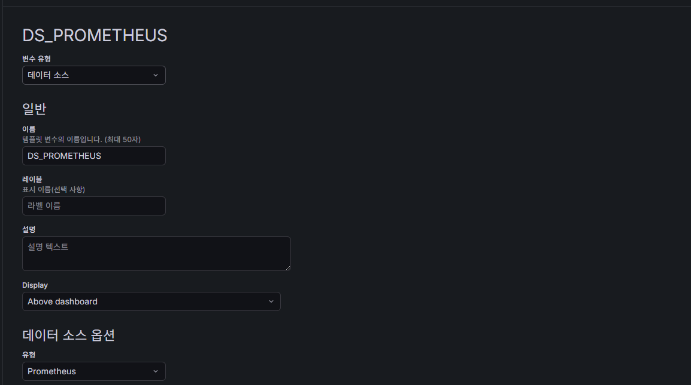
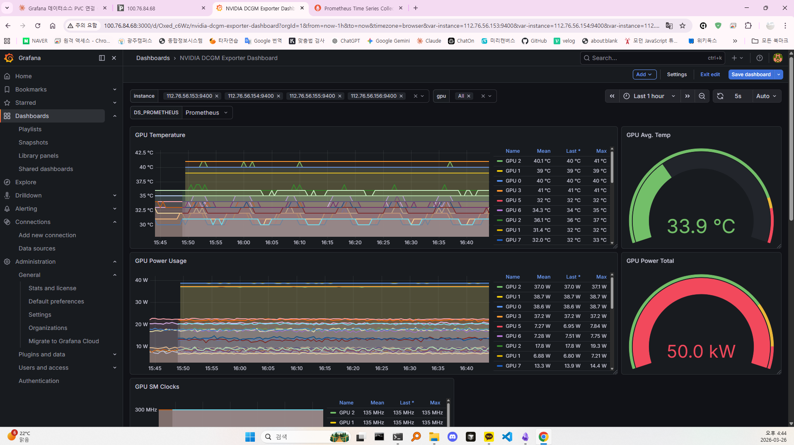

# 🖥️ GPU 클러스터 완전 구축 가이드

> **작업 일자:** 2026-03-23 ~ 27
> **작업 환경:** 폴리텍 대학 학과 전용 GPU 클러스터 (외부 공개 불가)
> **목적:** Ubuntu OS 설치 이후 K8s 기반 GPU 클러스터 완전 구축
> **최종 상태:** K8s + GPU Operator + NFS 10G + Portainer + Grafana + Prometheus + Tailscale

---

## 📋 클러스터 구성

| 노드          | 역할          | GPU        |
| ------------- | ------------- | ---------- |
| master-01     | control-plane | -          |
| master-02     | worker        | -          |
| v100-gpu-01   | worker        | V100 × 4   |
| 2080ti-gpu-02 | worker        | 2080Ti × 8 |
| 2080ti-gpu-03 | worker        | 2080Ti × 7 |
| 2080ti-gpu-04 | worker        | 2080Ti × 8 |
| NAS           | 스토리지      | 28TB       |

- **K8s 버전:** v1.29.15
- **OS:** Ubuntu 22.04.5 LTS
- **총 GPU:** V100 4장 + 2080Ti 23장

---

## 🌐 망 분리 아키텍처

```
[master-01 (151)]
    │  1G 관리망 (MASTER-IP)
    │  → NFS 제어, K8s API, 일반 통신
    └──→ NAS (MASTER-IP)

[GPU 노드 (153~156)]
    │  10G 데이터망 (10.10.10.x)
    │  → 실제 학습 데이터 전송
    └──→ NAS (10.10.10.157)
```

> **핵심 설계:** master-01은 1G망만 있으므로 NFS Provisioner는 1G 주소(MASTER-IP)로 제어하고, GPU 노드는 10G망(10.10.10.157)으로 데이터 직접 접근

---

## 🗺️ 작업 추천 순서

```
Phase 0: NAS 스토리지 구성
    ↓
Phase 1: 10G 네트워크 구성 (NAS + GPU 노드)
    ↓
Phase 2: GPU 드라이버 + K8s 설치
    ↓
Phase 3: K8s NFS 스토리지 자동화
    ↓
Phase 4: GPU Operator 설치
    ↓
Phase 5: 모니터링 (Portainer + Grafana + Prometheus)
    ↓
Phase 6: 외부 접속 (MetalLB + Tailscale)
    ↓
Phase 7: 검증 (GPU Job 테스트 + 속도 테스트)
```

---

## 📦 Phase 0 — NAS 스토리지 구성

### 0-1. 28TB 디스크 마운트

```bash
# 마운트 폴더 생성
sudo mkdir -p /data

# 데이터 연결
sudo mount /dev/sdb1 /data

# 데이터 확인
ls -lh /data
df -h  # /data 경로에 27.3T 표시 확인
```

### 0-2. 자동 마운트 설정 (fstab)

```bash
# UUID 확인
sudo blkid /dev/sdb1

# fstab 수정 (UUID 값 교체)
sudo nano /etc/fstab
# 맨 아래 추가:
# UUID=[복사한값]  /data  ext4  defaults  0  0
```

### 0-3. NFS 서버 설치 및 공유 설정

```bash
sudo apt update
sudo apt install -y nfs-kernel-server

# 1G 관리망 대역 허용
echo "/data MASTER-IP/24(rw,sync,no_subtree_check,no_root_squash)" | sudo tee -a /etc/exports

# 10G 데이터망 대역 허용
echo "/data 10.10.10.157/24(rw,sync,no_subtree_check,no_root_squash)" | sudo tee -a /etc/exports

# 설정 적용
sudo exportfs -ra
sudo systemctl restart nfs-kernel-server

# 확인
sudo exportfs -v
```

---

## 🏎️ Phase 1 — 10G 네트워크 구성

### ⚠️ 주의사항 (삽질 방지!)

> **NAS의 10G NIC 인터페이스 이름 확인하고 작업할것!**
> 반드시 `ip link show` 로 실제 이름 확인 후 작업할 것.
> 잘못된 인터페이스 이름으로 netplan 설정 시 부팅 시 커널 크래시 발생 가능.

### 1-1. NAS 10G NIC 확인

```bash
# NAS (MASTER-IP) 접속 후 실행
lspci | grep -i ether        # Broadcom BCM57810 확인
ip link show                  # 인터페이스 이름 확인 (enp2s0f0)
sudo ethtool enp2s0f0 | grep Speed  # Speed: 10000Mb/s 확인
```

### 1-2. NAS Netplan 설정

```bash
# 기존 잘못된 설정 파일 제거 (있을 경우)
sudo rm /etc/netplan/99-10gb-storage.yaml  # INSERT_NAME_HERE 등 미완성 파일

# 올바른 설정 파일 수정
sudo nano /etc/netplan/50-cloud-init.yaml
```

```yaml
network:
  version: 2
  ethernets:
    eno1:
      addresses:
        - MASTER-IP/24
      nameservers:
        addresses: [8.8.8.8, 8.8.4.4]
      routes:
        - to: default
          via: MASTER-IP
    enp2s0f0: # eno2 아님! 반드시 ip link show 로 확인한 이름 사용
      addresses:
        - 10.10.10.157/24
      mtu: 9000 # 점보 프레임 (10G 성능 최대화)
```

```bash
sudo netplan apply
ip addr show enp2s0f0  # 10.10.10.157 확인
```

### 1-3. GPU 노드 10G 설정 (153~156 각각)

```bash
# 각 노드 접속 후 netplan 파일 수정
sudo nano /etc/netplan/50-cloud-init.yaml
```

```yaml
# 예시: v100-gpu-01 (153번)
network:
  version: 2
  ethernets:
    enp2s0f0: # 1G 관리망 인터페이스 (DGX Station)
      addresses:
        - MASTER-IP/24
      nameservers:
        addresses: [8.8.8.8, 8.8.4.4]
      routes:
        - to: default
          via: MASTER-IP
    enp2s0f1: # 10G 데이터망 인터페이스 (DGX Station)
      addresses:
        - 10.10.10.153/24
```

> **노드별 10G IP 매핑:**
>
> | 노드          | 10G IP        | 10G 인터페이스 |
> | ------------- | ------------- | -------------- |
> | v100-gpu-01   | 10.10.10.153  | enp2s0f1       |
> | 2080ti-gpu-02 | 10.10.10.154  | eno2           |
> | 2080ti-gpu-03 | 10.10.10.155  | eno2           |
> | 2080ti-gpu-04 | 10.10.10.156  | eno2           |
> | NAS           | 10.10.10.157  | enp2s0f0       |

```bash
sudo netplan apply
```

### 1-4. 10G 속도 검증

```bash
# NAS에서 수신기 실행
iperf3 -s

# GPU 노드(153)에서 속도 테스트
iperf3 -c 10.10.10.157
# 목표: 9.0 ~ 9.6 Gbits/sec
```

**판독 기준:**

- ✅ 9.0 ~ 9.6 Gbits/sec: 완벽한 10G 개통
- ❌ 0.9 ~ 1.0 Gbits/sec: 1G망으로 연결된 것 → netplan 재확인

---

## 🔧 Phase 2 — GPU 드라이버 + K8s 설치

### 2-1. GPU 드라이버 설치 (각 GPU 노드)

```bash
# NVIDIA 드라이버 설치
sudo apt install -y nvidia-driver-535
sudo reboot

# 확인
nvidia-smi
```

### 2-2. K8s 설치 (전체 노드)

```bash
# containerd 설치
sudo apt install -y containerd
sudo systemctl enable --now containerd

# kubeadm, kubelet, kubectl 설치
sudo apt install -y kubeadm=1.29.15-1.1 kubelet=1.29.15-1.1 kubectl=1.29.15-1.1
sudo apt-mark hold kubeadm kubelet kubectl
```

### 2-3. 클러스터 초기화 (master-01)

```bash
sudo kubeadm init --pod-network-cidr=192.168.0.0/16

# kubeconfig 설정
mkdir -p $HOME/.kube
sudo cp -i /etc/kubernetes/admin.conf $HOME/.kube/config
sudo chown $(id -u):$(id -g) $HOME/.kube/config

# CNI 설치 (Calico)
kubectl apply -f https://raw.githubusercontent.com/projectcalico/calico/v3.27.0/manifests/calico.yaml
```

### 2-4. 워커 노드 합류

```bash
# master-01에서 join 명령어 출력
kubeadm token create --print-join-command

# 각 워커 노드에서 실행
sudo kubeadm join MASTER-IP:6443 --token [토큰] --discovery-token-ca-cert-hash [해시]
```

---

## 🗄️ Phase 3 — K8s NFS 스토리지 자동화

### 3-1. Helm 설치

```bash
curl https://raw.githubusercontent.com/helm/helm/main/scripts/get-helm-3 | bash
helm repo add nfs-subdir-external-provisioner \
  https://kubernetes-sigs.github.io/nfs-subdir-external-provisioner/
helm repo update
```

### 3-2. NFS Provisioner 배포

> **중요:** NFS Provisioner는 반드시 master-01에 배치해야 함.
> master-02는 10G망 없음 → 10.10.10.157 연결 불가.
> NFS Provisioner 제어는 1G 주소(MASTER-IP) 사용.

```bash
helm install nfs-provisioner \
  nfs-subdir-external-provisioner/nfs-subdir-external-provisioner \
  --set nfs.server=MASTER-IP \
  --set nfs.path=/data \
  --set storageClass.name=nfs-client \
  --set storageClass.defaultClass=true \
  --set nodeSelector."kubernetes\\.io/hostname"=master-01 \
  -n default
```

### 3-3. 워커 노드 전체 nfs-common 설치

```bash
for node in xxx.xxx.xxx.152 xxx.xxx.xxx.153 xxx.xxx.xxx.154 xxx.xxx.xxx.155 xxx.xxx.xxx.156; do
  ssh ubuntu@$node "sudo apt install -y nfs-common"
done
```

### 3-4. PVC 테스트

```bash
kubectl apply -f - <<EOF
apiVersion: v1
kind: PersistentVolumeClaim
metadata:
  name: test-pvc
spec:
  accessModes:
    - ReadWriteMany
  storageClassName: nfs-client
  resources:
    requests:
      storage: 1Gi
EOF

kubectl get pvc test-pvc  # STATUS: Bound 확인
kubectl delete pvc test-pvc  # 테스트 후 정리
```

---

## 🔌 Phase 4 — GPU Operator 설치

### 4-1. GPU Operator 설치

```bash
helm repo add nvidia https://helm.ngc.nvidia.com/nvidia
helm repo update

helm install gpu-operator-$(date +%s) \
  nvidia/gpu-operator \
  -n gpu-operator \
  --create-namespace
```

### 4-2. GPU 노드 라벨링

```bash
kubectl label nodes v100-gpu-01 gpu-type=v100
kubectl label nodes 2080ti-gpu-02 gpu-type=2080ti
kubectl label nodes 2080ti-gpu-03 gpu-type=2080ti
kubectl label nodes 2080ti-gpu-04 gpu-type=2080ti

# 확인
kubectl get nodes -o custom-columns=NAME:.metadata.name,GPU-TYPE:.metadata.labels.gpu-type
```

---

## 📊 Phase 5 — 모니터링 (Grafana + Prometheus)

### 5-1. kube-prometheus-stack 설치

```bash
helm repo add prometheus-community https://prometheus-community.github.io/helm-charts
helm repo update

helm install monitoring prometheus-community/kube-prometheus-stack \
  -n monitoring \
  --create-namespace
```

### 5-2. Grafana PVC 연결 (영구 저장)

```bash
kubectl apply -f - <<EOF
apiVersion: v1
kind: PersistentVolumeClaim
metadata:
  name: grafana-pvc
  namespace: monitoring
spec:
  accessModes:
    - ReadWriteOnce
  storageClassName: nfs-client
  resources:
    requests:
      storage: 10Gi
EOF

# Deployment에 PVC 연결
kubectl patch deployment monitoring-grafana -n monitoring --type=json -p='[
  {
    "op": "replace",
    "path": "/spec/template/spec/volumes/1",
    "value": {
      "name": "storage",
      "persistentVolumeClaim": {"claimName": "grafana-pvc"}
    }
  }
]'
```

### 5-3. 데이터소스 ConfigMap 정리

> **주의:** 수동 편집 시 Prometheus 항목 중복 삽입 주의 → 재시작 시 파싱 오류 발생

```bash
kubectl apply -f - <<EOF
apiVersion: v1
kind: ConfigMap
metadata:
  name: monitoring-kube-prometheus-grafana-datasource
  namespace: monitoring
  labels:
    grafana_datasource: "1"
    app.kubernetes.io/managed-by: Helm
  annotations:
    meta.helm.sh/release-name: monitoring
    meta.helm.sh/release-namespace: monitoring
data:
  datasource.yaml: |-
    apiVersion: 1
    datasources:
    - name: "Prometheus"
      type: prometheus
      uid: prometheus
      url: http://monitoring-kube-prometheus-prometheus.monitoring:9090/
      access: proxy
      isDefault: true
      jsonData:
        httpMethod: POST
        timeInterval: 30s
    - name: "Alertmanager"
      type: alertmanager
      uid: alertmanager
      url: http://monitoring-kube-prometheus-alertmanager.monitoring:9093/
      access: proxy
      jsonData:
        handleGrafanaManagedAlerts: false
        implementation: prometheus
EOF

kubectl rollout restart deployment monitoring-grafana -n monitoring
```

### 5-4. port-forward systemd 서비스 등록

```bash
# Grafana 서비스
sudo tee /etc/systemd/system/kubectl-grafana.service <<EOF
[Unit]
Description=kubectl port-forward grafana
After=network.target
[Service]
User=ubuntu
ExecStart=/usr/bin/kubectl port-forward svc/monitoring-grafana \
  -n monitoring --address 0.0.0.0 3000:3000
Restart=always
RestartSec=5
[Install]
WantedBy=multi-user.target
EOF

# Prometheus 서비스
sudo tee /etc/systemd/system/kubectl-prometheus.service <<EOF
[Unit]
Description=kubectl port-forward prometheus
After=network.target
[Service]
User=ubuntu
ExecStart=/usr/bin/kubectl port-forward \
  svc/monitoring-kube-prometheus-prometheus \
  -n monitoring --address 0.0.0.0 9090:9090
Restart=always
RestartSec=5
[Install]
WantedBy=multi-user.target
EOF

sudo systemctl daemon-reload
sudo systemctl enable --now kubectl-grafana kubectl-prometheus
```

---

## 🌍 Phase 6 — 외부 접속 구성

### 6-1. Portainer 설치

```bash
helm repo add portainer https://portainer.github.io/k8s/
helm repo update

helm install portainer portainer/portainer \
  -n portainer \
  --create-namespace \
  --set service.type=NodePort
```

### 6-2. MetalLB 설치 (IDC NodePort 차단 우회)

> **배경:** IDC 방화벽이 NodePort 범위(30000~32767) 전체 차단
> **해결:** MetalLB LoadBalancer 방식으로 전환

```bash
kubectl apply -f https://raw.githubusercontent.com/metallb/metallb/v0.13.12/config/manifests/metallb-native.yaml

# IP Pool 생성 (master-01 공인 IP 사용)
cat <<EOF | kubectl apply -f -
apiVersion: metallb.io/v1beta1
kind: IPAddressPool
metadata:
  name: main-pool
  namespace: metallb-system
spec:
  addresses:
  - MASTER-IP/32
---
apiVersion: metallb.io/v1beta1
kind: L2Advertisement
metadata:
  name: main-l2
  namespace: metallb-system
spec:
  ipAddressPools:
  - main-pool
EOF

# Portainer를 LoadBalancer로 전환
kubectl patch svc portainer -n portainer -p '{
  "spec": {
    "type": "LoadBalancer",
    "ports": [
      {"name":"http",  "port":9000, "targetPort":9000},
      {"name":"https", "port":9443, "targetPort":9443},
      {"name":"edge",  "port":30776,"targetPort":30776}
    ]
  }
}'
```

> **주의:** MetalLB IP Pool이 `/32` 하나 → Portainer가 점유
> Grafana/Prometheus는 port-forward 방식으로 접속

### 6-3. Tailscale 설치 (원격 접속)

```bash
curl -fsSL https://tailscale.com/install.sh | sh
sudo tailscale up
```

**접속 주소 (Tailscale):**

| 서비스     | 주소                       |
| ---------- | -------------------------- |
| Portainer  | https://MASTER-IP:9443 |
| Grafana    | http://MASTER-IP:3000  |
| Prometheus | http://MASTER-IP:9090  |

**접속 주소 (내부망 직접):**

| 서비스     | 주소                                   |
| ---------- | -------------------------------------- |
| Portainer  | https://MASTER-IP:9443 |
| Grafana    | http://MASTER-IP:3000  |
| Prometheus | http://MASTER-IP:9090  |

---

## ✅ Phase 7 — 최종 검증

### 7-1. GPU Job 테스트

```bash
# V100 테스트
kubectl apply -f - <<EOF
apiVersion: batch/v1
kind: Job
metadata:
  name: gpu-test-v100
spec:
  template:
    spec:
      restartPolicy: Never
      containers:
      - name: cuda-test
        image: nvidia/cuda:12.2.0-base-ubuntu22.04
        command: ["nvidia-smi"]
        resources:
          limits:
            nvidia.com/gpu: 1
      nodeSelector:
        gpu-type: v100
EOF

kubectl logs job/gpu-test-v100
# 확인: Tesla V100-DGXS-32GB, CUDA 12.2

# 2080Ti 테스트
kubectl apply -f - <<EOF
apiVersion: batch/v1
kind: Job
metadata:
  name: gpu-test-2080ti
spec:
  template:
    spec:
      restartPolicy: Never
      containers:
      - name: cuda-test
        image: nvidia/cuda:12.2.0-base-ubuntu22.04
        command: ["nvidia-smi"]
        resources:
          limits:
            nvidia.com/gpu: 1
      nodeSelector:
        gpu-type: 2080ti
EOF

kubectl logs job/gpu-test-2080ti
# 확인: NVIDIA GeForce RTX 2080 Ti, CUDA 12.8

# 정리
kubectl delete job gpu-test-v100 gpu-test-2080ti
```

### 7-2. DCGM 모니터링 확인

- Prometheus → Status > Targets → `serviceMonitor/gpu-operator/gpu-operator/0` UP 확인
- Grafana → Dashboard #12239 (NVIDIA DCGM Exporter) → GPU 온도/전력/클럭 확인
- 데이터소스 DS_PROMETHEUS 넣기



### 7-3. 10G 속도 최종 검증

```bash
# 전체 노드 일괄 테스트 (NAS에서 iperf3 -s 실행 후)
for node in xxx.xxx.xxx.153 xxx.xxx.xxx.154 xxx.xxx.xxx.155 xxx.xxx.xxx.156; do
  echo "=== $node ==="
  ssh ubuntu@$node "iperf3 -c 10.10.10.157"
done
# 목표: 전 노드 9Gbits/sec 이상
```

---

## 🔧 트러블슈팅 기록

### IDC NodePort 차단

| 항목     | 내용                                  |
| -------- | ------------------------------------- |
| **증상** | 외부에서 NodePort 접속 Timeout        |
| **원인** | IDC 방화벽이 30000~32767 전체 차단    |
| **해결** | MetalLB LoadBalancer + Tailscale 조합 |

### Grafana/Prometheus EXTERNAL-IP pending

| 항목     | 내용                                                |
| -------- | --------------------------------------------------- |
| **증상** | LoadBalancer 변경 후 EXTERNAL-IP `<pending>` 유지   |
| **원인** | MetalLB IP Pool이 `/32` 하나뿐인데 Portainer가 점유 |
| **해결** | ClusterIP 유지 + port-forward systemd 서비스로 우회 |

### Grafana 데이터소스 재시작 후 초기화

| 항목     | 내용                                                           |
| -------- | -------------------------------------------------------------- |
| **증상** | 재시작 후 데이터소스 초기화                                    |
| **원인** | ConfigMap에 수동 편집 중 Prometheus 항목 3개 중복 삽입         |
| **해결** | ConfigMap 중복 항목 제거, Prometheus + Alertmanager 2개만 유지 |

### NAS 10G NIC bnx2x 드라이버 크래시

| 항목       | 내용                                                                                                           |
| ---------- | -------------------------------------------------------------------------------------------------------------- |
| **증상**   | 재부팅 시 `bnx2x_nic_load` 커널 크래시 → 네트워크 설정 실패 → 부팅 멈춤                                        |
| **원인 1** | netplan에 `INSERT_NAME_HERE` 미완성 파일(`99-10gb-storage.yaml`) 잔존                                          |
| **원인 2** | bnx2x 펌웨어 손상                                                                                              |
| **해결**   | GRUB에서 `modprobe.blacklist=bnx2x` 로 임시 부팅 → `linux-firmware` 재설치 → 잘못된 netplan 파일 삭제 → 재부팅 |

**GRUB 임시 부팅 방법:**

1. 재시작 후 GRUB 화면에서 `e` 누르기
2. `linux` 줄 맨 끝에 추가: `modprobe.blacklist=bnx2x`
3. `Ctrl+X` 로 부팅

```bash
# 부팅 후 펌웨어 재설치
sudo apt install --reinstall linux-firmware -y

# 잘못된 netplan 파일 삭제
sudo rm /etc/netplan/99-10gb-storage.yaml

# netplan 적용
sudo netplan apply
```

### NFS Provisioner master-02에 배치되는 문제

| 항목     | 내용                                                                                          |
| -------- | --------------------------------------------------------------------------------------------- |
| **증상** | PVC Pending, `mount.nfs: Connection timed out`                                                |
| **원인** | NFS Provisioner가 10G망 없는 master-02에 배치됨                                               |
| **해결** | `nodeSelector`로 master-01에 강제 배치 + NFS 서버 주소를 1G망(MASTER-IP) 사용 |

---

## 💡 핵심 운영 팁

**Pending 발생 시 체크리스트:**

1. `kubectl get pods -n default | grep nfs` — nfs-provisioner Running 확인
2. NFS Provisioner가 master-01에 있는지 확인 (`-o wide`)
3. 워커 노드 전체에 `nfs-common` 설치 여부 확인
4. NAS `/etc/exports` 에 해당 대역 허용 여부 확인

**망 분리 운영 원칙:**

- master(151) → NAS 제어: `MASTER-IP` (1G)
- GPU 노드(153~156) → 데이터 전송: `10.10.10.157` (10G)
- NFS Provisioner 설정: 반드시 `MASTER-IP` (1G 주소) 사용

---

## 🗒️ 핵심 명령어 레퍼런스

```bash
# 클러스터 전체 상태
kubectl get nodes -o wide
kubectl get all -n portainer
kubectl get all -n monitoring
kubectl get all -n gpu-operator

# 스토리지 확인
kubectl get storageclass
kubectl get pvc -A

# GPU 확인
kubectl get nodes -o custom-columns=\
NAME:.metadata.name,\
GPU:.status.allocatable."nvidia\.com/gpu"

# GPU 노드 라벨 확인
kubectl get nodes -o custom-columns=NAME:.metadata.name,GPU-TYPE:.metadata.labels.gpu-type

# Tailscale 상태
tailscale status

# systemd 서비스 확인
sudo systemctl status kubectl-grafana kubectl-prometheus

# MetalLB 확인
kubectl get ipaddresspool -n metallb-system
kubectl get svc -A | grep LoadBalancer

# Grafana 데이터소스 확인
kubectl exec -n monitoring deploy/monitoring-grafana -- \
  cat /etc/grafana/provisioning/datasources/datasource.yaml

# Helm 릴리즈 전체 확인
helm list -A
```

---

## ✅ 현재 서비스 현황

| 서비스            | 타입                     | 접속 주소                              | 상태 |
| ----------------- | ------------------------ | -------------------------------------- | ---- |
| Portainer         | LoadBalancer             | https://MASTER-IP:9443 | ✅   |
| Grafana           | ClusterIP + port-forward | http://MASTER-IP:3000  | ✅   |
| Prometheus        | ClusterIP + port-forward | http://MASTER-IP:9090  | ✅   |
| NFS StorageClass  | -                        | nfs-client (default)                   | ✅   |
| DCGM GPU 모니터링 | -                        | Grafana Dashboard #12239               | ✅   |
| 10G 데이터망      | -                        | 전 GPU 노드 ~9Gbps                     | ✅   |

**GPU 인식 현황:**

| 노드          | GPU 수 | 타입   | CUDA | 메모리 |
| ------------- | ------ | ------ | ---- | ------ |
| v100-gpu-01   | 4      | V100   | 12.2 | 32GB   |
| 2080ti-gpu-02 | 8      | 2080Ti | 12.8 | 11GB   |
| 2080ti-gpu-03 | 7      | 2080Ti | 12.8 | 11GB   |
| 2080ti-gpu-04 | 8      | 2080Ti | 12.8 | 11GB   |
