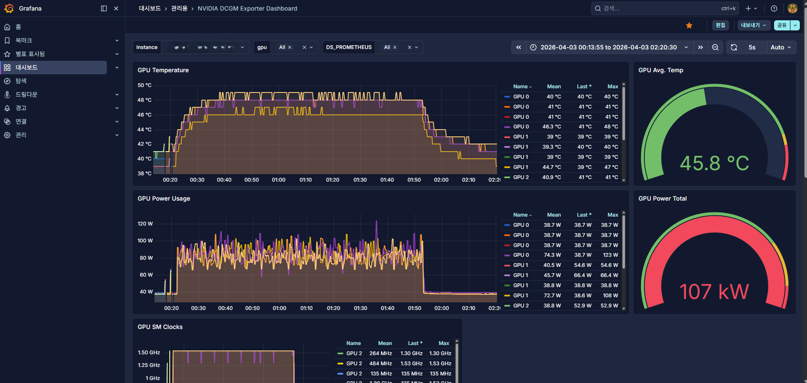

# YOLOv8 VisDrone 학습 결과 보고서

## 🗂️ 1. 작업 개요

> **작업 일자:** 2026-04-04
> **작업 목적:** VisDrone2019 데이터셋으로 YOLOv8n 드론 Object Detection 모델 학습 및 결과 검증 **학습 환경:** V100 ×4 DDP, Kubernetes Job (ai-team 네임스페이스)
> **소요 시간:** 1.517시간 (100 epochs)
> **모델 저장 경로:** `/data/yolov8/runs/visdrone_exp16/weights/best.pt`

---

## 📊 2. 최종 학습 결과

### 전체 성능

| 지표             | 수치        |
| ---------------- | ----------- |
| **mAP@0.5**      | **33.4%**   |
| **mAP@0.5:0.95** | **19.6%**   |
| Precision        | 44.1%       |
| Recall           | 33.4%       |
| 추론 속도        | 1.4ms/image |

### 클래스별 mAP@0.5

| 클래스          | mAP@0.5   | 비고                              |
| --------------- | --------- | --------------------------------- |
| **car**         | **75.4%** | 최고 — 크기가 크고 형태 명확      |
| bus             | 46.5%     |                                   |
| van             | 38.7%     |                                   |
| truck           | 31.4%     |                                   |
| pedestrian      | 35.0%     |                                   |
| motor           | 36.1%     |                                   |
| people          | 28.1%     |                                   |
| tricycle        | 24.0%     |                                   |
| awning-tricycle | 12.0%     |                                   |
| **bicycle**     | **7.2%**  | 최저 — 소형 + 형태 유사 객체 많음 |

---

## 🔍 3. 결과 분석

### COCO vs VisDrone 비교

| 항목      | COCO 학습       | VisDrone 학습        |
| --------- | --------------- | -------------------- |
| 데이터셋  | COCO (범용)     | VisDrone (드론 특화) |
| 클래스 수 | 80개            | 10개                 |
| mAP@0.5   | 46.8%           | 33.4%                |
| 소요 시간 | 8시간 (GPU 1장) | 1.517시간 (V100 4장) |

> **해석:** mAP 수치만 보면 COCO가 높지만, VisDrone은 드론 영상 특화 클래스만 다루기 때문에 직접 비교는 의미 없다. 드론 영상에서 실제 탐지 성능은 VisDrone 모델이 훨씬 뛰어나다.

### 소형 객체 성능이 낮은 이유

VisDrone 데이터셋은 드론 고도 촬영 특성상 객체가 매우 작다. bicycle(7.2%), awning-tricycle(12.0%)처럼 픽셀 수가 적은 객체는 YOLOv8n 기본 구조로는 한계가 있다.

**개선 방향:**

- `imgsz=1280` 으로 고해상도 학습
- YOLOv8s / YOLOv8m 등 더 큰 모델 사용
- 소형 객체 특화 augmentation 추가

### 멀티GPU 효과

| 항목               | 단일 GPU | V100 4장 DDP  |
| ------------------ | -------- | ------------- |
| COCO 학습 시간     | 8시간    | 2시간         |
| VisDrone 학습 시간 | -        | **1.517시간** |
| epoch당 소요       | ~4.8분   | **~54초**     |

V100 4장 병렬 학습으로 단일 GPU 대비 약 4~5배 속도 향상.



---

## 💾 4. 모델 파일

```
/data/yolov8/runs/visdrone_exp16/
├── weights/
│   ├── best.pt   (6.2MB) ← 최고 성능 체크포인트
│   └── last.pt   (6.2MB) ← 마지막 epoch 체크포인트
└── results.csv
```

### 로컬 PC로 모델 복사

```bash
scp ubuntu@(control-plane-public-ip):/data/yolov8/runs/visdrone_exp16/weights/best.pt C:\Users\wwdnj\Desktop\visdrone_best.pt
```

### 웹캠 추론 테스트

```bash
python -c "
from ultralytics import YOLO
model = YOLO(r'C:\Users\wwdnj\Desktop\visdrone_best.pt')
model.predict(source=0, show=True)
"
```

---

## 💡 5. 핵심 인사이트

**멀티GPU DDP는 학습 시간을 선형에 가깝게 단축시킨다.** V100 4장으로 단일 GPU 대비 약 4배 빠른 학습을 달성했다. K8s Job에 `device=0,1,2,3` 한 줄과 shm 볼륨 설정만으로 DDP가 자동으로 활성화된다.

**드론 특화 데이터셋은 범용 모델과 다른 기준으로 평가해야 한다.** mAP 수치가 COCO보다 낮더라도, 실제 드론 영상에서의 탐지 품질은 VisDrone 학습 모델이 훨씬 뛰어나다. 데이터셋의 도메인 특성을 이해하는 것이 성능 해석의 핵심이다.

**소형 객체는 YOLOv8n의 구조적 한계다.** bicycle(7.2%), awning-tricycle(12.0%)의 낮은 성능은 모델 크기와 입력 해상도의 한계에서 비롯된다. 다음 실험에서 imgsz=1280 또는 YOLOv8s 이상 모델로 개선 가능하다.

---

## 🚀 6. 다음 계획

- [ ] imgsz=1280 고해상도 재학습 (소형 객체 AP 개선)
- [ ] YOLOv8s 모델로 성능 비교 실험
- [ ] 드론 영상 파일로 추론 테스트
- [ ] K8s 위 모델 서빙 구조 설계 (추론 서버)
