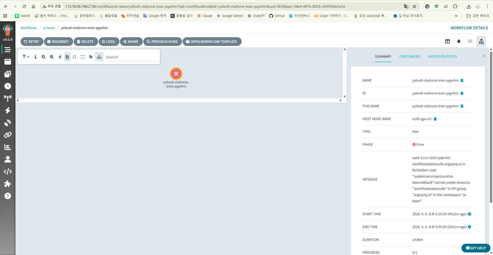
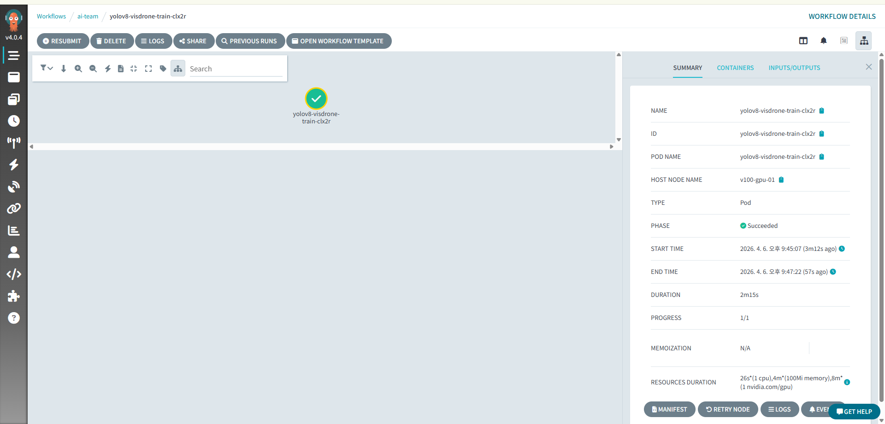

# Argo Workflows 설치 및 WorkflowTemplate 구성

## 🗂️ 1. 작업 개요

> **작업 일자:** 2026-04-06
> **작업 목적:** 팀원이 master-01 SSH 접근 없이 웹 UI로 학습 Job을 제출할 수 있도록 Argo Workflows를 설치하고, YOLOv8 VisDrone 학습 WorkflowTemplate을 구성한다.
> **대상 서버:** master-01 , master-02 
> **작업 환경:** Kubernetes v1.29, Helm, MetalLB, ai-team 네임스페이스
> **최종 결과:** Argo Workflows UI ((control-plane-public-ip):2746) 접근 가능, YOLOv8 VisDrone WorkflowTemplate 정상 실행

---

## 🏗️ 2. 작업 흐름

```text
[Helm으로 Argo Workflows 설치 → argo 네임스페이스]
        │ MetalLB IP 160 할당
        ▼
[WorkflowTemplate 작성 → ai-team 네임스페이스]
        │ nfs-datasets-pvc 마운트
        ▼
[Argo UI에서 Submit → V100 4장 DDP 학습 실행]
        │ /mnt/datasets/visdrone/visdrone.yaml
        ▼
[NAS /data/datasets/runs 결과 저장]
```

---

## 📦 3. Step 1 — Argo Workflows 설치

### 3.1 Helm으로 설치

`install.yaml` 직접 설치 방식은 v4.0.4에서 CRD 누락 문제가 발생한다. Helm 설치가 안전하다.

```bash
helm repo add argo https://argoproj.github.io/argo-helm
helm repo update

helm install argo-workflows argo/argo-workflows \
  -n argo \
  --create-namespace \
  --set server.authModes="{server}" \
  --set server.extraArgs="{--auth-mode=server}"
```

### 3.2 Pod 상태 확인

```bash
kubectl get pods -n argo
```

**정상 출력:**

```text
NAME                                                 READY   STATUS    RESTARTS   AGE
argo-workflows-server-8c4654bc8-8vrpx                1/1     Running   0          28s
argo-workflows-workflow-controller-cffc67b47-pznb5   1/1     Running   0          28s
```

---

## 🌐 4. Step 2 — UI 외부 노출 (MetalLB)

### 4.1 사용 가능한 IP 확인

```bash
# 기존 MetalLB 풀 및 할당 현황 확인
kubectl get ipaddresspool -n metallb-system -o yaml
kubectl get svc -A | grep LoadBalancer

# 후보 IP 핑 테스트 (응답 없으면 사용 가능)
ping -c 3 (control-plane-public-ip)
```

> **(control-plane-public-ip)** → JupyterHub 사용 중 (`proxy-public`)
> **(control-plane-public-ip)** → 응답 없음 ✅ 신규 할당

### 4.2 MetalLB 풀에 160 추가

```bash
kubectl patch ipaddresspool main-pool -n metallb-system --type=json -p='[
  {"op": "replace", "path": "/spec/addresses", "value": ["(control-plane-public-ip)/32", "(control-plane-public-ip)/32"]}
]'
```

### 4.3 Argo Server LoadBalancer로 전환

```bash
kubectl patch svc argo-workflows-server -n argo \
  -p '{"spec": {"type": "LoadBalancer"}, "metadata": {"annotations": {"metallb.universe.tf/loadBalancerIPs": "(control-plane-public-ip)"}}}'
```

### 4.4 확인

```bash
kubectl get svc -n argo
```

**정상 출력:**

```text
NAME                    TYPE           CLUSTER-IP       EXTERNAL-IP     PORT(S)
argo-workflows-server   LoadBalancer   10.111.109.193   (control-plane-public-ip)   2746:30150/TCP
```

**접속:** `http://(control-plane-public-ip):2746`

---

## 🔧 5. Step 3 — ai-team 네임스페이스 연동

Argo Controller가 `ai-team` 네임스페이스의 Workflow도 관리하도록 설정한다.

```bash
helm upgrade argo-workflows argo/argo-workflows -n argo \
  --set server.authModes="{server}" \
  --set server.extraArgs="{--auth-mode=server}" \
  --set workflow.serviceAccount.create=true \
  --set workflow.rbac.create=true \
  --set controller.workflowNamespaces="{argo,ai-team}"
```

> **주의:** helm upgrade 후 LoadBalancer 설정이 초기화된다. 아래 명령어로 재적용:
>
> ```bash
> kubectl patch svc argo-workflows-server -n argo \
>   -p '{"spec": {"type": "LoadBalancer"}, "metadata": {"annotations": {"metallb.universe.tf/loadBalancerIPs": "(control-plane-public-ip)"}}}'
> ```

---

## 📋 6. Step 4 — NFS PVC 구성

`ai-datasets` PVC는 NFS의 동적 프로비저닝 경로를 바라보고 있어 VisDrone 데이터셋 경로(`/data/datasets`)와 불일치한다. NAS의 `/data/datasets`를 직접 마운트하는 PV/PVC를 별도 생성한다.

```bash
cat << 'EOF' | kubectl apply -f -
apiVersion: v1
kind: PersistentVolume
metadata:
  name: nfs-datasets-pv
spec:
  capacity:
    storage: 500Gi
  accessModes:
    - ReadWriteMany
  nfs:
    server: (control-plane-public-ip)
    path: /data/datasets
  persistentVolumeReclaimPolicy: Retain
---
apiVersion: v1
kind: PersistentVolumeClaim
metadata:
  name: nfs-datasets-pvc
  namespace: ai-team
spec:
  accessModes:
    - ReadWriteMany
  resources:
    requests:
      storage: 500Gi
  volumeName: nfs-datasets-pv
  storageClassName: ""
EOF
```

**확인:**

```bash
kubectl get pvc nfs-datasets-pvc -n ai-team
# STATUS: Bound ✅
```

---

## 🚀 7. Step 5 — WorkflowTemplate 작성

```yaml
apiVersion: argoproj.io/v1alpha1
kind: WorkflowTemplate
metadata:
  name: yolov8-visdrone-train
  namespace: ai-team
spec:
  entrypoint: train
  arguments:
    parameters:
      - name: epochs
        value: '100'
      - name: batch-size
        value: '16'
      - name: img-size
        value: '640'
      - name: gpu-type
        value: 'v100'
  templates:
    - name: train
      nodeSelector:
        gpu-type: '{{inputs.parameters.gpu-type}}'
      inputs:
        parameters:
          - name: epochs
          - name: batch-size
          - name: img-size
          - name: gpu-type
      container:
        image: ultralytics/ultralytics:8.1.0
        command: [python, -c]
        args:
          - |
            from ultralytics import YOLO
            model = YOLO('yolov8n.pt')
            model.train(
              data='/mnt/datasets/visdrone/visdrone.yaml',
              epochs=100,
              batch=16,
              imgsz=640,
              device='0,1,2,3',
              project='/mnt/datasets/runs',
              name='visdrone-argo'
            )
        resources:
          limits:
            nvidia.com/gpu: '4'
        volumeMounts:
          - name: data
            mountPath: /mnt/datasets
          - name: dshm
            mountPath: /dev/shm
      volumes:
        - name: data
          persistentVolumeClaim:
            claimName: nfs-datasets-pvc
        - name: dshm
          emptyDir:
            medium: Memory
            sizeLimit: 16Gi
```

```bash
kubectl apply -f yolov8-visdrone-workflow.yaml
```

---

## 🔐 8. Step 6 — ai-team RBAC 권한 설정

Workflow 실행 완료 후 아래 에러가 발생한다:

```text
wait: Error (exit code 64): workflowtaskresults.argoproj.io is forbidden:
User "system:serviceaccount:ai-team:default" cannot create resource
"workflowtaskresults" in API group "argoproj.io" in the namespace "ai-team"
```



학습 자체는 정상 완료되지만, Argo가 실행 결과 메타데이터를 K8s에 기록하려다 권한이 없어 Workflow가 Error로 표시된다. `ai-team` 네임스페이스 기본 ServiceAccount에 권한을 추가한다.

```bash
cat << 'EOF' | kubectl apply -f -
apiVersion: rbac.authorization.k8s.io/v1
kind: Role
metadata:
  name: argo-workflow-role
  namespace: ai-team
rules:
- apiGroups: ["argoproj.io"]
  resources: ["workflowtaskresults"]
  verbs: ["create", "patch"]
---
apiVersion: rbac.authorization.k8s.io/v1
kind: RoleBinding
metadata:
  name: argo-workflow-rolebinding
  namespace: ai-team
subjects:
- kind: ServiceAccount
  name: default
  namespace: ai-team
roleRef:
  kind: Role
  name: argo-workflow-role
  apiGroup: rbac.authorization.k8s.io
EOF
```

**확인:**

```bash
kubectl get role argo-workflow-role -n ai-team
kubectl get rolebinding argo-workflow-rolebinding -n ai-team
```

**적용 테스트(epochs 1로 설정):**



---

## 📊 9. Argo UI 사용법

### Job 제출

1. `http://(control-plane-public-ip):2746` 접속
2. 왼쪽 메뉴 **Workflow Templates** 클릭
3. 상단 네임스페이스 드롭다운 → **ai-team** 선택
4. `yolov8-visdrone-train` 클릭 → **Submit**
5. 파라미터 확인 후 Submit

### 로그 확인

실행 중인 Workflow 클릭 → **LOGS** 버튼

### 주요 버튼

| 버튼      | 기능                                      |
| --------- | ----------------------------------------- |
| Submit    | 새 학습 Job 제출                          |
| Resubmit  | 새 인스턴스로 재제출 (설정 반영)          |
| Retry     | 이전 Pod 스펙 그대로 재실행 (설정 미반영) |
| Logs      | 실시간 학습 로그                          |
| Terminate | 강제 종료                                 |

> **주의:** WorkflowTemplate 수정 후에는 반드시 **Resubmit이 아닌 Submit**으로 새로 제출해야 변경사항이 반영된다. Retry/Resubmit은 이전 Pod 스펙을 재사용한다.

---

## 🛠️ 9. 트러블슈팅

### 문제 1: workflow-controller CrashLoopBackOff (install.yaml 방식)

```text
error="the server could not find the requested resource (get workflows.argoproj.io)"
```

**원인:** `latest` 태그로 설치 시 v4.0.4가 설치되는데 이 버전의 CRD가 `install.yaml`에 누락됨
**해결:** Helm 설치로 전환. Helm은 CRD를 templates에 포함해 누락 없이 설치됨

### 문제 2: PVC 경로 불일치

```text
FileNotFoundError: '/mnt/data/VisDrone/data.yaml' does not exist
```

**원인:** `ai-datasets` PVC가 NFS 동적 프로비저닝 경로(`/data/ai-team-ai-datasets-pvc-...`)를 바라봄. VisDrone 데이터셋은 `/data/datasets/visdrone/`에 위치
**해결:** NAS `/data/datasets`를 직접 마운트하는 `nfs-datasets-pv/pvc` 별도 생성

```bash
# PVC가 실제로 어느 NFS 경로를 바라보는지 확인하는 방법
kubectl get pvc <pvc-name> -n <namespace> -o jsonpath='{.spec.volumeName}' \
  | xargs kubectl get pv -o jsonpath='{.spec.nfs}'
```

### 문제 3: visdrone.yaml path 불일치

```text
FileNotFoundError: missing path '/mnt/data/datasets/visdrone/VisDrone2019-DET-val/images'
```

**원인:** NAS의 `visdrone.yaml` 내부 `path` 필드가 Pod 마운트 경로와 불일치
**해결:** NAS에서 직접 수정

```bash
ssh ubuntu@(control-plane-public-ip)
sudo sed -i 's|path: /data/datasets/visdrone|path: /mnt/datasets/visdrone|' \
  /data/datasets/visdrone/visdrone.yaml
```

> **참고:** 기존 kubectl Job(`visdrone-train-job.yaml`)은 실행 시마다 `visdrone.yaml`을 덮어쓰므로 영향 없음

### 문제 4: shared memory 부족 (DDP 멀티GPU)

```text
RuntimeError: unable to write to file </torch_...>: No space left on device (28)
```

**원인 및 해결:** kubectl Job에서 이미 경험한 동일 문제. WorkflowTemplate에도 dshm 볼륨이 필요하다.
→ 상세: `1_YOLOv8_VisDrone_멀티GPU_학습_Job.md` 트러블슈팅 참고

> **Argo 특이사항:** WorkflowTemplate에 dshm을 추가한 후 **Retry가 아닌 새 Submit**으로 제출해야 반영된다. Retry는 이전 Pod 스펙을 그대로 재사용한다.

---

## ✅ 11. 최종 학습 결과

**실행 환경:** V100 ×4 DDP, ultralytics:8.1.0, VisDrone2019

| 지표         | 결과           | 이전 kubectl Job |
| ------------ | -------------- | ---------------- |
| mAP@0.5      | **33.4%**      | 33.4%            |
| mAP@0.5:0.95 | 19.6%          | 19.4%            |
| 소요 시간    | **1.488시간**  | 1.517시간        |
| 실행 방식    | Argo UI Submit | kubectl apply    |

**클래스별 mAP@0.5:**

| 클래스     | mAP@0.5      |
| ---------- | ------------ |
| car        | 75.4% (최고) |
| bus        | 46.5%        |
| pedestrian | 35.0%        |
| van        | 38.7%        |
| motor      | 36.1%        |
| bicycle    | 7.2% (최저)  |

**모델 저장 경로:** `/mnt/datasets/runs/visdrone-argo7/weights/best.pt` (NAS)

> **재현성 검증:** kubectl Job과 Argo WorkflowTemplate이 동일한 mAP를 기록했다. 인프라 전환 후에도 학습 환경이 완전히 재현됨을 확인했다.

---

## 💡 12. 핵심 인사이트

**Argo WorkflowTemplate은 Retry와 Submit이 다르다.** Retry는 이전 Pod 스펙을 재사용하므로 Template을 수정해도 반영되지 않는다. 트러블슈팅 중 같은 에러가 반복된다면 이를 먼저 의심하라.

**PVC가 실제로 어느 NFS 경로를 바라보는지 반드시 확인해야 한다.** 동적 프로비저닝된 PVC는 NFS 서버의 자동 생성 서브디렉토리를 바라본다. 특정 NAS 경로를 직접 마운트해야 한다면 Static PV/PVC를 별도 생성하는 것이 올바른 설계다.

**kubectl Job에서 Argo WorkflowTemplate으로의 전환 핵심은 파라미터화다.** epochs, batch_size, gpu-type 등을 UI에서 입력 가능하게 만들면 팀원이 SSH 없이 실험 조건을 바꿔가며 학습을 제출할 수 있다. 이것이 MLOps 파이프라인의 첫 번째 레이어다.
