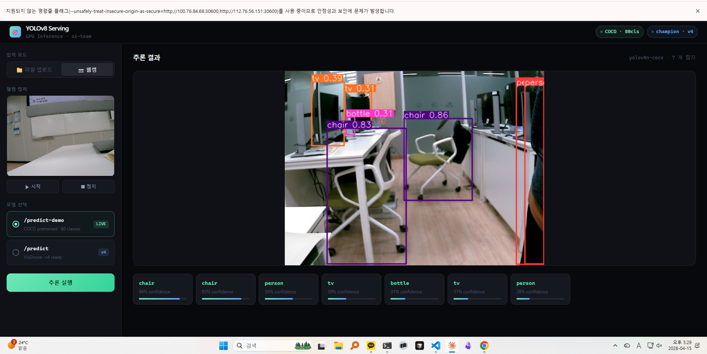

# MLflow alias + FastAPI 엔드포인트 분리

## 🗂️ 1. 작업 개요

> **작업 일자:** 2026-04-15
> **작업 목적:** 학습된 VisDrone 모델을 MLflow Registry에 등록하고 alias 기반으로 관리하여, FastAPI 서빙 엔드포인트와 실제로 연결한다. 데모용 COCO 엔드포인트와 MLOps 운영용 champion 엔드포인트를 분리한다.
> **대상 서버:** master-01, 2080ti-gpu-04, NAS
> **작업 환경:** Kubernetes v1.29, ai-team 네임스페이스, MLflow v2.13.0
> **최종 결과:** MLflow Registry alias와 NAS 저장 모델을 연계하여 FastAPI /predict에 반영되는 운영 루프 구축

---

### 🔥 작업 배경 — 해결한 구멍

작업 전 상태:

```
Argo DAG → visdrone-v1.pt NAS 저장
                    ↕ 연결 끊김
FastAPI /predict → yolov8n.pt (COCO pretrained, 전혀 다른 모델)
```

학습은 V100 4장으로 열심히 돌리는데, 서빙은 인터넷에서 받은 COCO 모델을 쓰는 구조였다.
면접관이 "학습한 모델이 어떻게 서비스에 반영됩니까?" 라고 물으면 답이 없는 상태.

작업 후:

```
Argo DAG → MLflow Registry 등록 → alias "champion" 지정
                                          ↓ 연결됨
FastAPI /predict → MLflow alias 조회 → NAS 파일 로드 → 추론
```

---

## 🏗️ 2. 전체 흐름

```
[git push → GitHub Actions → Argo DAG 트리거]
    │
    ▼
[validate-data] 데이터셋 존재 확인
    │
    ▼
[train] V100 4장 DDP 학습
    └→ MLflow run 시작, params 자동 기록
    └→ run_id → NAS 파일로 전달
    │
    ▼
[evaluate] val 데이터셋 평가
    └→ mAP@0.5, mAP@0.5:95 MLflow 기록
    └→ best.pt artifact 연동 로직 추가 (artifact_path="weights")
    │
    ▼
[save-model] 모델 저장 및 Registry 등록
    └→ NAS: /data/datasets/models/visdrone-{version}.pt 복사
    └→ MLflow Registry: "visdrone-yolov8" version 등록
    └→ alias "champion" → 최신 version 지정
    │
    ▼
[FastAPI /predict]
    └→ alias "champion" 조회 → version 번호 확인
    └→ version 번호로 NAS 파일명 매핑: visdrone-v{version}.pt
    └→ NAS 파일 직접 로드 (1순위)
    └→ MLflow artifact 경로 폴백 (2순위, 예비 경로)
    └→ YOLO 추론 → 결과 반환

※ /reload-champion 호출 시 재시작 없이 최신 champion 반영 가능
```

---

## 📐 3. 설계 결정

### 3.1 엔드포인트 분리 — COCO 데모 유지

| 엔드포인트 | 모델 | 목적 |
|---|---|---|
| `POST /predict-demo` | YOLOv8n COCO (80 클래스) | 웹캠 데모, 일상 물체 탐지 |
| `POST /predict` | MLflow champion (VisDrone) | E2E MLOps 검증, 드론 객체 탐지 |
| `POST /reload-champion` | — | Pod 재시작 없이 최신 champion 반영 |
| `GET /health` | — | 두 모델 상태 동시 확인 |

COCO 모델을 버리지 않은 이유: VisDrone 모델은 드론 시점 특화라 웹캠 환경에서 탐지가 잘 안 된다. 데모 가치는 COCO가 더 높다. 두 엔드포인트를 분리해 목적에 맞게 쓴다.

### 3.2 Production stage 대신 alias 사용

MLflow 최신 문서는 `Production`/`Staging` stage 방식보다 **alias 기반 운영**을 권장한다.

```python
# stage 방식 (deprecated 방향)
client.transition_model_version_stage("visdrone-yolov8", version, "Production")

# alias 방식 (현재 권장)
client.set_registered_model_alias("visdrone-yolov8", "champion", version)
```

alias "champion"을 새 version으로 바꾸면 FastAPI는 다음 모델 로드 시점에 해당 version을 반영한다.  
현재 구현에서는 `/reload-champion` 호출 또는 Pod 재시작을 통해 이를 즉시 반영할 수 있다.

### 3.3 mlflow.register_model() 대신 create_model_version() 사용

`mlflow.register_model()`이 내부적으로 `search_logged_models` API를 호출하는데,
현재 MLflow 서버 v2.13.0에서 해당 엔드포인트가 404를 반환한다. (클라이언트-서버 버전 불일치)

```python
# 실패: register_model() → search_logged_models → 404
mlflow.register_model(model_uri, "visdrone-yolov8")

# 성공: create_model_version() → 구버전 호환 API
mv = client.create_model_version(
    name="visdrone-yolov8",
    source=source,
    run_id=run_id
)
```

### 3.4 mlflow.pytorch.load_model() 대신 NAS 직접 접근

```python
# 실패: pytorch flavor 로드 → torch.nn.Module 반환
#        YOLO 래퍼 API와 호환 불가
champion = mlflow.pytorch.load_model("models:/visdrone-yolov8@champion")
champion(img, device=0)  # ← AttributeError

# 성공: alias 조회 → NAS 파일 직접 YOLO 로드
mv = client.get_model_version_by_alias("visdrone-yolov8", "champion")
nas_path = f"/mnt/datasets/models/visdrone-v{mv.version}.pt"
model = YOLO(nas_path)  # ← YOLO API 완전 호환
```

**champion version → NAS 파일명 매핑 구조:**

현재 구현은 MLflow alias가 가리키는 model version 번호를 기준으로  
`/mnt/datasets/models/visdrone-v{version}.pt` 파일명을 매핑해 로드한다.  
  
다만 MLflow Registry version 번호와 Argo의 `model-version` 파라미터는  
원래 별개 체계이므로, 이 방식은 현재 환경에서 동작하는 임시 규칙에 가깝다.  
장기적으로는 NAS 파일 경로를 별도 메타데이터로 저장하거나,  
Registry version과 파일명을 명시적으로 연결하는 방식으로 개선이 필요하다.

```
MLflow alias "champion" → version 4
NAS 파일: /mnt/datasets/models/visdrone-v4.pt
```

현재 구현이 안정적으로 동작하려면,  
MLflow Registry version 번호와 NAS 파일명이 우연히 일치하는 현재 운영 규칙이 유지되어야 한다.  
  
다만 Registry version과 Argo의 `model-version` 파라미터는 본래 별개 체계이므로,  
장기적으로는 save-model 단계에서 Registry version과 NAS 파일 경로를 명시적으로 연결하는 메타데이터 저장 방식으로 개선이 필요하다.

### 3.5 PVC 네임스페이스 격리 문제

`mlflow-artifacts-pvc`는 `mlflow` 네임스페이스에 있어 `ai-team`에서 직접 참조 불가.
동일한 NFS 경로를 가리키는 PV/PVC를 `ai-team` 네임스페이스에 별도 생성해 해결.

```yaml
# ai-team 전용 PV — mlflow와 동일한 NFS 경로
spec:
  nfs:
    server: 112.76.56.157
    path: /data/mlflow-mlflow-artifacts-pvc-pvc-a64b9480-a981-411f-a248-a26e232f5961
```

실제로는 NAS 직접 접근(/mnt/datasets) 방식을 1순위로 사용하므로 이 PVC는 폴백용.

---

## 📦 4. 변경 파일 목록

### 4.1 Argo WorkflowTemplate (yolov8-dag-pipeline)

**train 단계:**
- `command: [python, -c]` → `command: [sh, -c]` + `pip install mlflow psycopg2-binary -q` 추가
- `mlflow.log_params()` 유지 (autolog로 105개 자동 기록)
- `run_id` NAS 파일 저장 유지

**evaluate 단계:**
- mAP metrics 기록  
- `best.pt`를 MLflow artifact로 기록하도록 로직 추가

**save-model 단계:**
- `image: busybox` → `image: ultralytics/ultralytics:8.1.0` 교체 (mlflow 설치 필요)
- NAS 파일 복사 유지
- `client.create_registered_model()` + `client.create_model_version()` 추가
- `client.set_registered_model_alias(alias="champion")` 추가

### 4.2 FastAPI ConfigMap (yolov8-serving-code)

- `load_champion_model()` 함수 신규 추가
- champion 모델 로드 방식을 MLflow artifact 직접 경로 의존에서 **NAS 우선 로드 + artifact 폴백** 구조로 변경
- `/predict-demo` 엔드포인트 신규 (COCO, 기존 /predict 역할)
- `/predict` 엔드포인트 → champion 모델 서빙으로 교체
- `/reload-champion` 엔드포인트 신규 (핫 리로드)
- `/health` 응답에 `champion_ready`, `champion_version` 추가
- `/` 루트 페이지를 단순 안내 문구에서 웹 UI(파일 업로드 + 웹캠 캡처 + 엔드포인트 선택 + 결과 표시)로 확장

### 4.3 FastAPI Deployment

- `mlflow-artifacts-pvc` 볼륨 마운트 추가 (`/mnt/mlflow-artifacts`)
- `nfs-datasets-pvc` 볼륨 마운트 추가 (`/mnt/datasets`)
- serving Pod가 NAS 저장 모델 파일(`/mnt/datasets/models/visdrone-v{version}.pt`)을 직접 읽을 수 있도록 볼륨 구조 수정

### 4.4 신규 PV/PVC

- `mlflow-artifacts-pv-aiteam` (PV) — ai-team 네임스페이스용
- `mlflow-artifacts-pvc` (ai-team 네임스페이스) — mlflow와 동일 NFS 경로

---

## 🛠️ 5. 트러블슈팅

### 문제 1: train 단계 `ModuleNotFoundError: No module named 'mlflow'`

**원인:** `ultralytics:8.1.0` 이미지에 mlflow 미포함. `command: [python, -c]`로 바로 실행해 pip install 불가.

**해결:** `command: [sh, -c]`로 변경 후 `pip install mlflow psycopg2-binary -q` 선행 실행.

```yaml
command: [sh, -c]
args:
  - |
    pip install mlflow psycopg2-binary -q
    python - <<'PYEOF'
    # python 코드
    PYEOF
```

### 문제 2: save-model 단계 `search_logged_models 404`

**원인:** `mlflow.register_model()`이 내부적으로 신버전 API 호출. MLflow 서버 v2.13.0 미지원.

**해결:** `client.create_model_version()`으로 직접 등록.

### 문제 3: FastAPI Pod Pending — `persistentvolumeclaim "mlflow-artifacts-pvc" not found`

**원인:** PVC는 네임스페이스 범위 리소스. `mlflow` 네임스페이스 PVC를 `ai-team`에서 참조 불가.

**해결:** 동일 NFS 경로로 `ai-team` 네임스페이스에 PV/PVC 별도 생성.

### 문제 4: PVC Terminating 상태 고착

**원인:** finalizer가 남아있어 삭제 대기 중.

**해결:**
```bash
kubectl patch pvc mlflow-artifacts-pvc -n ai-team \
  -p '{"metadata":{"finalizers":null}}' --type=merge
kubectl delete pv mlflow-artifacts-pv-aiteam --force
```

### 문제 5: champion 모델 로드 실패 — `best.pt 없음`

**원인:** `mv.source`가 MLflow 서버 컨테이너 내부 경로(`/mnt/mlflow-artifacts/...`). FastAPI Pod의 NFS 마운트 경로 구조와 불일치.

**해결:** NAS 직접 접근 방식으로 전환. `save-model`이 이미 복사해둔 `/mnt/datasets/models/visdrone-v{version}.pt`를 1순위로 로드.

---

## ✅ 6. 검증 결과

### 6.1 DAG 완주 확인

| 단계            | 상태          | 결과                                 |
| ------------- | ----------- | ---------------------------------- |
| validate-data | ✅ Succeeded | 데이터셋 확인                            |
| train         | ✅ Succeeded | MLflow params 기록                   |
| evaluate      | ✅ Succeeded | mAP@0.5 기록 + artifact 기록 로직 실행     |
| save-model    | ✅ Succeeded | NAS 저장 + Registry 등록 + champion 지정 |

### 6.2 FastAPI 상태

```bash
curl http://TAILSCALE-IP:30600/health
```

```json
{
  "status": "ok",
  "demo_model": "yolov8n-coco",
  "champion_ready": true,
  "champion_version": "4"
}
```

### 6.3 로그 확인

```
✅ COCO demo 모델 로드 완료
✅ champion v4 NAS 로드 완료: /mnt/datasets/models/visdrone-v4.pt
INFO:     Application startup complete.
```

### 6.4 웹 UI 동작 확인



- 웹캠 캡처 → /predict-demo (COCO) 추론 성공
- chair 86%, bottle 31%, tv 39%, person 39% 탐지
- 헤더 상태: COCO · 80cls ✅ / champion · v4 ✅

---

## 💡 7. 핵심 인사이트

**MLflow alias는 stage보다 유연하다.** "champion" alias를 새 version으로 바꾸는 것만으로 서빙 모델이 교체된다. stage 방식은 deprecated 방향이고 alias가 현재 권장 패턴이다.

**클라이언트-서버 버전 불일치는 저수준 API로 우회한다.** `mlflow.register_model()` 같은 고수준 API가 서버 버전에 따라 동작이 달라질 수 있다. `MlflowClient().create_model_version()` 같은 저수준 API는 버전 호환성이 더 넓다.

**PVC는 네임스페이스를 넘을 수 없다.** 동일 NFS 경로를 여러 네임스페이스에서 쓰려면 각각 PV/PVC를 별도 생성해야 한다. PV는 클러스터 전역이지만 PVC는 네임스페이스 범위다.

**YOLO API 호환성을 유지하려면 pt 파일을 직접 YOLO()에 넘겨야 한다.** `mlflow.pytorch.load_model()`은 `torch.nn.Module`을 반환해 YOLO 래퍼 API와 호환이 안 된다. alias → 버전 조회 → pt 파일 경로 → `YOLO(pt_path)` 패턴이 가장 안정적이다.
