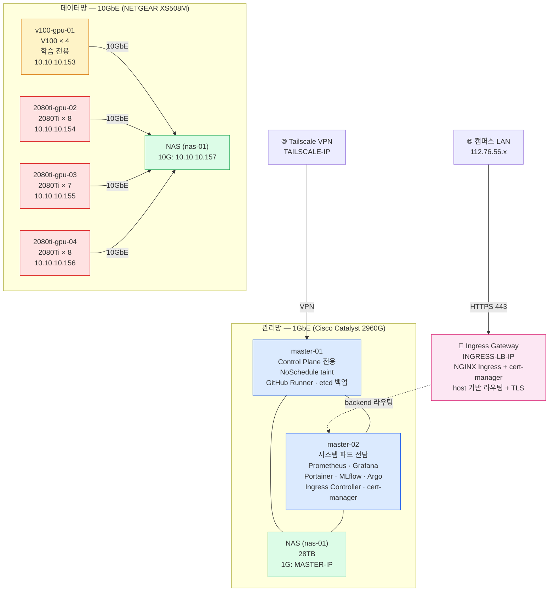
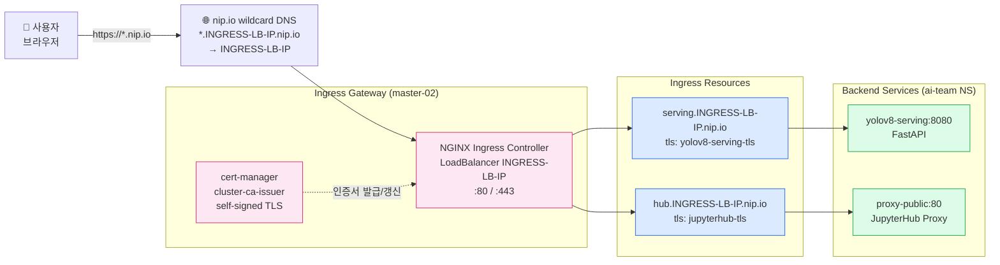
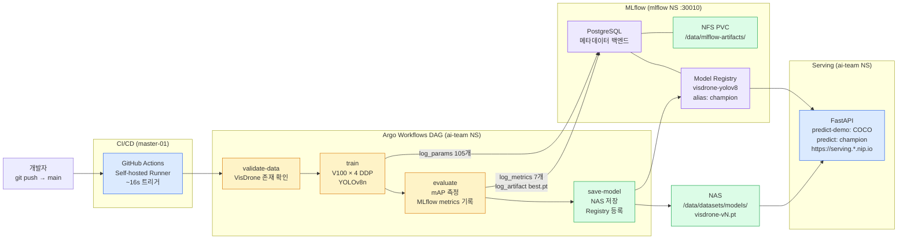
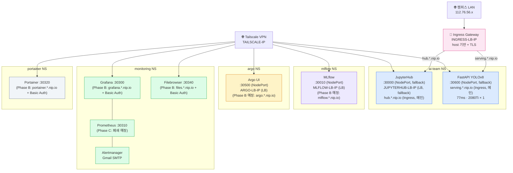
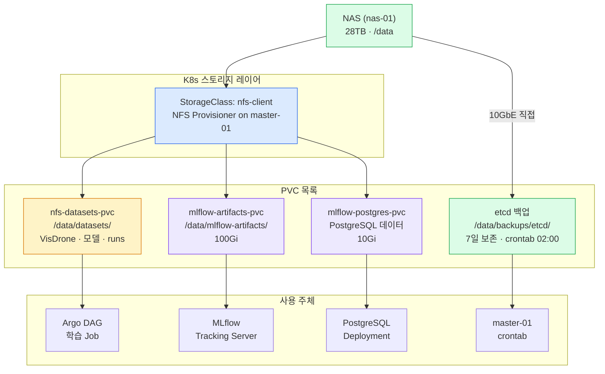

# 클러스터 구조 다이어그램

> **기준일:** 2026-04-27
> **K8s:** v1.29.15 / Ubuntu 22.04.5 LTS / Calico v3.27

---

## 1. 🖥️ 노드 구성 및 역할 분리

| 노드 | 역할 | 배치 파드 / 용도 | GPU | IP |
|---|---|---|---|---|
| master-01 | Control Plane 전용 | etcd · apiserver · scheduler · controller-manager GitHub Actions Runner · etcd 백업 crontab **NoSchedule taint 적용** | — | MASTER-IP |
| master-02 | 시스템 파드 전담 Worker | Prometheus · Grafana · Portainer · Alertmanager JupyterHub hub/proxy · MLflow · Argo Controller **NGINX Ingress Controller · cert-manager (2026-04-27 신규)** | — | WORKER-IP-02 |
| v100-gpu-01 | Worker (학습 전용) | Argo DAG 학습 Job (V100 × 4 DDP) | V100 × 4 | 10.10.10.153 |
| 2080ti-gpu-02 | Worker | 학습 워크로드 | 2080Ti × 8 | 10.10.10.154 |
| 2080ti-gpu-03 | Worker | 학습 워크로드 | 2080Ti × 7 | 10.10.10.155 |
| 2080ti-gpu-04 | Worker | 학습 / 서빙 자동 스케줄 | 2080Ti × 8 | 10.10.10.156 |
| NAS (nas-01) | 스토리지 | 28TB NFS 공유 스토리지 | — | MASTER-IP (1G) / 10.10.10.157 (10G) |

> **총 GPU:** V100 × 4 + 2080Ti × 23 = **27장**
> **설계 근거:** 3_31 네트워크 장애 후 SoC 원칙 적용

---

## 2. 🌐 네트워크 토폴로지

---

## 3. 🔐 Ingress 라우팅 구조 (2026-04-27 신규)

> **TLS 인증서:** cluster-ca self-signed (cert-manager 자동 갱신, 1년 만료, 30일 전 자동 갱신)
> **Phase B 예정:** Grafana, Argo, Portainer, Filebrowser, MLflow Ingress 추가 예정 (관리자 그룹은 Basic Auth 추가)

---

## 4. 🔄 ML 파이프라인 흐름

---

## 5. 🔌 서비스 맵

> **2026-04-27 변경:** 팀원 그룹(JupyterHub, YOLOv8) Ingress 통합 완료. 관리자/공개 그룹은 Phase B 예정. 기존 NodePort/LoadBalancer 경로는 fallback으로 유지.

---

## 6. 💾 스토리지 구조

---

## 변경 이력

| 날짜 | 변경 내용 |
|---|---|
| 2026-03-31 | master-01 NoSchedule taint 적용, master-02 시스템 파드 전담 설계 확정 |
| 2026-04-13 | MLflow, GitHub Actions CI/CD, etcd DR 검증 반영 |
| 2026-04-15 | FastAPI champion serving, MLflow alias 기반 운영 흐름 반영 |
| 2026-04-17 | 서빙 이미지 DockerHub 전환 (`1jkim/yolov8-serving:v1`), nodeSelector hostname 고정 제거 반영 |
| 2026-04-27 | **Ingress + TLS 도입**: NGINX Ingress Controller (master-02) + cert-manager + cluster-ca self-signed. host 기반 라우팅으로 `serving`, `hub` 통합. MetalLB IP 162 추가. Phase A 완료. |
