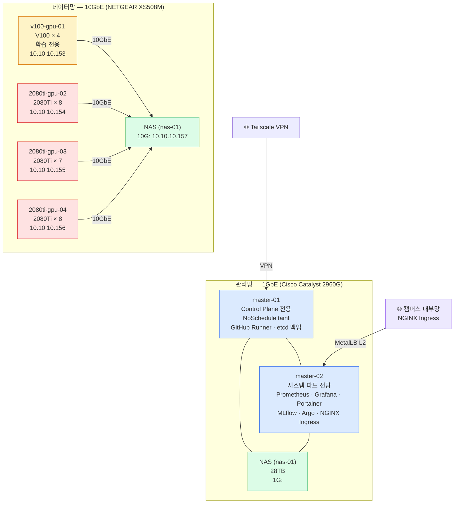
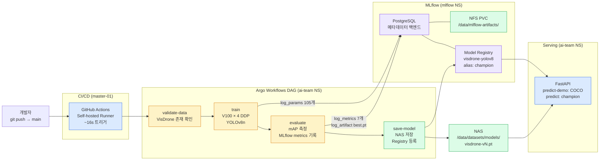
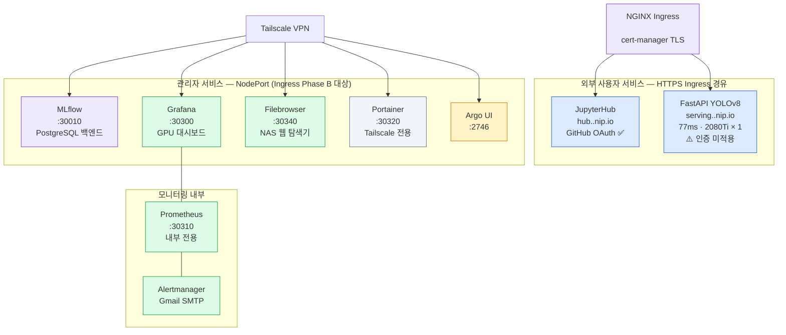
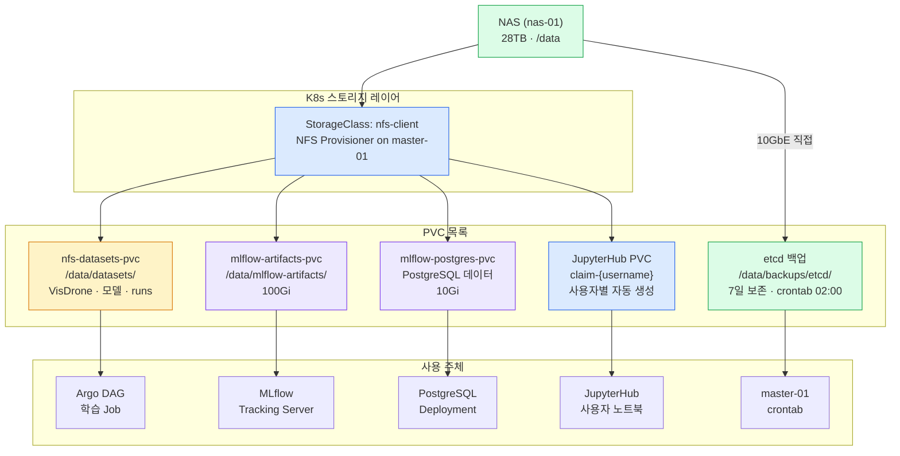

# 클러스터 구조 다이어그램

> **기준일:** 2026-04-28
> **K8s:** v1.29.15 / Ubuntu 22.04.5 LTS / Calico v3.27

---

## 1. 🖥️ 노드 구성 및 역할 분리

| 노드 | 역할 | 배치 파드 / 용도 | GPU | IP |
|---|---|---|---|---|
| master-01 | Control Plane 전용 | etcd · apiserver · scheduler · controller-manager GitHub Actions Runner · etcd 백업 crontab **NoSchedule taint 적용** | — | `<MASTER-IP>` |
| master-02 | 시스템 파드 전담 Worker | Prometheus · Grafana · Portainer · Alertmanager JupyterHub hub/proxy · MLflow · Argo Controller **NGINX Ingress Controller** | — | `<WORKER-IP-02>` |
| v100-gpu-01 | Worker (학습 전용) | Argo DAG 학습 Job (V100 × 4 DDP) | V100 × 4 | 10.10.10.153 |
| 2080ti-gpu-02 | Worker | 학습 · 서빙 워크로드 | 2080Ti × 8 | 10.10.10.154 |
| 2080ti-gpu-03 | Worker | 학습 · 서빙 워크로드 | 2080Ti × 7 | 10.10.10.155 |
| 2080ti-gpu-04 | Worker | 학습 · 서빙 워크로드 | 2080Ti × 8 | 10.10.10.156 |
| NAS (nas-01) | 스토리지 | 28TB NFS 공유 스토리지 | — | `<MASTER-IP>` (1G) / 10.10.10.157 (10G) |

> **총 GPU:** V100 × 4 + 2080Ti × 23 = **27장**
> **설계 근거:** 3_31 네트워크 장애 후 SoC 원칙 적용

---

## 2. 🌐 네트워크 토폴로지

---

## 3. 🔄 ML 파이프라인 흐름

---

## 4. 🔌 서비스 맵

---

## 5. 💾 스토리지 구조

---

## 6. 🔢 PriorityClass 계층 (2026-04-28 도입)

| 클래스명 | value | 적용 대상 |
|---|---|---|
| system-cluster-critical | 2,000,000,000 | kube-system 시스템 파드 |
| serving-critical | 1,000,000 | yolov8-serving |
| training-normal | 100 | Argo DAG 학습 Job |
| (default) | 0 | 나머지 모든 파드 |

> **설계 원칙:** serving-critical은 학습 Job보다 항상 선점 우위. 스케줄러가 GPU 부족 시 training-normal Pod를 선점하여 serving Pod 보호.

---

## 변경 이력

| 날짜 | 변경 내용 |
|---|---|
| 2026-03-31 | master-01 NoSchedule taint 적용, master-02 시스템 파드 전담 설계 확정 |
| 2026-04-13 | MLflow, GitHub Actions CI/CD, etcd DR 검증 반영 |
| 2026-04-15 | FastAPI champion serving, MLflow alias 기반 운영 흐름 반영 |
| 2026-04-17 | 서빙 이미지 DockerHub 전환 (`1jkim/yolov8-serving:v1`), 2080ti-gpu-04 hostname nodeSelector 고정 해제 |
| 2026-04-27 | NGINX Ingress + cert-manager TLS 완료, GitHub OAuth 완료, 서비스 맵 3분류(외부/관리자/내부) 체계로 재편, JupyterHub PVC 사용자별 자동 생성 반영 |
| 2026-04-28 | PriorityClass 4계층 도입 (serving-critical/training-normal), INC-2026-04-28 Grafana 차트 업그레이드 장애 복구 |
