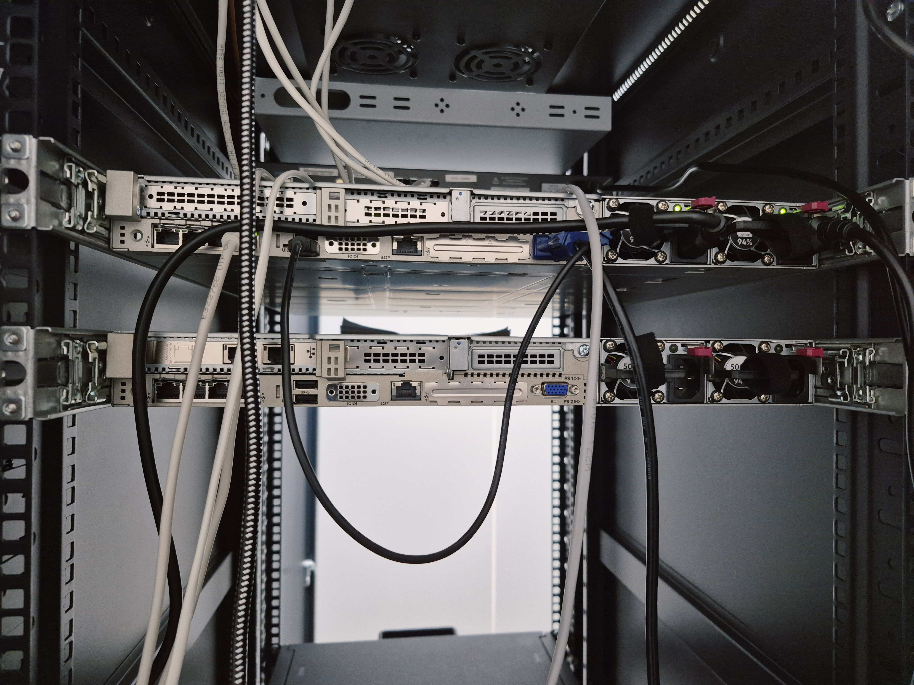
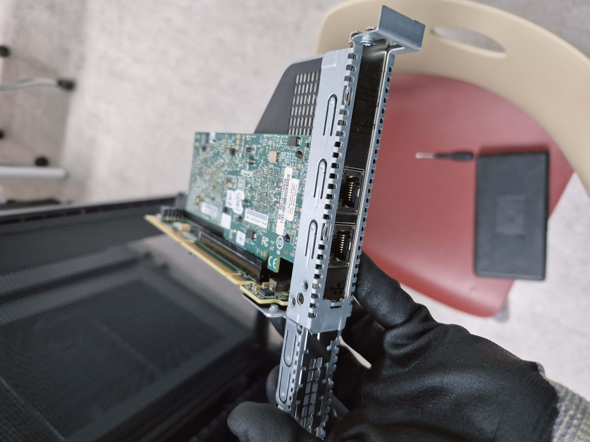
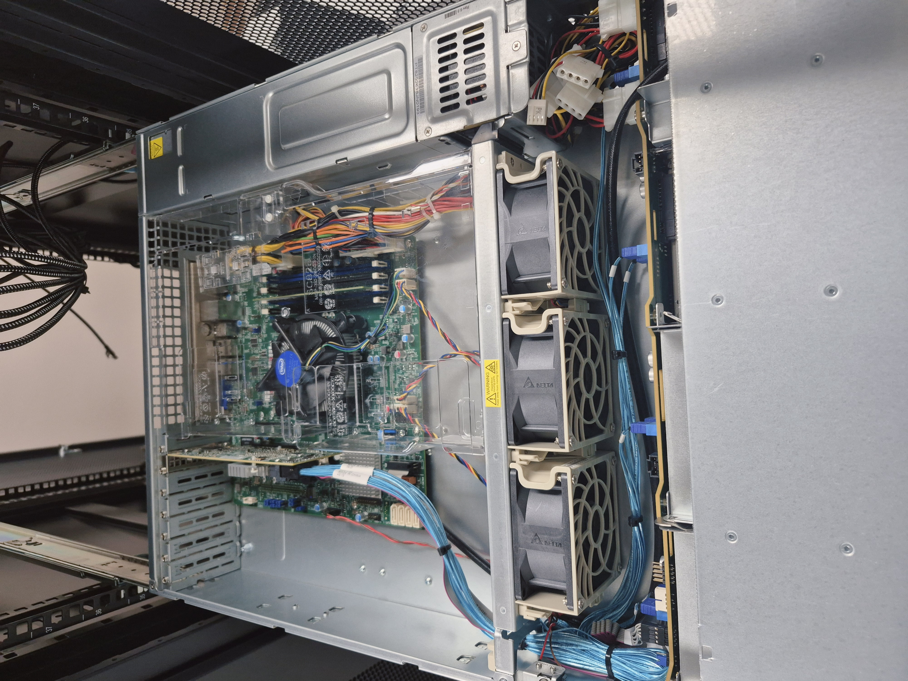
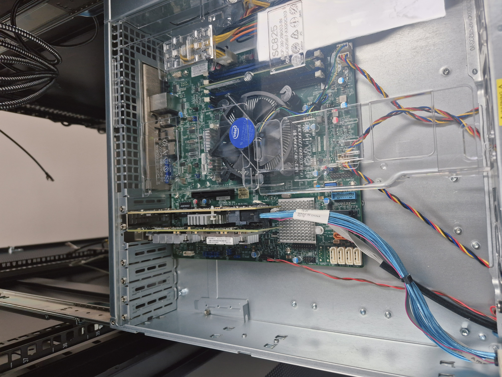

# 10G NIC 이전 작업일지 (NAS 네트워크 병목 해소)

> **작업 일자:** 2026-03-23
> **대상 장비:** master-02 ((control-plane-public-ip)) → NAS ((control-plane-public-ip))
> **최종 결과:** GPU 노드 ↔ NAS 간 10G 내부망 구성 완료 / 전 노드 ~9Gbps 달성

---

## 1. 문제 발견 (어떻게 알게 됐나)

워커노드 6대 Join을 완료한 직후, GPU Operator 등 본격적인 소프트웨어 구축에 들어가기 전 단계였습니다
NAS의 네트워크 설정을 진행하려고 NIC 상태를 조회했습니다.

```bash
ip link show      # 인터페이스 목록 확인
lspci | grep -i ether  # 물리 NIC 확인
```

**발견한 이상점:**

- NAS는 10G 스위치(NETGEAR ProSafe XS508M)에 연결되어 있었음
- 그런데 NAS에는 **10G NIC가 없고 1G NIC만 탑재**되어 있었음
- 10G 스위치에 연결해도 실제 통신은 1G로 동작 중인 상태

**이어진 의문:**

> "NAS에 10G NIC가 없으면 10G 스위치 연결이 의미가 없는데, 왜 업체에서 이렇게 구성해놨을까?"

다른 서버들을 확인하던 중 **master-02((control-plane-public-ip))에 10G NIC가 탑재**되어 있는 것을 발견했습니다.



---

## 2. 원인 분석 및 판단

### 왜 master-02에 10G NIC가 있었나

AI에게 1번의 문제를 질문했고 아래와 같은 답을 얻었습니다

> "업체 초기 구성 당시의 설계 의도는 불명확하나, 현재 클러스터 구조상 **master-02에 10G NIC는 불필요** master-02의 10G NIC를 NAS로 이전하면 GPU 노드들이 학습 데이터를 10G로 직접 전송받을 수 있다.
> master-02는 1G 관리망만으로 역할 수행에 문제없다."

### 판단

- master-02의 역할: 워커노드 (일반 워크로드 처리)
- master-02가 필요한 네트워크: K8s API 통신, Pod 간 통신 → **1G 관리망으로 충분**
- 10G가 실제로 필요한 곳: **NAS ↔ GPU 노드 간 학습 데이터 전송**

> **"master-02는 1G만 있어도 문제없다"** 확인 후 소프트웨어를 다 올리고 나면 하드웨어를 건드리기 훨씬 복잡해지기 때문에 이 시점이 하드웨어를 손댈 수 있는 마지막 기회라고 판단하고 이전 결정.

---

## 3. 하드웨어 작업 (PCIe 카드 물리 이전)

### 사전 확인

```bash
# master-02에서 10G NIC 정보 확인
lspci | grep -i ether
# 결과: Broadcom BCM57810 10 Gigabit Ethernet 확인

# 인터페이스명 확인 (netplan 설정에서 중요)
ip link show
```

### 물리 작업 순서

1. master-02 서버 전원 오프 (`sudo shutdown -h now`)
2. NAS 서버 전원 오프
3. **서버 뚜껑(커버) 오픈** — master-02에서 Broadcom BCM57810 PCIe 카드 탈거
4. NAS 서버에 해당 카드 장착 (빈 PCIe 슬롯 확인 후 삽입)
5. 양쪽 서버 커버 닫고 전원 온






---

## 4. 소프트웨어 설정

### 4-1. NAS 10G NIC 인터페이스명 확인 (핵심 주의사항)

```bash
ip link show
# 결과: enp2s0f0 (eno2가 아님!)

lspci | grep -i ether
# Broadcom BCM57810 확인

sudo ethtool enp2s0f0 | grep Speed
# Speed: 10000Mb/s 확인
```

> ⚠️ **중요:** 인터페이스명이 `eno2`가 아니라 `enp2s0f0`였습니다.
> netplan 설정 시 잘못된 이름을 쓰면 부팅 시 커널 크래시가 발생합니다.
> **반드시 `ip link show`로 실제 이름을 확인한 후 작업해야 합니다.**

### 4-2. NAS netplan 설정

```bash
sudo nano /etc/netplan/50-cloud-init.yaml
```

```yaml
network:
  version: 2
  ethernets:
    eno1:
      addresses:
        - (control-plane-public-ip)/24
      nameservers:
        addresses: [8.8.8.8, 8.8.4.4]
      routes:
        - to: default
          via: (control-plane-public-ip)
    enp2s0f0: # eno2 아님! ip link show로 확인한 실제 이름
      addresses:
        - (storage-backend-ip)/24
      mtu: 9000 # 점보 프레임 (10G 성능 최대화)
```

```bash
sudo netplan apply
ip addr show enp2s0f0  # (storage-backend-ip) 할당 확인
```

### 4-3. GPU 노드 10G 설정 (153~156 각각)

```bash
sudo nano /etc/netplan/50-cloud-init.yaml
```

```yaml
# 예시: v100-gpu-01 (153번)
network:
  version: 2
  ethernets:
    enp2s0f0: # 1G 관리망
      addresses:
        - (control-plane-public-ip)/24
      nameservers:
        addresses: [8.8.8.8, 8.8.4.4]
      routes:
        - to: default
          via: (control-plane-public-ip)
    enp2s0f1: # 10G 데이터망 (노드마다 이름 다를 수 있음)
      addresses:
        - (storage-backend-ip)/24
```

```bash
sudo netplan apply
```

---

## 5. 트러블슈팅 — bnx2x 드라이버 크래시(3월 27일 발생)

### 문제 현상

NAS 재부팅 시 `bnx2x_nic_load` 커널 크래시 발생 → 네트워크 설정 실패 → 부팅 멈춤.

### 원인

| 원인   | 내용                                                                          |
| ------ | ----------------------------------------------------------------------------- |
| 원인 1 | netplan에 잘못된 인터페이스명이 담긴 미완성 파일(`99-10gb-storage.yaml`) 잔존 |
| 원인 2 | bnx2x 펌웨어 손상                                                             |

### 해결 — GRUB 임시 부팅으로 복구

1. 재시작 후 GRUB 화면에서 `e` 누르기
2. `linux` 줄 맨 끝에 추가: `modprobe.blacklist=bnx2x`
3. `Ctrl+X`로 부팅 (10G NIC 비활성화 상태로 임시 진입)

```bash
# 부팅 후 펌웨어 재설치
sudo apt install --reinstall linux-firmware -y

# 잘못된 netplan 파일 삭제
sudo rm /etc/netplan/99-10gb-storage.yaml

# netplan 재적용
sudo netplan apply

# 재부팅 후 정상 확인
sudo reboot
```

---

## 6. 최종 검증 — 10G 속도 테스트

```bash
# NAS에서 수신기 실행
iperf3 -s

# 각 GPU 노드에서 속도 테스트
iperf3 -c (storage-backend-ip)
```

**전 노드 테스트 결과:**

```bash
for node in (control-plane-public-ip) (control-plane-public-ip) (control-plane-public-ip) (control-plane-public-ip); do
  echo "=== $node ==="
  ssh ubuntu@$node "iperf3 -c (storage-backend-ip)"
done
```

| 노드                | 결과              |
| ------------------- | ----------------- |
| v100-gpu-01 (153)   | ~9.x Gbits/sec ✅ |
| 2080ti-gpu-02 (154) | ~9.x Gbits/sec ✅ |
| 2080ti-gpu-03 (155) | ~9.x Gbits/sec ✅ |
| 2080ti-gpu-04 (156) | ~9.x Gbits/sec ✅ |

**판독 기준:**

- ✅ 9.0 ~ 9.6 Gbits/sec: 10G 정상 개통
- ❌ 0.9 ~ 1.0 Gbits/sec: 1G망으로 연결된 것 → netplan 재확인 필요


---

## 7. 결과

- GPU 노드 ↔ NAS 간 데이터 전송속도 **1G → 10G (약 10배 향상)**
- AI 학습 데이터셋 로딩 병목 해소
- NFS 마운트 경로: GPU 노드는 `(storage-backend-ip)` (10G망) 사용

---

## 8. 핵심 인사이트

**"이상한 걸 보면 왜인지 물어봐야 한다"**

NAS에 10G NIC가 없는데 10G 스위치에 연결되어 있다는 모순을 그냥 넘기지 않고
"왜 이렇게 구성해놨을까?"라는 질문을 던진 것이 이 작업의 시작이었습니다.

기존 업체 구성의 논리적 허점을 발견하고, 더 나은 구성으로 재배치한 사례입니다.
