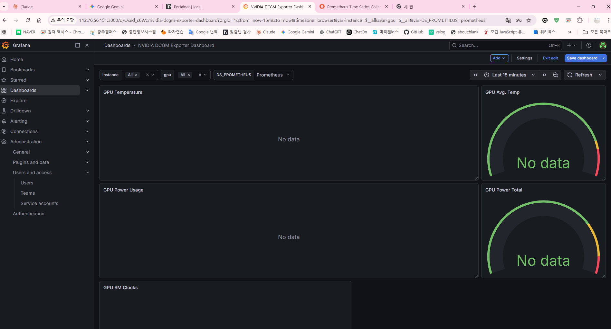

# Grafana NVIDIA DCGM Dashboard — No data 장애

## 1. 개요

| 항목          | 내용                                                                            |
| ------------- | ------------------------------------------------------------------------------- |
| **목적**      | GPU 모니터링 대시보드 전체 패널 'No data' 장애 원인 규명 및 복구                |
| **대상**      | kube-prometheus-stack + NVIDIA GPU Operator v26.3.0, 폴리텍 대학 GPU 클러스터   |
| **핵심 전략** | Pod → 메트릭 직접 curl → Prometheus 쿼리 → dropped targets 순서로 레이어별 진단 |
| **발생일**    | 2026-03-27                                                                      |

---

## 2. 문제 현상

- Grafana NVIDIA DCGM Exporter Dashboard (#12239) 전체 패널 **'No data'** 표시
- Prometheus Targets 페이지에서 DCGM 관련 항목이 목록에서 사라짐
- 직전까지 정상 동작하던 GPU 모니터링이 갑자기 중단
  

---

## 3. 원인 분석

### 3.1 레이어별 진단 결과

| 단계 | 진단 명령어                                                      | 결과                          |
| ---- | ---------------------------------------------------------------- | ----------------------------- |
| 1    | `kubectl get pods -n gpu-operator \| grep dcgm`                  | 4개 Pod 모두 1/1 Running ✅   |
| 2    | `curl http://LB_PUBLIC_IP:9400/metrics \| head -30` | DCGM 메트릭 정상 출력 ✅      |
| 3    | `curl localhost:9090/api/v1/query?query=DCGM_FI_DEV_SM_CLOCK`    | `result: []` — 수집 안 됨 ❌  |
| 4    | `kubectl get servicemonitor -n gpu-operator`                     | gpu-operator SM 존재 확인     |
| 5    | `kubectl get servicemonitor -n monitoring \| grep dcgm`          | nvidia-dcgm-exporter SM 발견  |
| 6    | `targets?state=dropped` 확인                                     | DCGM 4개 노드 전부 dropped ❌ |

### 3.2 핵심 원인 — ServiceMonitor 라벨 불일치

`monitoring` 네임스페이스에 수동 생성된 ServiceMonitor의 selector가 실제 Service 라벨과 불일치.

| 구분                                   | 라벨 값                                    |
| -------------------------------------- | ------------------------------------------ |
| ServiceMonitor selector (잘못된 설정)  | `app.kubernetes.io/name: dcgm-exporter` ❌ |
| 실제 nvidia-dcgm-exporter Service 라벨 | `app: nvidia-dcgm-exporter` ✅             |

> Prometheus는 selector 조건을 AND로 처리하므로, 라벨이 하나라도 맞지 않으면 해당 Endpoint를 dropped 처리한다.

### 3.3 1차 패치 실패 원인 — `merge` 방식의 함정

| 패치 방식                 | 결과                                                                             |
| ------------------------- | -------------------------------------------------------------------------------- |
| `--type=merge` (1차 시도) | 기존 `app.kubernetes.io/name` + 신규 `app` 이 AND 조건으로 중첩 → 여전히 dropped |
| `--type=json` (최종 해결) | selector 전체를 replace → `app: nvidia-dcgm-exporter` 단독 조건으로 교체 성공    |

---

## 4. 해결 과정

### 4.1 Pod 및 메트릭 정상 여부 확인

**🛠️ 사용 명령어:**

```bash
kubectl get pods -n gpu-operator -o wide | grep dcgm
curl -s http://LB_PUBLIC_IP:9400/metrics | head -30
```

---

### 4.2 Prometheus 수집 여부 확인

**🛠️ 사용 명령어:**

```bash
curl -s "http://localhost:9090/api/v1/query?query=DCGM_FI_DEV_SM_CLOCK" | python3 -m json.tool
# result: [] → Prometheus가 수집 못하고 있음 확인
```

---

### 4.3 ServiceMonitor 라벨 불일치 발견

**🛠️ 사용 명령어:**

```bash
kubectl get servicemonitor nvidia-dcgm-exporter -n monitoring -o yaml | grep -A5 selector
# selector.matchLabels: app.kubernetes.io/name: dcgm-exporter (잘못된 라벨 확인)
```

---

### 4.4 dropped targets 확인

**🛠️ 사용 명령어:**

```bash
curl -s "http://localhost:9090/api/v1/targets?state=dropped" | python3 -c "
import json,sys
data=json.load(sys.stdin)
for t in data['data']['droppedTargets']:
    if 'nvidia' in t.get('scrapePool',''):
        print(t['scrapePool'], t['discoveredLabels'].get('__address__',''))
"
# DCGM 4개 노드 전부 dropped 상태 확인
```

---

### 4.5 ServiceMonitor selector 완전 교체 (json replace)

**🛠️ 사용 명령어:**

```bash
kubectl patch servicemonitor nvidia-dcgm-exporter -n monitoring \
  --type='json' \
  -p='[{"op":"replace","path":"/spec/selector","value":{"matchLabels":{"app":"nvidia-dcgm-exporter"}}}]'
```

---

### 4.6 Prometheus 재시작 및 수집 정상화 확인

**🛠️ 사용 명령어:**

```bash
kubectl rollout restart statefulset/prometheus-monitoring-kube-prometheus-prometheus -n monitoring
kubectl wait pod/prometheus-monitoring-kube-prometheus-prometheus-0 \
  -n monitoring --for=condition=Ready --timeout=60s

# 수집 정상화 확인
curl -s "http://localhost:9090/api/v1/query?query=DCGM_FI_DEV_SM_CLOCK" | python3 -m json.tool | head -20
# "Hostname": "2080ti-gpu-02", "modelName": "NVIDIA GeForce RTX 2080 Ti" 반환 확인 ✅
```

---

## 5. 결과

- Prometheus가 4개 GPU 노드(153~156)의 DCGM 메트릭 정상 수집
- Grafana DCGM Dashboard — GPU Temperature, Power, SM Clock 패널 데이터 정상 표시
- dropped targets에서 DCGM 노드 항목 완전 제거

---

## 6. 핵심 인사이트

- **Pod가 Running이고 메트릭도 나오는데 Grafana에 데이터가 없다면** — 범인은 항상 Prometheus와 Exporter 사이 어딘가다. `dropped targets`를 체계적으로 추적하는 것이 빠른 해결의 핵심.
- **`merge` vs `replace` 패치 방식의 차이** — Helm 외부에서 수동 생성한 ServiceMonitor는 annotation에 원본 설정이 남아 `merge` 패치 시 기존 라벨이 제거되지 않고 AND 조건으로 중첩된다. selector 교체는 항상 `--type=json replace` 방식을 사용해야 한다.
- **GPU 모니터링 이상 시 진단 순서** — Pod 상태 확인 → 메트릭 직접 curl → Prometheus 쿼리 확인 → dropped targets 확인.

**dropped targets 빠른 확인 명령어:**

```bash
curl -s "http://localhost:9090/api/v1/targets?state=dropped" | python3 -c "
import json,sys
data=json.load(sys.stdin)
for t in data['data']['droppedTargets']:
    labels = t['discoveredLabels']
    print(t['scrapePool'])
    print('  address:', labels.get('__address__',''))
    print('  app label:', labels.get('__meta_kubernetes_service_label_app','N/A'))
    print('---')
"
```
