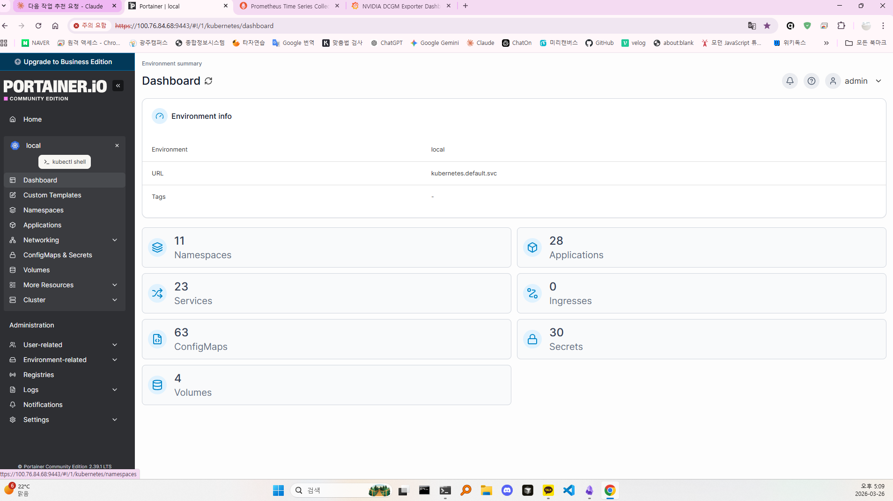

# Portainer Tailscale 접속 불가 — port-forward 좀비 상태

## 1. 개요

| 항목          | 내용                                                                            |
| ------------- | ------------------------------------------------------------------------------- |
| **목적**      | Tailscale VPN을 통한 Portainer 접속 불가 원인 규명 및 복구                      |
| **대상**      | `kubectl-portainer.service` (systemd port-forward), Portainer 9443 포트         |
| **핵심 전략** | Pod/MetalLB 정상 확인 후 중간 통로인 port-forward 터널 좀비 상태 진단 및 재시작 |
| **발생일**    | 2026-03-27                                                                      |

---

## 2. 문제 현상

- Tailscale VPN 연결 자체는 정상, Grafana(`http://TAILSCALE_HOST3000`) 등 다른 서비스는 접속 가능
- Portainer 대시보드(`https://TAILSCALE_HOST9443`)에만 갑자기 접속 불가
- 브라우저에서 `ERR_CONNECTION_REFUSED` 또는 무한 로딩 발생
- `kubectl get pods -n portainer` 조회 시 Pod는 `1/1 Running` 정상 상태
- MetalLB Controller, Speaker 포드 모두 Running

---

## 3. 원인 분석

**🛠️ 사용 명령어 (진단):**

```bash
kubectl get svc -n portainer          # External-IP LB_PUBLIC_IP, 9443 Endpoints 정상 확인
ss -tlnp | grep 9443                  # kubectl(pid=2208981)이 0.0.0.0:9443 점유 확인
ps aux | grep 2208981                 # kubectl port-forward svc/portainer 프로세스 확인
sudo systemctl list-units | grep kubectl  # kubectl-portainer.service active(running) 확인
```

**원인:**

`kubectl-portainer.service`(port-forward)가 Portainer Pod 재시작 타이밍에 연결이 끊긴 채 **좀비 상태**로 유지됨. systemd 상태는 `active (running)`으로 표시되지만 실제 터널은 죽어있어 트래픽이 Pod까지 전달되지 않는 상태.

---

## 4. 해결 과정

### 4.1 port-forward 서비스 상태 점검

**🛠️ 사용 명령어:**

```bash
sudo systemctl status kubectl-portainer.service
```

---

### 4.2 port-forward 서비스 재시작

끊어진 터널을 완전히 종료하고 새 연결로 재수립.

**🛠️ 사용 명령어:**

```bash
sudo systemctl restart kubectl-portainer.service
sudo systemctl status kubectl-portainer.service
# 로그에 "Forwarding from 0.0.0.0:9443" 확인 시 성공
```

---

## 5. 결과

- `kubectl-portainer.service` 재시작 후 port-forward 터널이 Portainer Pod와 정상 재연결
- Tailscale IP(`https://TAILSCALE_HOST9443`)를 통한 Portainer 대시보드 접속 완전 정상화
  

---

## 6. 핵심 인사이트

- **Pod와 MetalLB가 정상인데 접속이 안 되면 중간 통로를 의심하라** — systemd 서비스가 `active (running)`으로 표시되더라도 내부 연결이 끊긴 좀비 상태일 수 있다. 접속 이상 발생 시 port-forward 서비스 재시작을 1순위 조치로 체화해두는 것이 운영의 정석이다.
- **접속 이상 시 1차 대응 체크리스트:**

```bash
# 상태 일괄 점검
sudo systemctl status kubectl-portainer.service kubectl-grafana.service kubectl-prometheus.service

# 전체 일괄 재시작
sudo systemctl restart kubectl-portainer.service kubectl-grafana.service kubectl-prometheus.service

# 로그 확인 (원인 파악)
sudo journalctl -u kubectl-portainer.service -n 30 --no-pager
```
